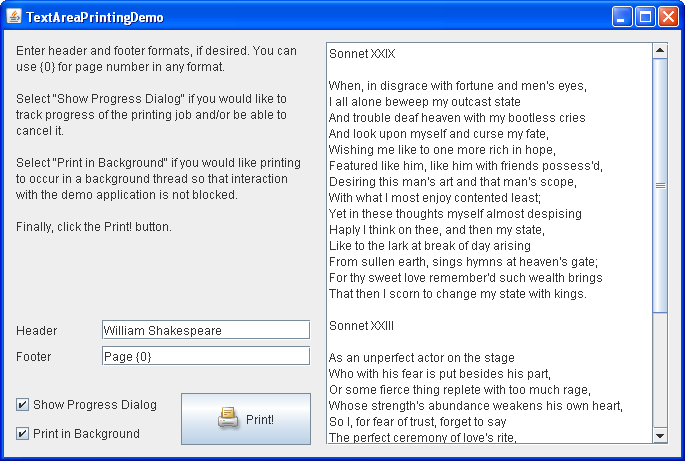
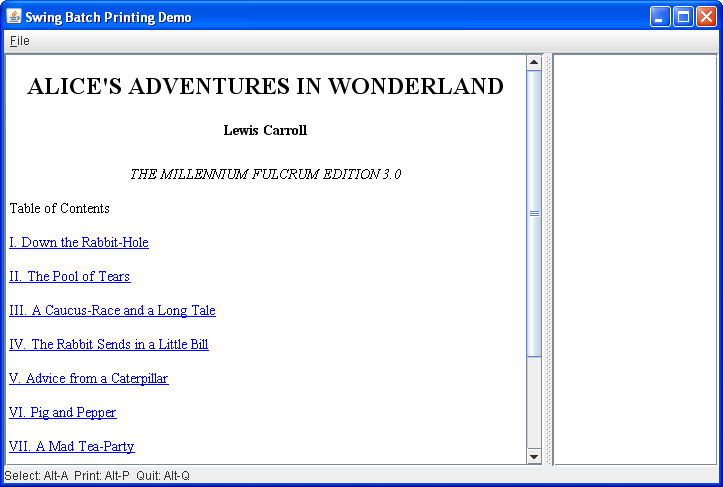

# 如何打印文本

> 原文： [https://docs.oracle.com/javase/tutorial/uiswing/misc/printtext.html](https://docs.oracle.com/javase/tutorial/uiswing/misc/printtext.html)

`JTextComponent`类为打印文本文档提供支持。 `JTextComponent` API 包含允许您实现基本和高级打印任务的方法。支持的格式包括 HTML，RTF 和纯文本。对于常见的打印任务，例如简单地打印文本文档，请直接使用`print`方法。 `print`方法有多种形式，带有各种参数集。此方法准备文本文档，获取相应的`Printable`对象，并将其发送到打印机。

如果`Printable`对象的默认实现不符合您的需要，您可以通过覆盖`getPrintable`方法来自定义打印布局以包装默认`Printable`，甚至完全替换它。

打印文本组件的最简单方法是调用不带参数的`print`方法。请参阅下面的代码示例。

```
try {
    boolean complete = textComponent.print();
    if (complete) {
        /* show a success message  */
        ...
    } else {
        /*show a message indicating that printing was cancelled */
        ...
    }
} catch (PrinterException pe) {
    /* Printing failed, report to the user */
    ...
}

```

当您在没有参数的情况下调用`print`方法时，会显示一个打印对话框，然后以交互方式打印文本组件而不显示页眉或页脚。下面的代码示例显示了带有完整参数集的`print`方法签名。

```
boolean complete = textComponent.print(MessageFormat headerFormat,
                                       MessageFormat footerFormat, 
                                       boolean showPrintDialog,
                                       PrintService service
                                       PrintRequestAttributeSet attributes,
                                       boolean interactive);

```

当您使用所有参数调用`print`方法时，您明确选择打印功能，如页眉和页脚文本，打印属性，目标打印服务，以及是否显示打印对话框，以及是交互式打印还是非打印-interactively。要确定哪种参数最适合您的需求，请参阅下面的可用功能说明。

`JTextComponent`打印 API 提供以下功能：

*   [交互式或非交互式打印](#interactively)
*   [显示打印对话框](#dialog)
*   [将页眉或页脚（或两者）添加到打印版面](#header)
*   [自动布局和分页](#layout)

在交互模式下，在打印期间会显示带有中止选项的进度对话框。以下是进度对话框的示例。

<center></center>

该对话框允许用户跟踪打印进度。当在事件调度线程上调用`print`方法时，进度对话框是模态的，否则是非模态的。在打印时保持文档保持不变非常重要，否则打印行为是不确定的。 `print`方法可确保您的文档不会被更改，并在打印期间禁用该组件。

如果在非交互模式下调用事件调度线程上的`print`方法，则将阻止包括重新绘制在内的所有事件。这就是为什么仅在具有不可见 GUI 的应用程序上推荐在 EDT 上非交互式打印的原因。

您可以显示标准打印对话框，允许用户执行以下操作：

*   选择一台打印机
*   指定份数
*   更改打印属性
*   在开始之前取消打印
*   开始打印

<center></center>

您可能会注意到打印对话框未指定打印输出中的总页数。这是因为文本打印实现使用`Printable` API，并且在打印时间之前不知道总页数。

页眉和页脚由 [`MessageFormat`](https://docs.oracle.com/javase/8/docs/api/java/text/MessageFormat.html) 参数提供。这些参数允许页眉和页脚本地化。阅读 [`MessageFormat`](https://docs.oracle.com/javase/8/docs/api/java/text/MessageFormat.html) 类的文档，因为单引号等字符是特殊的，需要避免。页眉和页脚都居中。您可以使用`{0}`插入页码。

`MessageFormat footer = new MessageFormat("Page - {0}");`

由于在打印时间之前未知输出中的总页数，因此无法指定“第 1 页，共 5 页”之类的编号格式。

 [`TextAreaPrintingDemo.java`](../examples/misc/TextAreaPrintingDemoProject/src/misc/TextAreaPrintingDemo.java) 中找到。该演示的丰富 GUI 是在 [NetBeans IDE GUI 构建器](http://netbeans.org/kb/docs/java/quickstart-gui.html)中构建的。这是`TextAreaPrintingDemo`应用程序的图片。

<center></center>

* * *

**Try this:** 

1.  单击“启动”按钮以使用 [Java™Web Start](http://www.oracle.com/technetwork/java/javase/javawebstart/index.html) （[下载 JDK 7 或更高版本](http://www.oracle.com/technetwork/java/javase/downloads/index.html)）运行 TextAreaPrintingDemo。或者，要自己编译并运行示例，请参考[示例索引](../examples/misc/index.html#TextAreaPrintingDemo)。 [](https://docs.oracle.com/javase/tutorialJWS/samples/uiswing/TextAreaPrintingDemoProject/TextAreaPrintingDemo.jnlp) 

2.  编辑页眉或页脚复选框中的文本或两者以提供不同的页眉或页脚。
3.  如果要在不显示进度对话框的情况下进行打印，请清除“显示进度对话框”复选框，这意味着以非交互方式进行打印。请注意，一旦启动，您将无法取消打印。
4.  清除“在后台打印”复选框以选择在事件派发线程上打印。请注意，在 EDT 上以非交互方式打印将使您的应用程序无响应 - 在打印过程中将阻止与您的应用程序的交互。
5.  单击“打印”按钮，根据所选选项打印文本区域的内容。

每当 Web 启动的应用程序尝试打印时，Java Web Start 都会打开一个安全对话框，询问用户是否允许打印，除非已在系统设置中授予此权限。要继续打印，用户必须接受请求。

为“打印”按钮注册了一个动作侦听器。当用户单击“打印”按钮时，`actionPerformed`方法调用`print`方法，该方法启动打印任务。打印任务是`SwingWorker`对象。下面的代码示例显示了如何实现`PrintingTask`类。

```
private class PrintingTask extends SwingWorker<Object, Object> {
    private final MessageFormat headerFormat;
    private final MessageFormat footerFormat;
    private final boolean interactive;
    private volatile boolean complete = false;
    private volatile String message;

    public PrintingTask(MessageFormat header, MessageFormat footer,
                        boolean interactive) {
        this.headerFormat = header;
        this.footerFormat = footer;
        this.interactive = interactive;
    }

    @Override
    protected Object doInBackground() {
        try {
            complete = text.print(headerFormat, footerFormat,
                    true, null, null, interactive);
            message = "Printing " + (complete ? "complete" : "canceled");
        } catch (PrinterException ex) {
            message = "Sorry, a printer error occurred";
        } catch (SecurityException ex) {
            message =
                "Sorry, cannot access the printer due to security reasons";
        }
        return null;
    }

    @Override
    protected void done() {
        message(!complete, message);
    }
}

```

下面的代码示例显示了`print`方法如何从 GUI 组件获取所选选项集，然后创建`PrintingTask`类的实例，并执行打印。

```
private void print(java.awt.event.ActionEvent evt) {
        MessageFormat header = createFormat(headerField);
        MessageFormat footer = createFormat(footerField);
        boolean interactive = interactiveCheck.isSelected();
        boolean background = backgroundCheck.isSelected();

        PrintingTask task = new PrintingTask(header, footer, interactive);
        if (background) {
            task.execute();
        } else {
            task.run()
        }
    }

```

粗体代码说明了如何根据`background`参数的值调用`PrintingTask`的方法。每当用户喜欢在后台线程上打印时，都会调用`execute`方法，该方法会调度打印任务以便在后台线程上执行。否则，`run`方法在 EDT 上执行打印任务。

由于打印大型文档是一项耗时的任务，因此建议在后台线程上执行打印。

 [`TextBatchPrintingDemo.java`](../examples/misc/TextBatchPrintingDemoProject/src/misc/TextBatchPrintingDemo.java) 中找到。这是`TextBatchPrintingDemo`应用程序的图片。

<center></center>

* * *

**Try this:** 

1.  单击“启动”按钮以使用 [Java™Web Start](http://www.oracle.com/technetwork/java/javase/javawebstart/index.html) （[下载 JDK 7 或更高版本](http://www.oracle.com/technetwork/java/javase/downloads/index.html)）运行 TextBatchPrintingDemo。或者，要自己编译并运行示例，请参考[示例索引](../examples/misc/index.html#TextBatchPrintingDemo)。 [](https://docs.oracle.com/javase/tutorialJWS/samples/uiswing/TextBatchPrintingDemoProject/TextBatchPrintingDemo.jnlp) 

2.  单击任何链接以查看相应的 HTML 页面。
3.  按 ALT + A 或选择文件&gt;添加页面菜单项以将显示的页面添加到右侧显示的打印列表中。
4.  按 ALT + H 或选择文件&gt;主页菜单项返回到演示的主页。
5.  根据需要将多个页面添加到打印列表中。
6.  按 ALT + C 或选择文件&gt;如果您需要清除打印列表并再次构建，请清除所选菜单项。
7.  按 ALT + P 或选择文件&gt;打印所选菜单项以打印所选页面。
8.  按 ALT + Q 或选择文件&gt;退出菜单项以退出应用程序。

您可以在`printSelectedPages`方法中找到打印代码。调用时，此方法首先获取选择用于打印的页面数量。下面的代码示例显示了`printSelectedPages`方法如何为每个页面创建`Runnable`对象，然后在单独的线程上打印当前页面。

```
for (int i = 0; i < n; i++) {
    final PageItem item = (PageItem) pages.getElementAt(i);
    // This method is called from EDT.  Printing is a time-consuming
    // task, so it should be done outside EDT, in a separate thread.
    Runnable printTask = new Runnable() {
        public void run() {
            try {
                item.print(
                        // Two "false" args mean "no print dialog" and
                        // "non-interactive" (ie, batch-mode printing).
                                null, null, false, printService, null, false);
            } catch (PrinterException pe) {
                JOptionPane.showMessageDialog(null,
                        "Error printing " + item.getPage() + "\n" + pe,
                        "Print Error", JOptionPane.WARNING_MESSAGE);
            }
        }
    };
    new Thread(printTask).start();

```

## 文本打印 API

本节列出了`JTextComponent`类中定义的允许您打印文本文档的方法。

| 方法 | 目的 |
| :-: | :-: |
| [boolean print（）](https://docs.oracle.com/javase/8/docs/api/javax/swing/text/JTextComponent.html#print--)
[boolean print（MessageFormat，MessageFormat）](https://docs.oracle.com/javase/8/docs/api/javax/swing/text/JTextComponent.html#print-java.text.MessageFormat-java.text.MessageFormat-)
[boolean print（MessageFormat，MessageFormat，boolean，PrintRequestAttributeSet，boolean，PrintService）](https://docs.oracle.com/javase/8/docs/api/javax/swing/text/JTextComponent.html#print-java.text.MessageFormat-java.text.MessageFormat-boolean-javax.print.PrintService-javax.print.attribute.PrintRequestAttributeSet-boolean-) | 在不带参数的情况下调用时，显示打印对话框，然后以交互方式打印此文本组件，而不显示页眉或页脚文本。如果用户继续打印，则返回`true`，如果用户取消打印，则返回`false`。
使用两个`MessageFormat`参数调用时，显示打印对话框，然后使用指定的页眉和页脚文本以交互方式打印此文本组件。
使用完整的参数集调用时，根据指定的参数打印此文本组件。两个`MessageFormat`参数指定页眉和页脚文本。第一个布尔参数定义是否显示打印对话框。另一个布尔参数指定是否以交互方式打印。使用另外两个参数，您可以指定打印属性和打印服务。
每当省略`PrintService`参数时，将使用默认打印机。 |
| [可打印的 getPrintable（MessageFormat，MessageFormat）](https://docs.oracle.com/javase/8/docs/api/javax/swing/text/JTextComponent.html#getPrintable-java.text.MessageFormat-java.text.MessageFormat-) | 返回用于打印文本组件的`Printable`对象。重写此方法以获取自定义的 Printable 对象。您可以将一个 Printable 对象包装到另一个对象中，以获取复杂的报表和文档。 |

此表列出了使用文本打印的示例，并指出了描述这些示例的位置。

| 例 | 在哪里描述 | 笔记 |
| :-- | :-- | :-- |
| [`TextAreaPrintingDemo`](../examples/misc/index.html#TextAreaPrintingDemo) | 这一页 | 演示文本打印的基础知识，并提供丰富的 GUI。允许用户指定页眉或页脚文本，打开或关闭打印对话框，以交互方式或非交互方式选择打印，然后根据所选选项进行打印。 |
| [`TextBatchPrintingDemo`](../examples/misc/index.html#TextBatchPrintingDemo) | 这一页 | 此演示显示带有 URL 列表的文本组件，允许用户查看 HTML 页面，将它们添加到打印列表，并在后台线程上一次打印所有选定的页面。 |

[« Previous](printtable.html) • [Trail](../TOC.html) • [Next »](splashscreen.html)

* * *

[关于 Oracle](http://www.oracle.com/corporate/index.html) | [联系我们](http://www.oracle.com/us/corporate/contact/index.html) | [法律声明](http://www.oracle.com/us/legal/index.html) | [使用条款](http://www.oracle.com/us/legal/terms/index.html) | [您的隐私权](http://www.oracle.com/us/legal/privacy/index.html)

[版权所有©1995,2017 Oracle 和/或其附属公司。版权所有。](http://www.oracle.com/pls/topic/lookup?ctx=cpyr&id=en-US)

**Previous page:** How to Print Tables
**Next page:** How to Create a Splash Screen