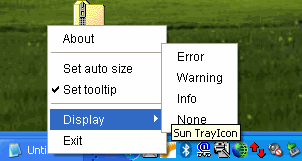

# 如何使用系统托盘

> 原文： [https://docs.oracle.com/javase/tutorial/uiswing/misc/systemtray.html](https://docs.oracle.com/javase/tutorial/uiswing/misc/systemtray.html)

系统托盘是桌面的专用区域，用户可以在其中访问当前正在运行的程序。在各种操作系统上可以不同地指代该区域。在 Microsoft Windows 上，系统托盘称为任务栏状态区，而在 GNU 网络对象模型环境（GNOME）桌面上，它被称为通知区域。在 K 桌面环境（KDE）上，此区域称为系统托盘。但是，在每个系统上，托盘区域由桌面上运行的所有应用程序共享。

Java™SE 版本 6 中引入的 [`java.awt.SystemTray`](https://docs.oracle.com/javase/8/docs/api/java/awt/SystemTray.html) 类表示桌面的系统托盘。可以通过调用静态`SystemTray.getSystemTray()`方法访问系统托盘。在调用此方法之前，请使用静态方法 [`isSupported()`](https://docs.oracle.com/javase/8/docs/api/java/awt/SystemTray.html#isSupported--) 检查是否支持系统托盘。如果此平台不支持系统托盘，则`isSupported()`方法返回 false。如果应用程序在这种情况下尝试调用`getSystemTray()`方法，则该方法将抛出`java.lang.UnsupportedOperationException`。

应用程序无法创建`SystemTray`类的实例。只能在此类中创建单个实例，并且可以使用 [`getSystemTray()`](https://docs.oracle.com/javase/8/docs/api/java/awt/SystemTray.html#getSystemTray--) 方法获取此实例。

系统托盘包含一个或多个托盘图标，使用 [`add(java.awt.TrayIcon)`](https://docs.oracle.com/javase/8/docs/api/java/awt/SystemTray.html#add-java.awt.TrayIcon-) 方法将其添加到托盘中。使用 [`remove(java.awt.TrayIcon)`](https://docs.oracle.com/javase/8/docs/api/java/awt/SystemTray.html#remove-java.awt.TrayIcon-) 方法不再需要它们时可以将它们移除。

* * *

**Note:** The `add()` method can throw an `AWTException` if the operating system or the Java runtime determines that the icon cannot be added to the system tray. For example, an `AWTException` will be thrown by X-Window desktops if the system tray does not exist on the desktop.

* * *

[`TrayIcon`](https://docs.oracle.com/javase/8/docs/api/java/awt/TrayIcon.html) 类功能超出了托盘中显示的图标。它还包括文本工具提示，弹出菜单，气球消息以及与之关联的一组侦听器。 `TrayIcon`对象生成各种鼠标事件，并支持添加相应的侦听器以接收这些事件的通知。 `TrayIcon`类处理一些事件本身。例如，默认情况下，在托盘图标上执行右键单击时，它会显示指定的弹出菜单。执行双击时，`TrayIcon`对象生成`ActionEvent`以启动应用程序。当鼠标指针悬停在托盘图标上时，将显示工具提示。图标图像会自动调整大小以适合为托盘上的图像分配的空间。

以下使用 AWT 包开发的演示演示了 SystemTray 和 TrayIcon 类的功能。



不幸的是，`TrayIcon`类的当前实现提供了对 Swing 弹出菜单（`JPopupMenu`类）的有限支持，并且不允许应用程序使用`javax.swing`包的所有功能。 Bug 数据库中描述了此问题的变通方法建议，请参阅错误 ID [6285881](http://bugs.java.com/bugdatabase/view_bug.do?bug_id=6285881) 。

* * *

**Try this:** 

1.  将 [`bulb.gif`](../examples/misc/TrayIconDemoProject/src/mihttps://docs.oracle.com/javase/tutorial/images/bulb.gif) 图像文件放在`image`目录中。编译并运行示例，请参考[示例索引](../examples/misc/index.html#TrayIconDemo)。
2.  托盘图标将出现在系统托盘中。

    &lt;center&gt;&lt;/center&gt;

3.  双击托盘图标以启动相应的应用程序。将显示该对话框。
4.  将鼠标指针悬停在托盘图标上，然后单击鼠标右键。出现弹出菜单。
5.  选择“设置自动大小”复选框菜单项。请注意，图标外观更改如下。

    &lt;center&gt;&lt;/center&gt;

6.  选择“设置工具提示”复选框菜单项。将鼠标指针悬停在托盘图标上。出现工具提示。
7.  选择“关于”菜单项。出现对话框。关闭对话框。
8.  选择任何“显示”子菜单项。这些项中的每一项都显示特定类型的消息对话框：错误，警告，信息或标准。
9.  使用“退出”菜单项退出应用程序。

    * * *

以下代码段显示如何将托盘图标添加到系统托盘并应用弹出菜单：

```
...
        //Check the SystemTray is supported
        if (!SystemTray.isSupported()) {
            System.out.println("SystemTray is not supported");
            return;
        }
        final PopupMenu popup = new PopupMenu();
        final TrayIcon trayIcon =
                new TrayIcon(createImage("images/bulb.gif", "tray icon"));
        final SystemTray tray = SystemTray.getSystemTray();

        // Create a pop-up menu components
        MenuItem aboutItem = new MenuItem("About");
        CheckboxMenuItem cb1 = new CheckboxMenuItem("Set auto size");
        CheckboxMenuItem cb2 = new CheckboxMenuItem("Set tooltip");
        Menu displayMenu = new Menu("Display");
        MenuItem errorItem = new MenuItem("Error");
        MenuItem warningItem = new MenuItem("Warning");
        MenuItem infoItem = new MenuItem("Info");
        MenuItem noneItem = new MenuItem("None");
        MenuItem exitItem = new MenuItem("Exit");

        //Add components to pop-up menu
        popup.add(aboutItem);
        popup.addSeparator();
        popup.add(cb1);
        popup.add(cb2);
        popup.addSeparator();
        popup.add(displayMenu);
        displayMenu.add(errorItem);
        displayMenu.add(warningItem);
        displayMenu.add(infoItem);
        displayMenu.add(noneItem);
        popup.add(exitItem);

        trayIcon.setPopupMenu(popup);

        try {
            tray.add(trayIcon);
        } catch (AWTException e) {
            System.out.println("TrayIcon could not be added.");
        }
...

```

该演示的完整代码可在 [`TrayIconDemo.java`](../examples/misc/TrayIconDemoProject/src/misc/TrayIconDemo.java) 文件中找到。该演示还使用 [`bulb.gif`](../examples/misc/TrayIconDemoProject/src/mihttps://docs.oracle.com/javase/tutorial/images/bulb.gif) 图像文件。

删除应用 Swing 组件的当前限制将使开发人员能够添加`JMenuItem`（带图像），`JRadioButtonMenuItem`和`JCheckBoxMenuItem`等组件。

只能在`SystemTray`类中创建单个实例。

| 方法 | 目的 |
| :-- | :-- |
| [加](https://docs.oracle.com/javase/8/docs/api/java/awt/SystemTray.html#add-java.awt.TrayIcon-) | 将托盘图标添加到系统托盘。添加后，托盘图标将在系统托盘中显示。未指定图标在托盘中显示的顺序 - 它取决于平台和实现。 |
| [getSystemTray](https://docs.oracle.com/javase/8/docs/api/java/awt/SystemTray.html#getSystemTray--) | 获取表示桌面托盘区域的`SystemTray`实例。此方法始终为每个应用程序返回相同的实例。在某些平台上，可能不支持系统托盘。使用`isSupported()`方法检查系统托盘是否受支持。 |
| [isSupported](https://docs.oracle.com/javase/8/docs/api/java/awt/SystemTray.html#isSupported--) | 返回有关当前平台是否支持系统托盘的信息。除了显示托盘图标外，最小系统托盘支持还包括弹出菜单（请参阅`TrayIcon.setPopupMenu(PopupMenu)`方法）或动作事件（请参阅`TrayIcon.addActionListener(ActionListener)`）。 |

`TrayIcon`对象表示可以添加到系统托盘的托盘图标。 `TrayIcon`对象可以有工具提示（文本），图像，弹出菜单以及与之关联的一组侦听器。

| 方法 | 目的 |
| :-- | :-- |
| [setImageAutoSize](https://docs.oracle.com/javase/8/docs/api/java/awt/TrayIcon.html#setImageAutoSize-boolean-) | 设置 auto-size 属性。自动尺寸确定托盘图像是否自动调整大小以适合托盘上图像的分配空间。默认情况下，auto-size 属性设置为`false`。 |
| [setPopupMenu](https://docs.oracle.com/javase/8/docs/api/java/awt/TrayIcon.html#setPopupMenu-java.awt.PopupMenu-) | 设置此`TrayIcon`对象的弹出菜单。如果弹出窗口是`null`，则没有弹出菜单与此`TrayIcon`对象关联。 |
| [setToolTip](https://docs.oracle.com/javase/8/docs/api/java/awt/TrayIcon.html#setToolTip-java.lang.String-) | 设置此`TrayIcon`对象的工具提示字符串。当鼠标悬停在图标上时，工具提示会自动显示。将工具提示设置为`null`会删除任何工具提示文本。显示时，工具提示字符串可能会在某些平台上被截断;可显示的字符数取决于平台。 |

The following table lists the example that uses tray icons added to the system tray.

| 例 | 在哪里描述 | 笔记 |
| :-- | :-- | :-- |
| [`TrayIconDemo`](../examples/misc/index.html#TrayIconDemo) | 这个部分 | 在系统托盘中创建托盘图标，向托盘图标添加弹出菜单。 |