# 如何使用 BoxLayout

> 原文： [https://docs.oracle.com/javase/tutorial/uiswing/layout/box.html](https://docs.oracle.com/javase/tutorial/uiswing/layout/box.html)

* * *

**Note:** This lesson covers writing layout code by hand, which can be challenging. If you are not interested in learning all the details of layout management, you might prefer to use the `GroupLayout` layout manager combined with a builder tool to lay out your GUI. One such builder tool is the [NetBeans IDE](../learn/index.html). Otherwise, if you want to code by hand and do not want to use `GroupLayout`, then `GridBagLayout` is recommended as the next most flexible and powerful layout manager.

* * *

如果您对使用 JavaFX 创建 GUI 感兴趣，请参阅[在 JavaFX](https://docs.oracle.com/javase/8/javafx/layout-tutorial/index.html) 中使用布局。

Swing 包包括一个名为 [`BoxLayout`](https://docs.oracle.com/javase/8/docs/api/javax/swing/BoxLayout.html) 的通用布局管理器。 `BoxLayout`要么将其组件堆叠在一起，要么将它们排成一排 - 您的选择。您可能会将其视为 [`FlowLayout`](flow.html) 的一个版本，但具有更强大的功能。下面是一个应用程序的图片，演示如何使用`BoxLayout`显示组件的居中列：

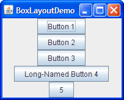

单击“启动”按钮以使用 [Java™Web Start](http://www.oracle.com/technetwork/java/javase/javawebstart/index.html) （[下载 JDK 7 或更高版本](http://www.oracle.com/technetwork/java/javase/downloads/index.html)）运行 BoxLayoutDemo。或者，要自己编译并运行示例，请参考[示例索引](../examples/layout/index.html#BoxLayoutDemo)。

[](https://docs.oracle.com/javase/tutorialJWS/samples/uiswing/BoxLayoutDemoProject/BoxLayoutDemo.jnlp)

您可以在 [`BoxLayoutDemo.java`](../examples/layout/BoxLayoutDemoProject/src/layout/BoxLayoutDemo.java) 中看到代码。

下图显示了使用`BoxLayout`的两个实例的 GUI。在 GUI 的顶部，从上到下的框布局在滚动窗格上方放置一个标签。在 GUI 的底部，从左到右的框布局将两个按钮放在一起。 `BorderLayout`组合了 GUI 的两个部分，并确保为滚动窗格提供了任何多余的空间。

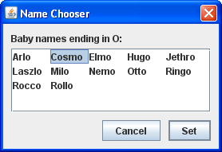

您可以在[示例索引](../components/../examples/components/index.html#ListDialog)中找到运行 ListDialog 及其源文件的链接，以使用 Swing 组件。

以下代码取自 [``ListDialog.java``](../examples/components/ListDialogRunnerProject/src/components/ListDialog.java)，列出了 GUI。此代码位于对话框的构造函数中，该实现为`JDialog`子类。粗体代码行设置框布局并向其添加组件。

```
JScrollPane listScroller = new JScrollPane(list);
listScroller.setPreferredSize(new Dimension(250, 80));
listScroller.setAlignmentX(LEFT_ALIGNMENT);
...
//Lay out the label and scroll pane from top to bottom.
JPanel listPane = new JPanel();
listPane.setLayout(new BoxLayout(listPane, BoxLayout.PAGE_AXIS));
JLabel label = new JLabel(labelText);
...
listPane.add(label);
listPane.add(Box.createRigidArea(new Dimension(0,5)));
listPane.add(listScroller);
listPane.setBorder(BorderFactory.createEmptyBorder(10,10,10,10));

//Lay out the buttons from left to right.
JPanel buttonPane = new JPanel();
buttonPane.setLayout(new BoxLayout(buttonPane, BoxLayout.LINE_AXIS));
buttonPane.setBorder(BorderFactory.createEmptyBorder(0, 10, 10, 10));
buttonPane.add(Box.createHorizontalGlue());
buttonPane.add(cancelButton);
buttonPane.add(Box.createRigidArea(new Dimension(10, 0)));
buttonPane.add(setButton);

//Put everything together, using the content pane's BorderLayout.
Container contentPane = getContentPane();
contentPane.add(listPane, BorderLayout.CENTER);
contentPane.add(buttonPane, BorderLayout.PAGE_END);

```

第一个粗线创建一个从上到下的框布局，并将其设置为`listPane`的布局管理器。 `BoxLayout`构造函数的两个参数是它管理的容器以及组件将沿其布置的轴。 `PAGE_AXIS`常量指定组件应按照目标容器的`ComponentOrientation`属性确定的行在页面上流动的方向布置。 `LINE_AXIS`常量指定组件应按照目标容器的`ComponentOrientation`属性确定的文本行方向布局。这些常量允许国际化，通过在容器中布置组件，使用正确的从左到右，从右到左或从上到下的方向。

接下来的三行粗线将标签和滚动窗格添加到容器中，将它们与 _ 刚性区域 _ 分开 - 这是一个用于在组件之间添加空间的不可见组件。在这种情况下，刚性区域没有宽度，并在标签和滚动窗格之间放置 5 个像素。稍后将在[使用不可见组件作为填充物](#filler)中讨论刚性区域。

下一个粗体代码块创建一个从左到右的框布局，并为`buttonPane`容器设置它。然后代码将两个按钮添加到容器中，使用刚性区域在按钮之间放置 10 个像素。要将按钮放在容器的右侧，添加到容器中的第一个组件是 _ 胶水 _。这种胶水是一种不可见的成分，可以根据需要生长，以吸收容器中的任何额外空间。在[使用不可见组分作为填料](#filler)中讨论了胶水。

作为使用隐形组件的替代方法，您有时可以使用空边框在组件周围创建空间，尤其是面板。例如，前面的代码片段使用空边框在对话框的所有边和其内容之间以及内容的两个部分之间放置 10 个像素。边框完全独立于布局管理器。它们只是 Swing 组件如何绘制边缘并在组件内容和边缘之间提供填充。有关详细信息，请参阅[如何使用边框](../components/border.html)。

以下部分更详细地讨论`BoxLayout`：

*   [盒子布局功能](#features)
*   [使用隐形组件作为填充物](#filler)
*   [修复对齐问题](#alignment)
*   [指定元件尺寸](#size)
*   [框布局 API](#api)
*   [使用框布局的示例](#eg)

不要让`BoxLayout`讨论的长度吓到你！您可以将`BoxLayout`与您已有的信息一起使用。如果您遇到麻烦或想要利用`BoxLayout`的电源，请继续阅读。

如前所述，`BoxLayout`将组件排列在彼此之上或排成一排。由于框布局排列组件，因此需要考虑组件的对齐以及最小，首选和最大尺寸。在本节中，我们将讨论从上到下的布局。相同的概念适用于从左到右或从右到左的布局。您只需将 X 替换为 Y，将高度替换为宽度，依此类推。

* * *

**Version note:** Before JDK version 1.4, no constants existed for specifying the box layout's axis in a localizable way. Instead, you specified `X_AXIS` (left to right) or `Y_AXIS` (top to bottom) when creating the `BoxLayout`. Our examples now use the constants `LINE_AXIS` and `PAGE_AXIS`, which are preferred because they enable programs to adjust to languages that have different orientations. In the default, left-to-right orientation, `LINE_AXIS` specifies left-to-right layout and `PAGE_AXIS` specifies top-to-bottom layout.

* * *

当`BoxLayout`从顶部到底部布置组件时，它会尝试在组件的首选高度处调整每个组件的大小。如果布局的垂直空间与首选高度的总和不匹配，则`BoxLayout`会尝试调整组件的大小以填充空间。组件可以增长或缩小以填充空间，`BoxLayout`可以满足每个组件的最小和最大尺寸。容器底部会出现任何额外空间。

对于从上到下的框布局，容器的首选宽度是子框架的最大首选宽度。如果容器被强制宽，`BoxLayout`会尝试将每个组件的宽度调整为容器宽度的宽度（减去插入）。如果组件的最大尺寸小于容器的宽度，则 X 对齐起作用。

X 对齐不仅影响组件相对于彼此的位置，还影响组件（作为一组）在其容器内的位置。下图说明了具有受限最大宽度的组件的对齐。

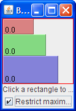  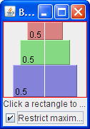  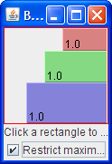

在第一个图中，所有三个组件的 X 对齐为 0.0（`Component.LEFT_ALIGNMENT`）。这意味着组件的左侧应对齐。此外，这意味着所有三个组件都尽可能远离其容器。

在第二个图中，所有三个组件的 X 对齐为 0.5（`Component.CENTER_ALIGNMENT`）。这意味着组件的中心应该对齐，并且组件应该位于其容器的水平中心。

在第三个图中，组件的 X 对齐为 1.0（`Component.RIGHT_ALIGNMENT`）。您可以猜测这对于组件相对于其容器的对齐和位置意味着什么。

您可能想知道当组件具有受限制的最大尺寸和不同的 X 对齐时会发生什么。下图显示了一个这样的例子：

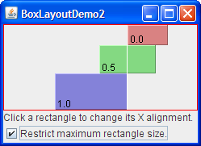

如您所见，X 对齐为 0.0（`Component.LEFT_ALIGNMENT`）的组件左侧与具有 0.5 X 对齐（`Component.CENTER_ALIGNMENT`）的组件的中心对齐，该对齐与右侧对齐 X 对齐为 1.0（`Component.RIGHT_ALIGNMENT`）的组件。在[固定对准问题](#alignment)中进一步讨论了这样的混合对准。

如果没有任何组件具有最大宽度怎么办？在这种情况下，如果所有组件具有相同的 X 对齐，则所有组件都与其容器一样宽。如果 X 对齐不同，则 X 对齐为 0.0（左）或 1.0（右）的任何组件都将更小。具有中间 X 对齐（例如中心）的所有组件将与其容器一样宽。这是两个例子：

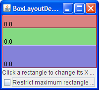  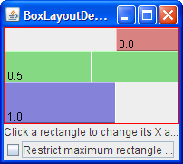

为了更好地了解`BoxLayout`，您可以使用 BoxLayoutDemo2 运行自己的实验。

* * *

**Try this:** 

1.  Click the Launch button to run BoxLayoutDemo2 using [Java™ Web Start](http://www.oracle.com/technetwork/java/javase/javawebstart/index.html) ([download JDK 7 or later](http://www.oracle.com/technetwork/java/javase/downloads/index.html)). Alternatively, to compile and run the example yourself, consult the [example index](../examples/layout/index.html#BoxLayoutDemo2).[](https://docs.oracle.com/javase/tutorialJWS/samples/uiswing/BoxLayoutDemo2Project/BoxLayoutDemo2.jnlp)

    您可以在 [`BoxLayoutDemo2.java`](../examples/layout/BoxLayoutDemo2Project/src/layout/BoxLayoutDemo2.java) 中看到代码。
    你会看到一个像上面那样包含三个矩形的窗口。每个矩形都是`BLDComponent`的实例，它是`JComponent`子类。

2.  单击其中一个矩形。
    这是你改变矩形 X 对齐的方法。
3.  单击窗口底部的复选框。
    关闭所有矩形的限制大小。
4.  让窗户更高。
    这使得矩形的容器大于矩形的首选大小的总和。容器是`JPanel`，具有红色轮廓，因此您可以知道容器边缘的位置。

* * *

由框布局控制的每个组件都与其相邻组件对接。如果要在组件之间留出空间，可以向一个或两个组件添加空[边框](border.html)，或插入不可见组件以提供空间。您可以在`Box`类的帮助下创建不可见的组件。

[`Box`](https://docs.oracle.com/javase/8/docs/api/javax/swing/Box.html) 类定义了一个嵌套类 [`Box.Filler`](https://docs.oracle.com/javase/8/docs/api/javax/swing/Box.Filler.html) ，它是一个不绘制任何内容的透明组件，用于在其他组件之间提供空间。但是，`Filler`实际上并不可见，因为未调用`setVisible(false)`。 `Box`类提供了方便的方法来帮助您创建常见的填充类型。下表提供了使用`Box`和`Box.Filler`创建不可见组件的详细信息。

| 类型 | 大小限制 | 如何创建 |
| --- | --- | --- |
| [刚性区](#rigidarea) | 
 | `Box.createRigidArea(size)` |
| [胶水](#glue)，水平 | 
 | `Box.createHorizontalGlue()` |
| [胶](#glue)，垂直 | 
 | `Box.createVerticalGlue()` |
| [自定义`Box.Filler`](#box.filler) | _（如指定）_ | `new Box.Filler(minSize, prefSize, maxSize)` |

以下是您通常使用每种填料的方法：

Use this when you want a fixed-size space between two components. For example, to put 5 pixels between two components in a left-to-right box, you can use this code:

```
container.add(firstComponent);
container.add(Box.createRigidArea(new Dimension(5,0)));
container.add(secondComponent);

```

 

* * *

**注意：** `Box`类提供了另一种填充物，用于在组件之间放置固定空间：垂直或水平支柱。不幸的是，支柱具有无限的最大高度或宽度（分别用于水平和垂直支柱）。这意味着，如果您在垂直框内使用水平框，则水平框有时会变得太高。因此，我们建议您使用刚性区域而不是支柱。

* * *

Use this to specify where excess space in a layout should go. Think of it as a kind of elastic glue — stretchy and expandable, yet taking up no space unless you pull apart the components that it is sticking to. For example, by putting horizontal glue between two components in a left-to-right box, you make any extra space go between those components, instead of to the right of all the components. Here is an example of making the space in a left-to-right box go between two components, instead of to the right of the components:

```
container.add(firstComponent);
container.add(Box.createHorizontalGlue());
container.add(secondComponent);

```

 

Use this to specify a component with whatever minimum, preferred, and maximum sizes you want. For example, to create some filler in a left-to-right layout that puts at least 5 pixels between two components and ensures that the container has a minimum height of 100 pixels, you could use this code:

```
container.add(firstComponent);
Dimension minSize = new Dimension(5, 100);
Dimension prefSize = new Dimension(5, 100);
Dimension maxSize = new Dimension(Short.MAX_VALUE, 100);
container.add(new Box.Filler(minSize, prefSize, maxSize));
container.add(secondComponent);

```

 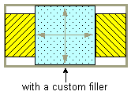

`BoxLayout`有时会出现两种对齐问题：

*   A group of components all have the same alignment, but you want to change their alignment to make them look better. For example, instead of having the centers of a group of left-to-right buttons all in a line, you might want the bottoms of the buttons to be aligned. Here is an example:

    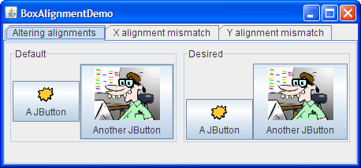

*   Two or more components controlled by a `BoxLayout` have different default alignments, which causes them to be mis-aligned. For example, as the following shows, if a label and a panel are in a top-to-bottom box layout, the label's left edge is, by default, aligned with the center of the panel.

    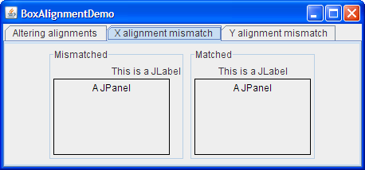

通常，由顶部到底部`BoxLayout`对象控制的所有组件应具有相同的 X 对齐。类似地，由左到右`Boxlayout`控制的所有组件通常应具有相同的 Y 对齐。您可以通过调用`setAlignmentX`方法来设置`JComponent`的 X 对齐。所有组件可用的替代方法是覆盖组件类的自定义子类中的`getAlignmentX`方法。类似地，通过调用`setAlignmentY`方法或覆盖`getAlignmentY`来设置组件的 Y 对齐。

下面是一个示例，取自名为 [`BoxAlignmentDemo`](../examples/layout/index.html#BoxAlignmentDemo) 的应用程序，用于更改两个按钮的 Y 对齐，以便按钮的底部对齐：

```
button1.setAlignmentY(Component.BOTTOM_ALIGNMENT);
button2.setAlignmentY(Component.BOTTOM_ALIGNMENT);

```

单击“启动”按钮以使用 [Java™Web Start](http://www.oracle.com/technetwork/java/javase/javawebstart/index.html) （[下载 JDK 7 或更高版本](http://www.oracle.com/technetwork/java/javase/downloads/index.html)）运行 BoxAlignmentDemo。或者，要自己编译并运行示例，请参考[示例索引](../examples/layout/index.html#BoxAlignmentDemo)。

[](https://docs.oracle.com/javase/tutorialJWS/samples/uiswing/BoxAlignmentDemoProject/BoxAlignmentDemo.jnlp)

默认情况下，大多数组件都具有中心 X 和 Y 对齐。但是，按钮，组合框，标签和菜单项具有不同的默认 X 对齐值：`LEFT_ALIGNMENT`。上图显示了如果将左对齐组件（如标签）与中心对齐组件放在由顶部到底部`BoxLayout`控制的容器中会发生什么。

[`BoxAlignmentDemo`](../examples/layout/index.html#BoxAlignmentDemo) 程序提供了修复不匹配对齐问题的示例。通常，它就像使违规按钮或标签居中对齐一样简单。例如：

```
label.setAlignmentX(Component.CENTER_ALIGNMENT);

```

如前所述，`BoxLayout`会关注组件所要求的最小，首选和最大大小。在对布局进行微调时，可能需要调整这些尺寸。

有时需要调整大小是显而易见的。例如，按钮的最大大小通常与其首选大小相同。如果您希望在有额外空间时将按钮绘制得更宽，则需要更改其最大尺寸。

然而，有时候调整尺寸的需求并不那么明显。使用框布局可能会得到意外结果，您可能不知道原因。在这种情况下，通常最好首先将问题视为[对齐问题](#alignment)。如果调整对齐没有帮助，那么您可能会遇到尺寸问题。我们稍后会进一步讨论这个问题。

* * *

**Note:** Although `BoxLayout` pays attention to a component's maximum size, many layout managers do not. For example, if you put a button in the bottom part of a `BorderLayout`, the button will probably be wider than its preferred width, no matter what the button's maximum size is. `BoxLayout`, on the other hand, never makes a button wider than its maximum size.

* * *

您可以通过两种方式更改最小尺寸，首选尺寸和最大尺寸：

*   通过调用适当的`集 _Xxx_ Size` 方法（由`JComponent`类定义）。例如：

    ```
    comp.setMinimumSize(new Dimension(50, 25));
    comp.setPreferredSize(new Dimension(50, 25));
    comp.setMaximumSize(new Dimension(Short.MAX_VALUE,
                                      Short.MAX_VALUE));

    ```

*   通过覆盖适当的 `get _Xxx_ Size` 方法。例如：

    ```
      ... //在组件类的子类中： public Dimension getMaximumSize（）{size = getPreferredSize（）; size.width = Short.MAX_VALUE;回报大小; } 
    ```

如果您在使用盒子布局遇到麻烦并且排除了对齐问题，那么麻烦可能与大小有关。例如，如果由框布局控制的容器占用太多空间，则容器中的一个或多个组件可能需要限制其最大尺寸。

您可以使用两种技术来跟踪框布局中的尺寸问题：

*   将一条花边线[边框](border.html)添加到相关 Swing 组件的外部。这可以让你看到他们真正的大小。例如：

    ```
    comp.setBorder(BorderFactory.createCompoundBorder(
                       BorderFactory.createLineBorder(Color.red),
                       comp.getBorder()));

    ```

*   使用`System.out.println`打印组件的最小，首选和最大尺寸，以及它们的边界。

下表列出了常用的`BoxLayout`和`Box`构造函数和方法。使用框布局的 API 属于以下类别：

*   [创建`BoxLayout`对象](#construct)
*   [创建空间填充物](#fillerapi)
*   [其他有用的方法](#other)


| 构造函数或方法 | 目的 |
| --- | --- |
| `BoxLayout(Container, int)` | 创建一个控制指定`Container`的`BoxLayout`实例。整数参数指定应沿其布置容器组件的轴。当容器具有默认组件方向时，`BoxLayout.LINE_AXIS`指定组件从左到右布置，`BoxLayout.PAGE_AXIS`指定组件从上到下布置。 |
| `Box(int)` | 创建`Box` - 使用带有指定轴的`BoxLayout`的容器。 |
| `static Box createHorizontalBox()`
_（在`Box`中）_ | 创建一个`Box`，从左到右排列其组件。 |
| `static Box createVerticalBox()`
_（在`Box`中）_ | 创建一个`Box`，从上到下排列其组件。 |


_These methods are defined in the `Box` class._
| 构造函数或方法 | 目的 |
| --- | --- |
| `Component createRigidArea(Dimension)` | 创建[刚性](#rigidarea)组件。 |
| `组件 createHorizo​​ntalGlue（）
组件 createVerticalGlue（）
组件 createGlue（）` | 创建[胶水](#glue)组件。水平胶和垂直胶可以非常有用。 |
| `组件 createHorizo​​ntalStrut（）
组件 createVerticalStrut（）` | 创建一个“支柱”组件。我们建议使用刚性区域而不是支柱。 |
| `Box.Filler(Dimension, Dimension, Dimension)` | 创建具有指定的最小，首选和最大大小的组件（使用按该顺序指定的参数）。有关详细信息，请参阅本节前面的[自定义`Box.Filler`](#box.filler) 讨论。 |


| 方法 | 目的 |
| --- | --- |
| `void changeShape(Dimension, Dimension, Dimension)` _（在`Box.Filler`中）_ | 更改收件人`Box.Filler`对象的最小，首选和最大大小。布局相应地改变。 |

下表列出了一些使用框布局的示例。

| 例 | 在哪里描述 | 笔记 |
| :-- | :-- | :-- |
| [BoxLayoutDemo2](../examples/layout/index.html#BoxLayoutDemo2) | 这一页 | 使用框布局创建中心的组件列。 |
| [BoxAlignmentDemo](../examples/layout/index.html#BoxAlignmentDemo) | 这一页 | 演示如何解决常见的对齐问题。 |
| [BoxLayoutDemo](../examples/layout/index.html#BoxLayoutDemo) | 这一页 | 让您玩对齐和最大尺寸。 |
| [ListDialog](../components/../examples/components/index.html#ListDialog) | 这一页 | 一个简单而实际的例子，它使用了从上到下的盒子布局和从左到右的盒子布局。使用水平胶水，刚性区域和空白边框。还设置组件的 X 对齐方式。 |
| [InternalFrameEventDemo](../events/../examples/events/index.html#InternalFrameEventDemo) | [如何编写内部帧监听器](../events/internalframelistener.html) | 使用从上到下的布局来居中按钮和内部框架中的滚动窗格。 |
| [MenuGlueDemo](../components/../examples/components/index.html#MenuGlueDemo) | [自定义菜单布局](../components/menu.html#custom) | 显示如何使用胶水组件右键对齐菜单栏中的菜单。 |
| [MenuLayoutDemo](../components/../examples/components/index.html#MenuLayoutDemo) | [自定义菜单布局](../components/menu.html#custom) | 显示如何通过更改菜单栏以使用从上到下的框布局来自定义菜单布局，以及使用从左到右框布局的弹出菜单。 |
| [转换器](../components/../examples/components/index.html#Converter)演示中的`ConversionPanel.java` | [如何使用面板](../components/panel.html) | 通过将组件的宽度设置为相同，并将其容器的宽度设置为相同，将两个组件对齐在不同的框布局控制的容器中。 |