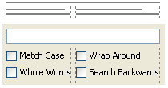

# GroupLayout 示例

> 原文： [https://docs.oracle.com/javase/tutorial/uiswing/layout/groupExample.html](https://docs.oracle.com/javase/tutorial/uiswing/layout/groupExample.html)

* * *

**Note:** This lesson covers writing layout code by hand, which can be challenging. If you are not interested in learning all the details of layout management, you might prefer to use the `GroupLayout` layout manager combined with a builder tool to lay out your GUI. One such builder tool is the [NetBeans IDE](../learn/index.html). Otherwise, if you want to code by hand and do not want to use `GroupLayout`, then `GridBagLayout` is recommended as the next most flexible and powerful layout manager.

* * *

如果您对使用 JavaFX 创建 GUI 感兴趣，请参阅[在 JavaFX](https://docs.oracle.com/javase/8/javafx/layout-tutorial/index.html) 中使用布局。

作为使用`GroupLayout`创建 GUI 的示例，让我们为此“查找”对话框创建一个布局：


## 水平布局

从左到右检查水平尺寸 _，我们可以看到序列中有 3 组。第一个实际上不是一个组，只是一个组件 - 标签。第二个是包含文本字段和复选框的组（稍后我们将对其进行分解）。第三个是两个按钮组。如下图所示：_


让我们在代码中勾画出顺序组。请注意，`GroupLayout.Alignment.LEADING`对应于水平维度中的左对齐。另请注意，假设 _ 间隙自动插入 _ 功能已打开，我们不会指定间隙。

```java
layout.setHorizontalGroup(layout.createSequentialGroup()
    .addComponent(label)
    .addGroup(layout.createParallelGroup(GroupLayout.Alignment.LEADING))
    .addGroup(layout.createParallelGroup(GroupLayout.Alignment.LEADING))
);

```

现在让我们在中间分解这个群体。这是最难的一个。有一个文本字段与两个并行组的序列并行，每个组包含两个复选框。请参见下图：



让我们添加相应的代码：

```java
layout.setHorizontalGroup(layout.createSequentialGroup()
    .addComponent(label)
    .addGroup(layout.createParallelGroup(GroupLayout.Alignment.LEADING)
         .addComponent(textField)
         .addGroup(layout.createSequentialGroup()
              .addGroup(layout.createParallelGroup(GroupLayout.Alignment.LEADING)
                  .addComponent(caseCheckBox)
                  .addComponent(wholeCheckBox))
              .addGroup(layout.createParallelGroup(GroupLayout.Alignment.LEADING)
                  .addComponent(wrapCheckBox)
                  .addComponent(backCheckBox))))
     .addGroup(layout.createParallelGroup(GroupLayout.Alignment.LEADING))
);

```

我们希望文本字段可以调整大小，但这会自动发生，因为`JTextField`默认返回正确的最大大小。

右边的剩余组是微不足道的：它只包含两个按钮。这是代码：

```java
layout.setHorizontalGroup(layout.createSequentialGroup()
    .addComponent(label)
    .addGroup(layout.createParallelGroup(GroupLayout.Alignment.LEADING)
        .addComponent(textField)
        .addGroup(layout.createSequentialGroup()
            .addGroup(layout.createParallelGroup(GroupLayout.Alignment.LEADING)
                .addComponent(caseCheckBox)
                .addComponent(wholeCheckBox))
            .addGroup(layout.createParallelGroup(GroupLayout.Alignment.LEADING)
                .addComponent(wrapCheckBox)
                .addComponent(backCheckBox))))
    .addGroup(layout.createParallelGroup(GroupLayout.Alignment.LEADING)
        .addComponent(findButton)
        .addComponent(cancelButton))
);

```

最后，我们希望按钮的大小始终相同，所以让我们链接它们：

```java
layout.linkSize(SwingConstants.HORIZONTAL, findButton, cancelButton);

```

现在我们完成了横向维度。让我们切换到垂直维度。从现在开始，我们只需要考虑 y 轴。

## 垂直布局

在垂直维度中，我们检查从 _ 顶部到底部 _ 的布局。我们绝对希望第一行的所有组件在基线上对齐。因此，沿着垂直轴，存在基线组的序列，接着是一组剩余的组件。见下图。


让我们勾勒出代码。首先，我们需要定义两个并行组。请注意，`GroupLayout.Alignment.LEADING`对应于垂直维度中的顶部对齐。

```java
layout.setVerticalGroup(layout.createSequentialGroup()
    .addGroup(layout.createParallelGroup(GroupLayout.Alignment.BASELINE))
    .addGroup(layout.createParallelGroup(GroupLayout.Alignment.LEADING))
);

```

我们可以立即填写基线组：

```java
layout.setVerticalGroup(layout.createSequentialGroup()
    .addGroup(layout.createParallelGroup(GroupLayout.Alignment.BASELINE)
        .addComponent(label)
        .addComponent(textField)
        .addComponent(findButton))
    .addGroup(layout.createParallelGroup(GroupLayout.Alignment.LEADING))
);

```

现在让我们看一下底层组。请注意，取消按钮不在复选框的共享基线上;它在顶部对齐。因此，第二个并行组包含按钮和两个基线组的连续组，其中包含复选框：


相应的代码如下：

```java
layout.setVerticalGroup(layout.createSequentialGroup()
    .addGroup(layout.createParallelGroup(GroupLayout.Alignment.BASELINE)
        .addComponent(label)
        .addComponent(textField)
        .addComponent(findButton))
    .addGroup(layout.createParallelGroup(GroupLayout.Alignment.LEADING)
        .addGroup(layout.createSequentialGroup()
            .addGroup(layout.createParallelGroup(GroupLayout.Alignment.BASELINE)
                .addComponent(caseCheckBox)
                .addComponent(wrapCheckBox))
            .addGroup(layout.createParallelGroup(GroupLayout.Alignment.BASELINE)
                .addComponent(wholeCheckBox)
                .addComponent(backCheckBox)))
        .addComponent(cancelButton))
);

```

因此，我们创建了一个完整的布局，包括调整大小行为，而不指定像素中的单个数字 - 真正的跨平台布局。请注意，我们不需要指定组件之间的间隙，我们会根据外观指导自动获得正确的间距。以下是“查找”对话框布局的完整代码：

```java
GroupLayout layout = new GroupLayout(getContentPane());
getContentPane().setLayout(layout);
layout.setAutoCreateGaps(true);
layout.setAutoCreateContainerGaps(true);

layout.setHorizontalGroup(layout.createSequentialGroup()
    .addComponent(label)
    .addGroup(layout.createParallelGroup(GroupLayout.Alignment.LEADING)
        .addComponent(textField)
        .addGroup(layout.createSequentialGroup()
            .addGroup(layout.createParallelGroup(GroupLayout.Alignment.LEADING)
                .addComponent(caseCheckBox)
                .addComponent(wholeCheckBox))
            .addGroup(layout.createParallelGroup(GroupLayout.Alignment.LEADING)
                .addComponent(wrapCheckBox)
                .addComponent(backCheckBox))))
    .addGroup(layout.createParallelGroup(GroupLayout.Alignment.LEADING)
        .addComponent(findButton)
        .addComponent(cancelButton))
);
layout.linkSize(SwingConstants.HORIZONTAL, findButton, cancelButton);

layout.setVerticalGroup(layout.createSequentialGroup()
    .addGroup(layout.createParallelGroup(GroupLayout.Alignment.BASELINE)
        .addComponent(label)
        .addComponent(textField)
        .addComponent(findButton))
    .addGroup(layout.createParallelGroup(GroupLayout.Alignment.LEADING)
        .addGroup(layout.createSequentialGroup()
            .addGroup(layout.createParallelGroup(GroupLayout.Alignment.BASELINE)
                .addComponent(caseCheckBox)
                .addComponent(wrapCheckBox))
            .addGroup(layout.createParallelGroup(GroupLayout.Alignment.BASELINE)
                .addComponent(wholeCheckBox)
                .addComponent(backCheckBox)))
        .addComponent(cancelButton))
);

```

这是完整的 [`Find.java`](../examples/layout/FindProject/src/layout/Find.java)文件。您可以编译并运行它。尝试水平调整对话框大小以查看布局如何自动调整为新大小。