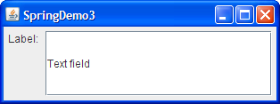
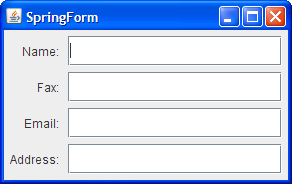

# 如何使用 SpringLayout

> 原文： [https://docs.oracle.com/javase/tutorial/uiswing/layout/spring.html](https://docs.oracle.com/javase/tutorial/uiswing/layout/spring.html)

* * *

**Note:** This lesson covers writing layout code by hand, which can be challenging. If you are not interested in learning all the details of layout management, you might prefer to use the `GroupLayout` layout manager combined with a builder tool to lay out your GUI. One such builder tool is the [NetBeans IDE](../learn/index.html). Otherwise, if you want to code by hand and do not want to use `GroupLayout`, then `GridBagLayout` is recommended as the next most flexible and powerful layout manager.

* * *

如果您对使用 JavaFX 创建 GUI 感兴趣，请参阅[在 JavaFX](https://docs.oracle.com/javase/8/javafx/layout-tutorial/index.html) 中使用布局。

在 JDK 1.4 版中添加了 [`SpringLayout`](https://docs.oracle.com/javase/8/docs/api/javax/swing/SpringLayout.html) 类以支持 GUI 构建器中的布局。 `SpringLayout`是一个非常灵活的布局管理器，可以模拟其他布局管理器的许多功能。 `SpringLayout`是非常低级的，因此您实际上只应该将它与 GUI 构建器一起使用，而不是尝试手动编写弹簧布局管理器。

本节首先介绍一个简单的示例，其中显示了创建第一个弹簧布局时需要记住的所有事项 - 以及忘记它们时会发生什么！稍后它介绍了实用方法，可以让您在几种不同类型的网格中布置组件。

以下是我们将介绍的一些布局图片：


Spring 布局通过在组件边缘之间定义方向关系或 _ 约束 _ 来完成它们的工作。例如，您可以定义一个组件的左边缘与另一个组件的右边缘相距固定距离（例如 5 个像素）。

在`SpringLayout`中，每条边的位置取决于另一条边的位置。如果随后添加约束以为边创建新绑定，则先前的绑定将被丢弃，并且边仍然依赖于单个边。

与许多布局管理器不同，`SpringLayout`不会自动设置它管理的组件的位置。如果您手动编写使用`SpringLayout`的 GUI，请记住通过约束西/东和北/南位置来初始化组件位置。根据您使用的约束，您可能还需要显式设置容器的大小。

组件定义 _edge_ 属性，这些属性由`Spring`实例连接。每个弹簧有四个属性 - 其 _ 最小 _，_ 首选 _ 和 _ 最大 _ 值及其实际（当前）_ 值 _。与每个组件相关联的弹簧被收集到`SpringLayout.Constraints`对象中。

`Spring`类的实例包含表征其行为的三个属性：最小值，首选值和最大值。这些属性中的每一个都可能涉及基于一系列规则定义其第四个值属性。

`Spring`类的实例可以被视为机械弹簧，当弹簧被压缩或拉伸远离其优选值时，该机械弹簧提供校正力。该力被建模为距离优选值的距离的线性函数，但具有两个不同的常数 - 一个用于压缩力，一个用于拉伸力。这些常数由弹簧的最小值和最大值指定，使得处于其最小值的弹簧产生与其处于其最大值时产生的力相等且相反的力。因此，优选值和最小值之间的差异表示弹簧可以被压缩的容易程度。其最大值和首选值之间的差异表明`Spring`可以延伸的容易程度。

基于此，可以将`SpringLayout`可视化为一组对象，这些对象通过其边缘上的一组弹簧连接。

本节将指导您完成为使用`SpringLayout`的容器指定约束的典型步骤。第一个示例 [`SpringDemo1.java`](../examples/layout/SpringDemo1Project/src/layout/SpringDemo1.java) 是一个非常简单的应用程序，它在由弹簧布局控制的内容窗格中具有标签和文本字段。这是相关代码：

```
public class SpringDemo1 {
    public static void main(String[] args) {
        ...
        Container contentPane = frame.getContentPane();
        SpringLayout layout = new SpringLayout();
        contentPane.setLayout(layout);
        contentPane.add(new JLabel("Label: "));
        contentPane.add(new JTextField("Text field", 15));
        ...
        frame.pack();
        frame.setVisible(true);
    }
}

```

单击“启动”按钮以使用 [Java™Web Start](http://www.oracle.com/technetwork/java/javase/javawebstart/index.html) （[下载 JDK 7 或更高版本](http://www.oracle.com/technetwork/java/javase/downloads/index.html)）运行 SpringDemo1。或者，要自己编译并运行示例，请参考[示例索引](../examples/layout/index.html#SpringDemo1)。

[](https://docs.oracle.com/javase/tutorialJWS/samples/uiswing/SpringDemo1Project/SpringDemo1.jnlp)

这是 GUI 首次出现时的样子：


以下是调整大小时的样子：


显然，我们有一些问题。框架不仅太小，而且即使调整大小，组件也都位于（0,0）。发生这种情况是因为我们没有设置弹簧来指定组件的位置和容器的宽度。一个小小的安慰是至少组件处于它们的首选尺寸 - 我们从`SpringLayout`为每个组件创建的默认弹簧中免费获得。

我们的下一个例子 [`SpringDemo2.java`](../examples/layout/SpringDemo2Project/src/layout/SpringDemo2.java) 通过指定每个组件的位置来改善这种情况。单击 Launch 按钮使用 [Java™Web Start](http://www.oracle.com/technetwork/java/javase/javawebstart/index.html) 运行 SpringDemo2（[下载 JDK 7 或以后](http://www.oracle.com/technetwork/java/javase/downloads/index.html)）。或者，要自己编译并运行示例，请参考[示例索引](../examples/layout/index.html#SpringDemo2)。

[](https://docs.oracle.com/javase/tutorialJWS/samples/uiswing/SpringDemo2Project/SpringDemo2.jnlp)

在这个例子中，我们将指定组件应该出现在一行中，它们之间有 5 个像素。以下代码指定标签的位置：

```
//Adjust constraints for the label so it's at (5,5).
layout.putConstraint(SpringLayout.WEST, label,
                     5,
                     SpringLayout.WEST, contentPane);
layout.putConstraint(SpringLayout.NORTH, label,
                     5,
                     SpringLayout.NORTH, contentPane);

```

第一个`putConstraint`调用指定标签的左（西）边缘应距其容器的左边缘 5 个像素。这转换为 _x_ 坐标为 5.第二个`putConstraint`调用在标签的顶部（北部）边缘与其容器之间建立类似的关系，从而产生 _y_ 坐标 5。

以下是设置文本字段位置的代码：

```
//Adjust constraints for the text field so it's at
//(<label's right edge> + 5, 5).
layout.putConstraint(SpringLayout.WEST, textField,
                     5,
                     SpringLayout.EAST, label);
layout.putConstraint(SpringLayout.NORTH, textField,
                     5,
                     SpringLayout.NORTH, contentPane);

```

第一个`putConstraint`调用使文本字段的左（西）边缘距标签的右（东）边缘 5 个像素。第二个`putConstraint`调用就像第一个代码段中的第二个调用一样，具有将组件的 _y_ 坐标设置为 5 的相同效果。

前面的例子仍然存在容器太小的问题。但是当我们调整窗口大小时，组件位于正确的位置：


为了使容器最初以正确的尺寸显示，我们需要设置定义容器本身的右（东）和底（南）边缘的弹簧。默认情况下，没有设置右侧和底部容器边缘的约束。通过设置这些约束来定义容器的大小。 [`SpringDemo3.java`](../examples/layout/SpringDemo3Project/src/layout/SpringDemo3.java) 显示了如何执行此操作。单击“启动”按钮以使用 [Java™Web Start](http://www.oracle.com/technetwork/java/javase/javawebstart/index.html) （[下载 JDK 7 或更高版本](http://www.oracle.com/technetwork/java/javase/downloads/index.html)）运行 SpringDemo3。或者，要自己编译并运行示例，请参考[示例索引](../examples/layout/index.html#SpringDemo3)。

[](https://docs.oracle.com/javase/tutorialJWS/samples/uiswing/SpringDemo3Project/SpringDemo3.jnlp)

以下是设置容器弹簧的代码：

```
layout.putConstraint(SpringLayout.EAST, contentPane,
                     5,
                     SpringLayout.EAST, textField);
layout.putConstraint(SpringLayout.SOUTH, contentPane,
                     5,
                     SpringLayout.SOUTH, textField);

```

第一个`putConstraint`调用使容器的右边缘位于文本字段右边缘右侧 5 个像素处。第二个使其底部边缘超出最高组件的底部边缘 5 个像素（为简单起见，我们假设是文本字段）。

最后，窗口的大小合适：


当我们使窗口变大时，我们可以看到弹簧布局的运行，在可用组件之间分配额外的空间。



在这种情况下，弹簧布局选择为文本字段提供所有额外空间。虽然弹簧布局似乎对标签和文本字段的处理方式不同，但弹簧布局对任何 Swing 或 AWT 组件都没有特殊的了解。它依赖于组件的最小，首选和最大大小属性的值。下一节将讨论弹簧布局如何使用这些属性，以及它们为什么会导致不均匀的空间分布。

## 弹簧和组件尺寸

`SpringLayout`对象自动为`SpringLayout`控制的每个组件的高度和宽度安装`Spring`。这些弹簧基本上是组件的`getMinimumSize`，`getPreferredSize`和`getMaximumSize`方法的覆盖物。 “覆盖”是指不仅弹簧 _ 用这些方法中的适当值初始化 _，而且弹簧 _ 跟踪 _ 这些值。例如，表示组件宽度的`Spring`对象是一种特殊的弹簧，它只是将其实现委托给组件的相关大小方法。这样，随着组件特性的变化，弹簧与尺寸方法保持同步。

当组件的`getMaximumSize`和`getPreferredSize`方法返回相同的值时，`SpringLayout`将其解释为意味着不应该拉伸组件。 `JLabel`和`JButton`是以这种方式实现的组件的示例。因此，SpringDemo3 示例中的标签不会拉伸。

某些组件的`getMaximumSize`方法（如`JTextField`）返回值`Integer.MAX_VALUE`的最大大小的宽度和高度，表示组件可以增长到任何大小。因此，当放大 SpringDemo3 窗口时，`SpringLayout`会将所有额外空间分配给可以增长的唯一弹簧 - 确定文本字段大小的弹簧。

SpringDemo 示例使用`SpringLayout`方法`putConstraint`设置与每个组件关联的弹簧。 `putConstraint`方法是一种方便的方法，它允许您修改组件的约束，而无需使用完整的弹簧布局 API。这里，同样是来自`SpringDemo3`的代码设置标签的位置：

```
layout.putConstraint(SpringLayout.WEST, label,
                     5,
                     SpringLayout.WEST, contentPane);
layout.putConstraint(SpringLayout.NORTH, label,
                     5,
                     SpringLayout.NORTH, contentPane);

```

这是直接使用`SpringLayout.Constraints`和`Spring`类的等效代码：

```
SpringLayout.Constraints  contentPaneCons = 
        layout.getConstraints(contentPane);
contentPaneCons.setX(Spring.sum(Spring.constant(5),
                          contentPaneCons
                          .getConstraint(SpringLayout.WEST)));
contentPaneCons.setY(Spring.sum(Spring.constant(5),
                          contentPaneCons
                          .getConstraint(SpringLayout.NORTH)));

```

要查看转换为使用此 API 的整个演示，请查看 [`SpringDemo4.java`](../examples/layout/SpringDemo4Project/src/layout/SpringDemo4.java) 。该文件还包括设置容器大小的更精细（更长）的代码版本。单击“启动”按钮以使用 [Java™Web Start](http://www.oracle.com/technetwork/java/javase/javawebstart/index.html) （[下载 JDK 7 或更高版本](http://www.oracle.com/technetwork/java/javase/downloads/index.html)）运行 SpringDemo4。或者，要自己编译并运行示例，请参考[示例索引](../examples/layout/index.html#SpringDemo3)。

[](https://docs.oracle.com/javase/tutorialJWS/samples/uiswing/SpringDemo4Project/SpringDemo4.jnlp)

正如前面的片段所暗示的那样，`SpringLayout`和`SpringLayout.Constraints`倾向于使用不同的约定来描述弹簧。 `SpringLayout` API 使用边来定义其约束。弹簧连接边缘以建立它们之间的线性关系。边缘由组件定义，使用以下常量：

*   `SpringLayout.NORTH`指定组件边界矩形的上边缘。
*   `SpringLayout.SOUTH`指定组件边界矩形的下边缘。
*   `SpringLayout.EAST`指定组件边界矩形的右边缘。
*   `SpringLayout.WEST`指定组件边界矩形的左边缘。
*   `SpringLayout.BASELINE`指定组件的基线。
*   `SpringLayout.HORIZONTAL_CENTER`指定组件边界矩形的水平中心。
*   `SpringLayout.VERTICAL_CENTER`指定组件边界矩形的垂直中心。

边缘与`Spring`对象不同`SpringLayout.Constraints`类知道边缘，但只有`Spring`对象用于以下属性：

*   _x_
*   _y_
*   _ 宽度 _
*   _ 身高 _

每个`Constraints`对象在其弹簧和它们所代表的边之间保持以下关系：

```
 west = x
north = y
 east = x + width
south = y + height

```

如果你感到困惑，别担心。下一节将介绍可用于完成一些常见布局任务的实用程序方法，而无需了解有关 spring 布局 API 的任何信息。

因为`SpringLayout`类是为 GUI 构建器创建的，所以为布局设置单独的弹簧对于手动编码来说可能很麻烦。本节介绍了几种可用于安装在网格中布置一组组件所需的弹簧的方法。这些方法模拟`GridLayout`，`GridBagLayout`和`BoxLayout`类的一些特征。

这两种方法称为`makeGrid`和`makeCompactGrid`，在 [`SpringUtilities.java`](../examples/layout/SpringGridProject/src/layout/SpringUtilities.java) 中定义。这两种方法的工作原理是将组件组合成行和列，并使用`Spring.max`方法制作宽度或高度弹簧，使行或列足够大，以适应其中的所有组件。在`makeCompactGrid`方法中，相同的宽度或高度弹簧分别用于特定列或行中的所有组件。相反，在`makeGrid`方法中，宽度和高度弹簧由容器中的每个组件共享，强制它们的大小相同。此外，工厂方法由 [`Spring`](https://docs.oracle.com/javase/8/docs/api/javax/swing/Spring.html) 提供，用于创建不同类型的弹簧，包括依赖于其他弹簧的弹簧。

让我们看看这些方法的实际应用。我们在源文件 [`SpringGrid.java`](../examples/layout/SpringGridProject/src/layout/SpringGrid.java) 中实现的第一个示例在文本字段中显示一组数字。中心文本字段比其他字段宽得多。与`GridLayout`一样，有一个大的细胞迫使所有细胞同样大。单击“启动”按钮以使用 [Java™Web Start](http://www.oracle.com/technetwork/java/javase/javawebstart/index.html) （[下载 JDK 7 或更高版本](http://www.oracle.com/technetwork/java/javase/downloads/index.html)）运行 SpringGrid。或者，要自己编译并运行示例，请参考[示例索引](../examples/layout/index.html#SpringGrid)。

[](https://docs.oracle.com/javase/tutorialJWS/samples/uiswing/SpringGridProject/SpringGrid.jnlp)


以下是在 SpringGrid 中创建和布局文本字段的代码：

```
JPanel panel = new JPanel(new SpringLayout());
for (int i = 0; i < 9; i++) {
    JTextField textField = new JTextField(Integer.toString(i));
    ...//when i==4, put long text in the text field...
    panel.add(textField);
}
...
SpringUtilities.makeGrid(panel,
                         3, 3, //rows, cols
                         5, 5, //initialX, initialY
                         5, 5);//xPad, yPad

```

现在让我们看一下在源文件 [`SpringCompactGrid.java`](../examples/layout/SpringGridProject/src/layout/SpringCompactGrid.java) 中使用`makeCompactGrid`方法而不是`makeGrid`的示例。此示例显示了许多数字，以显示弹簧布局最小化所需空间的能力。单击 Launch 按钮以使用 [Java™Web Start](http://www.oracle.com/technetwork/java/javase/javawebstart/index.html) （[下载 JDK 7 或更高版本](http://www.oracle.com/technetwork/java/javase/downloads/index.html)）运行 SpringCompactGrid。或者，要自己编译并运行示例，请参考[示例索引](../examples/layout/index.html#SpringCompactGrid)。

[](https://docs.oracle.com/javase/tutorialJWS/samples/uiswing/SpringCompactGridProject/SpringCompactGrid.jnlp)

以下是 SpringCompactGrid GUI 的外观：


以下是在 SpringCompactGrid 中创建和布局文本字段的代码：

```
JPanel panel = new JPanel(new SpringLayout());

int rows = 10;
int cols = 10;
for (int r = 0; r < rows; r++) {
    for (int c = 0; c < cols; c++) {
        int anInt = (int) Math.pow(r, c);
        JTextField textField =
                new JTextField(Integer.toString(anInt));
        panel.add(textField);
    }
}

//Lay out the panel.
SpringUtilities.makeCompactGrid(panel, //parent
                                rows, cols,
                                3, 3,  //initX, initY
                                3, 3); //xPad, yPad

```

`makeCompactGrid`方法最方便的用途之一是将标签与组件相关联，其中标签位于一列中，组件位于另一列中。文件 [`SpringForm.java`](../examples/layout/SpringFormProject/src/layout/SpringForm.java) 以这种方式使用`makeCompactGrid`，如下图所示。


单击“启动”按钮以使用 [Java™Web Start](http://www.oracle.com/technetwork/java/javase/javawebstart/index.html) （[下载 JDK 7 或更高版本](http://www.oracle.com/technetwork/java/javase/downloads/index.html)）运行 SpringForm。或者，要自己编译并运行示例，请参考[示例索引](../examples/layout/index.html#SpringForm)。

[](https://docs.oracle.com/javase/tutorialJWS/samples/uiswing/SpringFormProject/SpringForm.jnlp)

以下是在 SpringForm 中创建和布局标签文本字段对的代码：

```
String[] labels = {"Name: ", "Fax: ", "Email: ", "Address: "};
int numPairs = labels.length;

//Create and populate the panel.
JPanel p = new JPanel(new SpringLayout());
for (int i = 0; i < numPairs; i++) {
    JLabel l = new JLabel(labels[i], JLabel.TRAILING);
    p.add(l);
    JTextField textField = new JTextField(10);
    l.setLabelFor(textField);
    p.add(textField);
}

//Lay out the panel.
SpringUtilities.makeCompactGrid(p,
                                numPairs, 2, //rows, cols
                                6, 6,        //initX, initY
                                6, 6);       //xPad, yPad

```

因为我们使用的是真正的布局管理器而不是绝对定位，所以布局管理器会动态响应所涉及组件的变化。例如，如果标签的名称已本地化，则弹簧布局会生成一个配置，根据需要为第一列提供更多或更少的空间。如下图所示，当窗口调整大小时，灵活调整大小的组件 - 文本字段 - 占用所有多余的空间，而标签则坚持他们需要的东西。



我们在 [`SpringBox.java`](../examples/layout/SpringBoxProject/src/layout/SpringBox.java) 中的`makeCompactGrid`方法的最后一个示例显示了一些配置为在一行中布局的按钮。单击“启动”按钮以使用 [Java™Web Start](http://www.oracle.com/technetwork/java/javase/javawebstart/index.html) （[下载 JDK 7 或更高版本](http://www.oracle.com/technetwork/java/javase/downloads/index.html)）运行 SpringBox。或者，要自己编译并运行示例，请参考[示例索引](../examples/layout/index.html#SpringBox)。

[](https://docs.oracle.com/javase/tutorialJWS/samples/uiswing/SpringBoxProject/SpringBox.jnlp)


请注意，在单行的情况下，行为几乎与`BoxLayout`的行为相同。不仅作为`BoxLayout`布置的组件会排列它们，但使用`SpringLayout`的容器的最小，首选和最大尺寸返回与`BoxLayout`相同的结果。这是对生成此布局的`makeCompactGrid`的调用：

```
//Lay out the buttons in one row and as many columns
//as necessary, with 6 pixels of padding all around.
SpringUtilities.makeCompactGrid(contentPane, 1,
                                contentPane.getComponentCount(),
                                6, 6, 6, 6);

```

让我们看一下当我们调整窗口大小时会发生什么。这是一个奇怪的特殊情况，值得注意，因为您可能会在第一个布局中偶然遇到它。


什么都没动！这是因为没有任何组件（按钮）或它们之间的间距被定义为可拉伸的。在这种情况下，弹簧布局计算父容器的最大大小，该大小等于其首选大小，这意味着父容器本身不可伸缩。如果 AWT 拒绝调整一个不可拉伸的窗口，但事实并非如此，那可能就不那么令人困惑了。布局管理器在这里不能做任何明智的事情，因为没有任何组件会占用所需的空间。它不会崩溃，而是什么都不做，将所有组件保留原样。

使用`SpringLayout`的 API 分布在三个类中：

*   [`SpringLayout`](#SpringLayout)
*   [`SpringLayout.Constraints`](#SpringLayout.Constraints)
*   [`Spring`](#Spring)


| 构造器或方法 | 目的 |
| --- | --- |
| [SpringLayout（）](https://docs.oracle.com/javase/8/docs/api/javax/swing/SpringLayout.html#SpringLayout--) | 创建`SpringLayout`实例。 |
| [SpringLayout.Constraints getConstraints（Component）](https://docs.oracle.com/javase/8/docs/api/javax/swing/SpringLayout.html#getConstraints-java.awt.Component-) | 获取与指定组件关联的约束（弹簧集）。 |
| [Spring getConstraint（String，Component）](https://docs.oracle.com/javase/8/docs/api/javax/swing/SpringLayout.html#getConstraint-java.lang.String-java.awt.Component-) | 获得元件边缘的弹簧。第一个参数指定边缘，并且必须是以下`SpringLayout`常量之一：`NORTH`，`SOUTH`，`EAST`或`WEST`。 |
| [void putConstraint（String，Component，int，String，Component）](https://docs.oracle.com/javase/8/docs/api/javax/swing/SpringLayout.html#putConstraint-java.lang.String-java.awt.Component-int-java.lang.String-java.awt.Component-)
[void putConstraint（String，Component，Spring，String，Component）](https://docs.oracle.com/javase/8/docs/api/javax/swing/SpringLayout.html#putConstraint-java.lang.String-java.awt.Component-javax.swing.Spring-java.lang.String-java.awt.Component-) | 用于定义两个组件的边缘之间的关系的便捷方法。前两个参数指定第一个组件及其受影响的边缘。最后两个参数指定第二个组件及其受影响的边缘。第三个参数指定确定两者之间距离的弹簧。当第三个参数是整数时，会创建一个常量弹簧以提供组件边缘之间的固定距离。 |


| 构造器或方法 | 目的 |
| --- | --- |
| [SpringLayout.Constraints（）](https://docs.oracle.com/javase/8/docs/api/javax/swing/SpringLayout.Constraints.html#SpringLayout.Constraints--)
[SpringLayout.Constraints（Spring，Spring）](https://docs.oracle.com/javase/8/docs/api/javax/swing/SpringLayout.Constraints.html#SpringLayout.Constraints-javax.swing.Spring-javax.swing.Spring-)
[SpringLayout.Constraints（Spring，Spring，Spring，Spring）](https://docs.oracle.com/javase/8/docs/api/javax/swing/SpringLayout.Constraints.html#SpringLayout.Constraints-javax.swing.Spring-javax.swing.Spring-javax.swing.Spring-javax.swing.Spring-) | 创建`SpringLayout.Constraints`实例。前两个参数（如果存在）分别指定 X 和 Y 弹簧。后两个参数（如果存在）分别指定高度和宽度弹簧。省略参数会导致相应的弹簧为`null`，`SpringLayout`通常会替换为合适的默认值。 |
| [Spring getConstraint（String）](https://docs.oracle.com/javase/8/docs/api/javax/swing/SpringLayout.Constraints.html#getConstraint-java.lang.String-)
[Spring getHeight（）](https://docs.oracle.com/javase/8/docs/api/javax/swing/SpringLayout.Constraints.html#getHeight--)
[Spring getWidth（）](https://docs.oracle.com/javase/8/docs/api/javax/swing/SpringLayout.Constraints.html#getWidth--)
[Spring getX（）](https://docs.oracle.com/javase/8/docs/api/javax/swing/SpringLayout.Constraints.html#getX--)
[Spring getY（）](https://docs.oracle.com/javase/8/docs/api/javax/swing/SpringLayout.Constraints.html#getY--)
[void setConstraint（String，Spring）](https://docs.oracle.com/javase/8/docs/api/javax/swing/SpringLayout.Constraints.html#setConstraint-java.lang.String-javax.swing.Spring-)
[void setHeight（Spring）](https://docs.oracle.com/javase/8/docs/api/javax/swing/SpringLayout.Constraints.html#setHeight-javax.swing.Spring-)
[void setWidth（Spring）](https://docs.oracle.com/javase/8/docs/api/javax/swing/SpringLayout.Constraints.html#setWidth-javax.swing.Spring-)
[void setX（Spring）](https://docs.oracle.com/javase/8/docs/api/javax/swing/SpringLayout.Constraints.html#setX-javax.swing.Spring-)
[void setY（Spring）](https://docs.oracle.com/javase/8/docs/api/javax/swing/SpringLayout.Constraints.html#setY-javax.swing.Spring-) | 获取或设置指定的弹簧。 `getConstraint`和`setConstraint`方法的字符串参数指定边名，并且必须是`SpringLayout`常量`NORTH`，`SOUTH`，`EAST`或`WEST`之一。 |


| 方法 | 目的 |
| --- | --- |
| [static Spring constant（int）](https://docs.oracle.com/javase/8/docs/api/javax/swing/Spring.html#constant-int-)
[static Spring constant（int，int，int）](https://docs.oracle.com/javase/8/docs/api/javax/swing/Spring.html#constant-int-int-int-) | Create a spring that does not track a component's sizes. The three-argument version creates a spring with its minimum, preferred, and maximum values set to the specified values, in that order. The one-argument version creates a spring with its minimum, preferred, and maximum values all set to the specified integer.尽管有这个名字，`constant`返回的泉水是可变的。为了使布局工作，`SpringLayout`可能被迫调整“恒定”弹簧。因此，除非（1）您确实希望弹簧始终精确相似，并且（2）其他弹簧在布局中提供一定的灵活性，否则应避免重复使用恒定弹簧。 |
| [静态弹簧和（Spring，Spring）](https://docs.oracle.com/javase/8/docs/api/javax/swing/Spring.html#sum-javax.swing.Spring-javax.swing.Spring-)
[静态弹簧最大值（弹簧，弹簧）](https://docs.oracle.com/javase/8/docs/api/javax/swing/Spring.html#max-javax.swing.Spring-javax.swing.Spring-)
[静态弹簧减去（弹簧）](https://docs.oracle.com/javase/8/docs/api/javax/swing/Spring.html#minus-javax.swing.Spring-) | 创建一个弹簧，这是一些数学操作的结果。 `sum`方法增加了两个弹簧。 `max`方法返回一个 spring，其值始终大于或等于两个参数的值。 `minus`方法返回一个在参数的反方向运行的弹簧。 `minus`方法可用于为`sum`方法创建参数，使您可以获得两个弹簧之间的差异。 |
| [int getMinimumValue（）](https://docs.oracle.com/javase/8/docs/api/javax/swing/Spring.html#getMinimumValue--)
[int getPreferredValue（）](https://docs.oracle.com/javase/8/docs/api/javax/swing/Spring.html#getPreferredValue--)
[int getMaximumValue（）](https://docs.oracle.com/javase/8/docs/api/javax/swing/Spring.html#getMaximumValue--) | 从弹簧中获取相应的值。对于自动跟踪组件的`SpringLayout`创建的弹簧，这些方法会调用组件的相应 `get _Xxx_ Size` 方法。 |
| [int getValue（）](https://docs.oracle.com/javase/8/docs/api/javax/swing/Spring.html#getValue--)
[setValue（int）](https://docs.oracle.com/javase/8/docs/api/javax/swing/Spring.html#setValue-int-) | 获取或设置弹簧的当前值。 |

下表列出了一些使用 spring 布局的示例。

| 例 | 在哪里描述 | 笔记 |
| :-- | :-- | :-- |
| [`SpringDemo3`](../examples/layout/index.html#SpringDemo3) | 这一页 | 使用`SpringLayout`创建一排均匀分布的自然尺寸组件。 |
| [`SpringDemo4`](../examples/layout/index.html#SpringDemo4) | 这一页 | 重新实现 SpringDemo3 直接使用`SpringLayout.Constraints`和`Spring`。 |
| [`SpringGrid`](../examples/layout/index.html#SpringGrid) | 这一页 | 使用`SpringLayout`和`makeGrid`实用程序方法创建一个所有组件大小相同的布局。 |
| [`SpringCompactGrid`](../examples/layout/index.html#SpringCompactGrid) | 这一页 | 使用`SpringLayout`和`makeCompactGrid`实用程序方法创建一个布局，其中一行中的所有组件具有相同的高度，并且列中的所有组件具有相同的宽度。 |
| [`SpringForm`](../examples/layout/index.html#SpringForm) | 这一页 | 使用`SpringLayout`和`makeCompactGrid`对齐标签文本字段对。 |
| [`SpringBox`](../examples/layout/index.html#SpringBox) | 这一页 | 使用`SpringLayout`和`makeCompactGrid`来展示布置单排元件，以及当没有弹簧可以生长时会发生什么。 |
| [`SpinnerDemo`](../components/../examples/components/index.html#SpinnerDemo) | [如何使用旋转器](../components/spinner.html) | 使用`SpringLayout`和`makeCompactGrid`布置标签 - 微调器对的行。 |
| [`TextInputDemo`](../components/../examples/components/index.html#TextInputDemo) | [如何使用格式化文本字段](../components/formattedtextfield.html) | 使用`SpringLayout`和`makeCompactGrid`布置标记组件的行。组件是文本字段，格式化文本字段和微调器的混合。 |