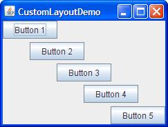

# 创建自定义布局管理器

> 原文： [https://docs.oracle.com/javase/tutorial/uiswing/layout/custom.html](https://docs.oracle.com/javase/tutorial/uiswing/layout/custom.html)

在开始创建自定义布局管理器之前，请确保没有现有布局管理器满足您的要求。特别是， [`GridBagLayout`](gridbag.html) ， [`SpringLayout`](spring.html) 和 [`BoxLayout`](box.html) 等布局管理器在很多情况下都足够灵活。您还可以从其他来源（例如来自 Internet）查找布局管理器。最后，您可以通过将组件分组到[面板](../components/panel.html)等容器中来简化布局。

* * *

**Note:** This lesson covers writing layout code by hand, which can be challenging. If you are not interested in learning all the details of layout management, you might prefer to use the `GroupLayout` layout manager combined with a builder tool to lay out your GUI. One such builder tool is the [NetBeans IDE](../learn/index.html). Otherwise, if you want to code by hand and do not want to use `GroupLayout`, then `GridBagLayout` is recommended as the next most flexible and powerful layout manager.

* * *

如果您对使用 JavaFX 创建 GUI 感兴趣，请参阅[在 JavaFX](https://docs.oracle.com/javase/8/javafx/layout-tutorial/index.html) 中使用布局。

要创建自定义布局管理器，必须创建一个实现 [`LayoutManager`](https://docs.oracle.com/javase/8/docs/api/java/awt/LayoutManager.html) 接口的类。您可以直接实现它，也可以实现其子接口 [`LayoutManager2`](https://docs.oracle.com/javase/8/docs/api/java/awt/LayoutManager2.html) 。

每个布局管理器必须至少实现`LayoutManager`接口所需的以下五种方法：

**`void addLayoutComponent(String, Component)`**

Called by the `Container` class's `add` methods. Layout managers that do not associate strings with their components generally do nothing in this method.

**`void removeLayoutComponent(Component)`**

Called by the `Container` methods `remove` and `removeAll`. Layout managers override this method to clear an internal state they may have associated with the `Component`.

**`Dimension preferredLayoutSize(Container)`**

Called by the `Container` class's `getPreferredSize` method, which is itself called under a variety of circumstances. This method should calculate and return the ideal size of the container, assuming that the components it contains will be at or above their preferred sizes. This method must take into account the container's internal borders, which are returned by the [`getInsets`](https://docs.oracle.com/javase/8/docs/api/java/awt/Container.html#getInsets--) method.

**`Dimension minimumLayoutSize(Container)`**

Called by the `Container` `getMinimumSize` method, which is itself called under a variety of circumstances. This method should calculate and return the minimum size of the container, assuming that the components it contains will be at or above their minimum sizes. This method must take into account the container's internal borders, which are returned by the `getInsets` method.

**`void layoutContainer(Container)`**

Called to position and size each of the components in the container. A layout manager's `layoutContainer` method does not actually draw components. It simply invokes one or more of each component's `setSize`, `setLocation`, and `setBounds` methods to set the component's size and position.

此方法必须考虑容器的内部边框，这些边框由`getInsets`方法返回。如果合适，还应考虑容器的方向（由 [`getComponentOrientation`](https://docs.oracle.com/javase/8/docs/api/java/awt/Component.html#getComponentOrientation--) 方法返回）。您不能假设在调用`layoutContainer`之前将调用`preferredLayoutSize`或`minimumLayoutSize`方法。

除了实现前五种方法外，布局管理器通常至少实现一个公共构造函数和`toString`方法。

如果您希望支持组件约束，最大大小或对齐，那么布局管理器应该实现`LayoutManager2`接口。事实上，由于这些原因，几乎所有现代布局管理者都需要实现`LayoutManager2`。该接口为`LayoutManager`所需的方法添加了五种方法：

*   `addLayoutComponent(Component, Object)`
*   `getLayoutAlignmentX(Container)`
*   `getLayoutAlignmentY(Container)`
*   `invalidateLayout(Container)`
*   `maximumLayoutSize(Container)`

在这些方法中，最重要的是`addLayoutComponent(Component, Object)`和`invalidateLayout(Container)`。 `addLayoutComponent`方法用于使用指定的约束对象向布局添加组件。 `invalidateLayout`方法用于使布局无效，因此如果布局管理器具有缓存信息，则应该丢弃该信息。有关`LayoutManager2`的更多信息，请参阅 [`LayoutManager2`](https://docs.oracle.com/javase/8/docs/api/java/awt/LayoutManager2.html) API 文档。

最后，无论何时创建自定义布局管理器，都应该注意保持对不再是`Container`子代的`Component`实例的引用。即，布局管理器应覆盖`removeLayoutComponent`以清除与`Component`相关的任何缓存状态。

## 自定义布局的示例

示例`CustomLayoutDemo`使用名为`DiagonalLayout`的自定义布局管理器。您可以在 [`DiagonalLayout.java`](../examples/layout/CustomLayoutDemoProject/src/layout/DiagonalLayout.java) 中找到布局管理器的源代码。 `DialogLayout`从左到右对角排列组件，每行一个组件。这是 CustomLayoutDemo 的图片，使用`DialogLayout`布置五个按钮。

单击启动按钮以使用 [Java™Web Start](http://www.oracle.com/technetwork/java/javase/javawebstart/index.html) （[下载 JDK 7 或更高版本](http://www.oracle.com/technetwork/java/javase/downloads/index.html)）运行`CustomLayoutDemo`。或者，要自己编译并运行示例，请参考[示例索引](../examples/layout/index.html#CustomLayoutDemo)。

