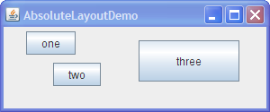

# 没有布局管理器（绝对定位）

> 原文： [https://docs.oracle.com/javase/tutorial/uiswing/layout/none.html](https://docs.oracle.com/javase/tutorial/uiswing/layout/none.html)

虽然可以不使用布局管理器，但是如果可能的话，应该使用布局管理器。布局管理器可以更轻松地调整依赖于外观的组件外观，不同的字体大小，容器的大小变化以及不同的区域设置。布局管理器也可以被其他容器以及其他程序轻松地重用。

* * *

**Note:** This lesson covers writing layout code by hand, which can be challenging. If you are not interested in learning all the details of layout management, you might prefer to use the `GroupLayout` layout manager combined with a builder tool to lay out your GUI. One such builder tool is the [NetBeans IDE](../learn/index.html). Otherwise, if you want to code by hand and do not want to use `GroupLayout`, then `GridBagLayout` is recommended as the next most flexible and powerful layout manager.

* * *

如果您对使用 JavaFX 创建 GUI 感兴趣，请参阅[在 JavaFX](https://docs.oracle.com/javase/8/javafx/layout-tutorial/index.html) 中使用布局。

如果容器包含大小不受容器大小影响的组件，或者字体，外观或语言更改，那么绝对定位可能有意义。包含[内部框架](../components/internalframe.html)的桌面窗格属于此类别。内部框架的大小和位置不直接取决于桌面窗格的大小。程序员确定桌面窗格内部框架的初始大小和位置，然后用户可以移动或调整框架大小。在这种情况下，布局管理器是不必要的。

绝对定位可能有意义的另一种情况是自定义容器执行容器特有的大小和位置计算，并且可能需要了解容器的专用状态。这是[分割窗格](../components/splitpane.html)的情况。

在没有布局管理器的情况下创建容器涉及以下步骤。

1.  通过调用`setLayout(null)`将容器的布局管理器设置为 null。
2.  为每个容器的子项调用`Component`类的`setbounds`方法。
3.  调用`Component`类的`repaint`方法。

但是，如果调整包含容器的窗口大小，则使用绝对定位的容器创建容器会导致问题。

以下是内容窗格使用绝对定位的框架的快照。

<center></center>

单击“启动”按钮以使用 [Java™Web Start](http://www.oracle.com/technetwork/java/javase/javawebstart/index.html) （[下载 JDK 7 或更高版本](http://www.oracle.com/technetwork/java/javase/downloads/index.html)）运行 AbsoluteLayoutDemo。或者，要自己编译并运行示例，请参考[示例索引](../examples/layout/index.html#AbsoluteLayoutDemo)。

[](https://docs.oracle.com/javase/tutorialJWS/samples/uiswing/AbsoluteLayoutDemoProject/AbsoluteLayoutDemo.jnlp)

其代码在 [`AbsoluteLayoutDemo.java`](../examples/layout/AbsoluteLayoutDemoProject/src/layout/AbsoluteLayoutDemo.java) 中。以下代码段显示了如何创建和布置内容窗格中的组件。

```
pane.setLayout(null);

JButton b1 = new JButton("one");
JButton b2 = new JButton("two");
JButton b3 = new JButton("three");

pane.add(b1);
pane.add(b2);
pane.add(b3);

Insets insets = pane.getInsets();
Dimension size = b1.getPreferredSize();
b1.setBounds(25 + insets.left, 5 + insets.top,
             size.width, size.height);
size = b2.getPreferredSize();
b2.setBounds(55 + insets.left, 40 + insets.top,
             size.width, size.height);
size = b3.getPreferredSize();
b3.setBounds(150 + insets.left, 15 + insets.top,
             size.width + 50, size.height + 20);

...//In the main method:
Insets insets = frame.getInsets();
frame.setSize(300 + insets.left + insets.right,
              125 + insets.top + insets.bottom);

```