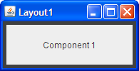
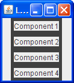
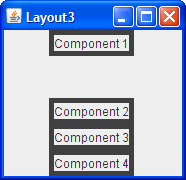
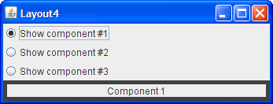
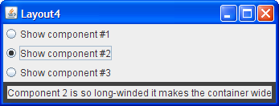

# 问题和练习：在容器中布置组件

> 原文： [https://docs.oracle.com/javase/tutorial/uiswing/QandE/questions-ch4.html](https://docs.oracle.com/javase/tutorial/uiswing/QandE/questions-ch4.html)

## 问题

在以下每个问题中，选择最适合所述布局的布局管理器。假设布局管理器控制的容器是`JPanel`。

1.容器有一个组件应占用尽可能多的空间

|  |  |

一个。 `BorderLayout`
b。 `GridLayout`
c。 `GridBagLayout`
d。 a 和 b
e。 b 和 c

2.容器有一排组件，应该以相同的尺寸显示，填充容器的整个区域。

 

一个。 `FlowLayout`
b。 `GridLayout`
c。 `BoxLayout`
d。 a 和 b

3.容器在列中显示许多组件，前两个组件之间有任何额外的空间。

|  |  |

一个。 `FlowLayout`
b。 `BoxLayout`
c。 `GridLayout`
d。 `BorderLayout`

4.容器可以在不同时间显示三个完全不同的组件，这可能取决于用户输入或程序状态。即使组件的大小不同，从一个组件切换到下一个组件也不应改变用于组件的空间量。

 

一个。 `SpringLayout`
b。 `BoxLayout`
c。 `CardLayout`
d。 `GridBagLayout`

## 演习

1.实现问题 1 中描述和显示的布局。

2.实现问题 2 中描述和显示的布局。

3.实现问题 3 中描述和显示的布局。

4.实现问题 4 中描述和显示的布局。

5.通过添加一行代码，使您为练习 2 编写的程序从右到左显示组件，而不是从左到右。

 [检查你的答案。](answers-ch4.html)