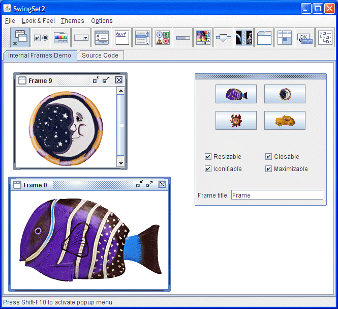
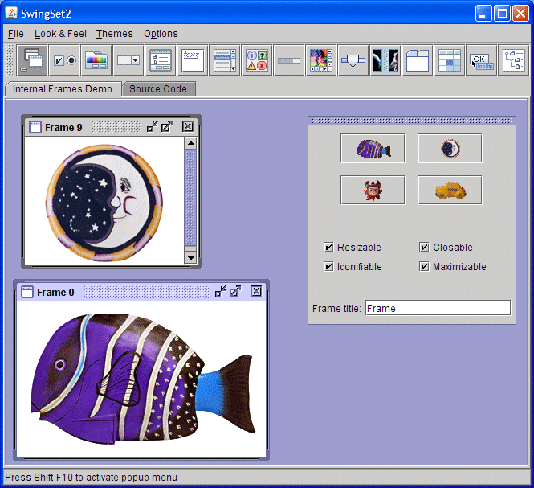

# 如何设置外观和感觉

> 原文： [https://docs.oracle.com/javase/tutorial/uiswing/lookandfeel/plaf.html](https://docs.oracle.com/javase/tutorial/uiswing/lookandfeel/plaf.html)

Swing 的体系结构旨在让您可以更改应用程序 GUI 的“外观”（L&amp; F）（参见 [Swing 架构概述](http://www.oracle.com/technetwork/java/architecture-142923.html)）。 “外观”指的是 GUI 小部件的外观（更正式地说，`JComponents`），“感觉”指的是小部件的行为方式。

Swing 的体系结构通过将每个组件分成两个不同的类来实现多个 L&amp; Fs：`JComponent`子类和相应的`ComponentUI`子类。例如，每个`JList`实例都具有`ListUI`的具体实现（`ListUI`扩展`ComponentUI`）。 `ComponentUI`子类在 Swing 的文档中以各种名称引用 - “UI”，“组件 UI”，“UI 委托”和“外观委托”都用于标识`ComponentUI`子类。

大多数开发人员永远不需要直接与 UI 委托进行交互。在大多数情况下，UI 委托由`JComponent`子类在内部用于关键功能，`JComponent`子类提供的覆盖方法用于对 UI 委托的所有访问。例如，`JComponent`子类中的所有绘制都委托给 UI 委托。通过委托绘画，“外观”可以根据 L&amp; F 而变化。

每个 L&amp; F 都有责任为 Swing 定义的每个`ComponentUI`子类提供具体的实现。例如，Java 外观创建`MetalTabbedPaneUI`的实例以为`JTabbedPane`提供 L&amp; F.实际创建的 UI 委托由 Swing 为您处理 - 在大多数情况下，您永远不需要直接与 UI 委托交互。

本节的其余部分讨论以下主题：

*   [外观和感觉](#available)
*   [以编程方式设置外观](#programmatic)
*   [指定外观：命令行](#commandLine)
*   [指定外观：swing.properties](#properties)
*   [UI 管理器如何选择外观](#steps)
*   [启动后改变外观](#dynamic)
*   [一个例子](#example)
*   [主题](#themes)
*   [SwingSet2 演示程序](#swingset2)

Sun 的 JRE 提供以下 L&amp; Fs：

1.  `CrossPlatformLookAndFeel` - 这是所有平台上看起来相同的“Java L&amp; F”（也称为“金属”）。它是 Java API（`javax.swing.plaf.metal`）的一部分，如果您在代码中不执行任何操作来设置不同的 L&amp; F，则默认使用它。

2.  `SystemLookAndFeel` - 在那里，应用程序使用 L&amp; F，它是运行它的系统的原生。系统 L&amp; F 在运行时确定，其中应用程序要求系统返回适当的 L&amp; F 的名称。

3.  Synth-使用 XML 文件创建自己的外观的基础。

4.  多路复用 - 一种让 UI 方法同时委托给许多不同外观实现的方法。

对于 Linux 和 Solaris，如果安装了 GTK + 2.2 或更高版本，则系统 L&amp; Fs 为“GTK +”，否则为“Motif”。对于 Windows，系统 L&amp; F 是“Windows”，它模仿运行经典 Windows，XP 或 Vista 的特定 Windows 操作系统的 L&amp; F. GTK +，Motif 和 Windows L&amp; Fs 由 Sun 提供，随 Java SDK 和 JRE 一起提供，尽管它们不是 Java API 的一部分。

Apple 提供自己的 JVM，其中包括其专有的 L&amp; F.

总之，当您使用`SystemLookAndFeel`时，您会看到以下内容：

| 平台 | 外观和感觉 |
| --- | --- |
| Solaris，Linux，GTK + 2.2 或更高版本 | GTK + |
| 其他 Solaris，Linux | 主题 |
| IBM UNIX | IBM * |
| HP UX | 生命值* |
| 经典 Windows | 视窗 |
| Windows XP | Windows XP |
| Windows Vista | Windows Vista |
| 苹果 | 苹果* |

*由系统供应商提供。

您没有在 API 中看到系统 L&amp; F.它需要的 GTK +，Motif 和 Windows 软件包随 Java SDK 一起提供：

```
com.sun.java.swing.plaf.gtk.GTKLookAndFeel
com.sun.java.swing.plaf.motif.MotifLookAndFeel
com.sun.java.swing.plaf.windows.WindowsLookAndFeel

```

请注意，路径包括`java`，而不是`javax`。

* * *

**Note:** The GTK+ L&F will only run on UNIX or Linux systems with GTK+ 2.2 or later installed, while the Windows L&F runs only on Windows systems. Like the Java (Metal) L&F, the Motif L&F will run on any platform.

* * *

所有 Sun 的 L&amp; Fs 都有很多共性。这种通用性在 API 中的`Basic`外观中定义（`javax.swing.plaf.basic`）。 Motif 和 Windows L&amp; Fs 都是通过扩展`javax.swing.plaf.basic`中的 UI 委托类来构建的（可以通过做同样的事情来构建自定义 L&amp; F）。没有扩展就不使用“基本”L&amp; F.

在 API 中，您将看到四个 L&amp; F 包：

*   `javax.swing.plaf.basic` -basic UI 代表在创建自定义 L&amp; F 时进行扩展

*   `javax.swing.plaf.metal` -Java L&amp; F，也称为 CrossPlatform L&amp; F（“Metal”是该 L&amp; F 的 Sun 项目名称）此 L&amp; F 的当前默认“主题”（下面讨论）是“海洋，所以这通常被称为海洋 L&amp; F.

*   `javax.swing.plaf.multi` - 一种多路复用的外观，允许 UI 方法同时委托给许多外观实现。它可以用于增强特定外观的感觉，例如使用 L&amp; F，它在 Windows 外观和感觉之上提供音频提示。这是一种创造残疾人无障碍外观的方式。

*   `javax.swing.plaf.synth` - 使用 XML 文件轻松配置 L&amp; F（在本课的下一节中讨论）

```
java -classpath .;C:\java\lafdir\customlaf.jar YourSwingApplication

```

一旦外部 L&amp; F 进入您的程序类路径，您的程序就可以像 Java 平台附带的任何 L&amp; F 一样使用它。

* * *

**Note:** If you are going to set the L&F, you should do it as the very first step in your application. Otherwise you run the risk of initializing the Java L&F regardless of what L&F you've requested. This can happen inadvertently when a static field references a Swing class, which causes the L&F to be loaded. If no L&F has yet been specified, the default L&F for the JRE is loaded. For Sun's JRE the default is the Java L&F, for Apple's JRE the Apple L&F, and so forth.

* * *

Swing 组件使用的 L&amp; F 通过`javax.swing`包中的`UIManager`类指定。每当创建 Swing 组件时，组件都会向 UI 管理器询问实现组件 L&amp; F 的 UI 委托。例如，每个`JLabel`构造函数向 UI 管理器查询适用于标签的 UI 委托对象。然后，它使用该 UI 委托对象来实现其所有绘图和事件处理。

要以编程方式指定 L&amp; F，请使用`UIManager.setLookAndFeel()`方法，并将`LookAndFeel`的相应子类的完全限定名称作为其参数。例如，以下代码段中的粗体代码使程序使用跨平台 Java L&amp; F：

```
public static void main(String[] args) {
    try {
            // Set cross-platform Java L&F (also called "Metal")
        UIManager.setLookAndFeel(
            UIManager.getCrossPlatformLookAndFeelClassName());
    } 
    catch (UnsupportedLookAndFeelException e) {
       // handle exception
    }
    catch (ClassNotFoundException e) {
       // handle exception
    }
    catch (InstantiationException e) {
       // handle exception
    }
    catch (IllegalAccessException e) {
       // handle exception
    }

    new SwingApplication(); //Create and show the GUI.
}

```

或者，此代码使程序使用系统 L&amp; F：

```
public static void main(String[] args) {
    try {
            // Set System L&F
        UIManager.setLookAndFeel(
            UIManager.getSystemLookAndFeelClassName());
    } 
    catch (UnsupportedLookAndFeelException e) {
       // handle exception
    }
    catch (ClassNotFoundException e) {
       // handle exception
    }
    catch (InstantiationException e) {
       // handle exception
    }
    catch (IllegalAccessException e) {
       // handle exception
    }

    new SwingApplication(); //Create and show the GUI.
}

```

您还可以使用外观的实际类名作为`UIManager.setLookAndFeel()`的参数。例如，

```
// Set cross-platform Java L&F (also called "Metal")
UIManager.setLookAndFeel("javax.swing.plaf.metal.MetalLookAndFeel");

```

要么

```
// Set Motif L&F on any platform
UIManager.setLookAndFeel("com.sun.java.swing.plaf.motif.MotifLookAndFeel");

```

您不限于前面的参数。您可以为程序类路径中的任何 L&amp; F 指定名称。

您可以使用`-D`标志在命令行指定 L&amp; F 来设置`swing.defaultlaf`属性。例如：

```
java -Dswing.defaultlaf=com.sun.java.swing.plaf.gtk.GTKLookAndFeel MyApp

java -Dswing.defaultlaf=com.sun.java.swing.plaf.windows.WindowsLookAndFeel MyApp

```

指定当前 L&amp; F 的另一种方法是使用`swing.properties`文件来设置`swing.defaultlaf`属性。您可能需要创建的此文件位于 Sun Java 版本的`lib`目录中（其他 Java 供应商可能使用不同的位置）。例如，如果您在 `_javaHomeDirectory_ \ bin` 中使用 Java 解释器，则`swing.properties`文件（如果存在）位于 `_javaHomeDirectory_ 中] \ lib` 。以下是 [`swing.properties`](swing.properties) 文件内容的示例：

```
# Swing properties
swing.defaultlaf=com.sun.java.swing.plaf.windows.WindowsLookAndFeel

```

以下是 UI 管理器需要设置 L&amp; F 时出现的外观确定步骤：

1.  如果程序在需要外观之前设置 L&amp; F，则 UI 管理器尝试创建指定的外观类的实例。如果成功，所有组件都使用 L&amp; F.
2.  如果程序未成功指定 L&amp; F，则 UI 管理器使用由`swing.defaultlaf`属性指定的 L&amp; F.如果在命令行的`swing.properties`文件 _ 和 _ 中都指定了该属性，则命令行定义优先。
3.  如果这些步骤都没有产生有效的 L&amp; F，则 Sun 的 JRE 使用 Java L&amp; F.其他供应商，如 Apple，将使用其默认的 L&amp; F.

即使在程序的 GUI 可见之后，您也可以使用`setLookAndFeel`更改 L&amp; F.为了使现有组件反映新的 L&amp; F，每个顶级容器调用一次`SwingUtilities` `updateComponentTreeUI`方法。然后，您可能希望调整每个顶级容器的大小以反映其包含的组件的新大小。例如：

```
UIManager.setLookAndFeel(lnfName);
SwingUtilities.updateComponentTreeUI(frame);
frame.pack();

```

在以下示例中，`LookAndFeelDemo.java`，您可以尝试不同的外观和感觉。该程序使用按钮和标签创建一个简单的 GUI。每次单击该按钮，标签都会递增。

您可以通过更改第 18 行的`LOOKANDFEEL`常量来更改 L​​&amp; F.前面几行的注释告诉您可接受的值：

```
    // Specify the look and feel to use by defining the LOOKANDFEEL constant
    // Valid values are: null (use the default), "Metal", "System", "Motif",
    // and "GTK"
    final static String LOOKANDFEEL = "Motif";

```

这里常量设置为“Motif”，这是一个可在任何平台上运行的 L&amp; F（默认情况下为“Metal”）。 “GTK +”不能在 Windows 上运行，“Windows”只能在 Windows 上运行。如果您选择不会运行的 L&amp; F，您将获得 Java 或 Metal，L&amp; F.

在实际设置 L&amp; F 的代码部分中，您将看到几种不同的设置方式，如上所述：

```
if (LOOKANDFEEL.equals("Metal")) {
   lookAndFeel = UIManager.getCrossPlatformLookAndFeelClassName();
   //  an alternative way to set the Metal L&F is to replace the 
   // previous line with:
   // lookAndFeel = "javax.swing.plaf.metal.MetalLookAndFeel";

```

您可以通过对两个备选方案进行注释/取消注释来验证这两个参数是否有效。

这是 [`LookAndFeelDemo`](../examples/lookandfeel/LookAndFeelDemoProject/src/lookandfeel/LookAndFeelDemo.java) 源文件的列表：

```
package lookandfeel;

import javax.swing.*;          
import java.awt.*;
import java.awt.event.*;
import javax.swing.plaf.metal.*;

public class LookAndFeelDemo implements ActionListener {
    private static String labelPrefix = "Number of button clicks: ";
    private int numClicks = 0;
    final JLabel label = new JLabel(labelPrefix + "0    ");

    // Specify the look and feel to use by defining the LOOKANDFEEL constant
    // Valid values are: null (use the default), "Metal", "System", "Motif",
    // and "GTK"
    final static String LOOKANDFEEL = "Metal";

    // If you choose the Metal L&F, you can also choose a theme.
    // Specify the theme to use by defining the THEME constant
    // Valid values are: "DefaultMetal", "Ocean",  and "Test"
    final static String THEME = "Test";

    public Component createComponents() {
        JButton button = new JButton("I'm a Swing button!");
        button.setMnemonic(KeyEvent.VK_I);
        button.addActionListener(this);
        label.setLabelFor(button);

        JPanel pane = new JPanel(new GridLayout(0, 1));
        pane.add(button);
        pane.add(label);
        pane.setBorder(BorderFactory.createEmptyBorder(
                                        30, //top
                                        30, //left
                                        10, //bottom
                                        30) //right
                                        );

        return pane;
    }

    public void actionPerformed(ActionEvent e) {
        numClicks++;
        label.setText(labelPrefix + numClicks);
    }

    private static void initLookAndFeel() {
        String lookAndFeel = null;

        if (LOOKANDFEEL != null) {
            if (LOOKANDFEEL.equals("Metal")) {
                lookAndFeel = UIManager.getCrossPlatformLookAndFeelClassName();
              //  an alternative way to set the Metal L&F is to replace the 
              // previous line with:
              // lookAndFeel = "javax.swing.plaf.metal.MetalLookAndFeel";

            }

            else if (LOOKANDFEEL.equals("System")) {
                lookAndFeel = UIManager.getSystemLookAndFeelClassName();
            } 

            else if (LOOKANDFEEL.equals("Motif")) {
                lookAndFeel = "com.sun.java.swing.plaf.motif.MotifLookAndFeel";
            } 

            else if (LOOKANDFEEL.equals("GTK")) { 
                lookAndFeel = "com.sun.java.swing.plaf.gtk.GTKLookAndFeel";
            } 

            else {
                System.err.println("Unexpected value of LOOKANDFEEL specified: "
                                   + LOOKANDFEEL);
                lookAndFeel = UIManager.getCrossPlatformLookAndFeelClassName();
            }

            try {

                UIManager.setLookAndFeel(lookAndFeel);

                // If L&F = "Metal", set the theme

                if (LOOKANDFEEL.equals("Metal")) {
                  if (THEME.equals("DefaultMetal"))
                     MetalLookAndFeel.setCurrentTheme(new DefaultMetalTheme());
                  else if (THEME.equals("Ocean"))
                     MetalLookAndFeel.setCurrentTheme(new OceanTheme());
                  else
                     MetalLookAndFeel.setCurrentTheme(new TestTheme());

                  UIManager.setLookAndFeel(new MetalLookAndFeel()); 
                }	

            } 

            catch (ClassNotFoundException e) {
                System.err.println("Couldn't find class for specified look and feel:"
                                   + lookAndFeel);
                System.err.println("Did you include the L&F library in the class path?");
                System.err.println("Using the default look and feel.");
            } 

            catch (UnsupportedLookAndFeelException e) {
                System.err.println("Can't use the specified look and feel ("
                                   + lookAndFeel
                                   + ") on this platform.");
                System.err.println("Using the default look and feel.");
            } 

            catch (Exception e) {
                System.err.println("Couldn't get specified look and feel ("
                                   + lookAndFeel
                                   + "), for some reason.");
                System.err.println("Using the default look and feel.");
                e.printStackTrace();
            }
        }
    }

    private static void createAndShowGUI() {
        //Set the look and feel.
        initLookAndFeel();

        //Make sure we have nice window decorations.
        JFrame.setDefaultLookAndFeelDecorated(true);

        //Create and set up the window.
        JFrame frame = new JFrame("SwingApplication");
        frame.setDefaultCloseOperation(JFrame.EXIT_ON_CLOSE);

        LookAndFeelDemo app = new LookAndFeelDemo();
        Component contents = app.createComponents();
        frame.getContentPane().add(contents, BorderLayout.CENTER);

        //Display the window.
        frame.pack();
        frame.setVisible(true);
    }

    public static void main(String[] args) {
        //Schedule a job for the event dispatch thread:
        //creating and showing this application's GUI.
        javax.swing.SwingUtilities.invokeLater(new Runnable() {
            public void run() {
                createAndShowGUI();
            }
        });
    }
}

```

介绍主题是一种轻松改变跨平台 Java（金属）外观和颜色的颜色和字体的方法。在上面列出的示例程序`LookAndfeelDemo.java`中，您可以通过将第 23 行的`THEME`常量设置为以下三个值之一来更改 Metal L&amp; F 的主题：

*   `DefaultMetal`
*   `Ocean`
*   `Test`

`Ocean`，比纯金属外观略微柔和，自 Java SE 5 以来一直是 Metal（Java）L&amp; F 的默认主题。尽管它的名称，`DefaultMetal`不是 Metal 的默认主题（它在 Java SE 5 之前，它解释了它的名字）。 `Test`主题是 [``TestTheme.java``](../examples/lookandfeel/LookAndFeelDemoProject/src/lookandfeel/TestTheme.java)中定义的主题，您必须使用`LookAndfeelDemo.java`进行编译。正如它所写，`TestTheme.java`设置三原色（有些奇怪的结果）。您可以修改`TestTheme.java`来测试您喜欢的任何颜色。

设置主题的代码部分从`LookAndfeelDemo.java`的第 92 行开始。请注意，您必须使用 Metal L&amp; F 来设置主题。

```
 if (LOOKANDFEEL.equals("Metal")) {
    if (THEME.equals("DefaultMetal"))
       MetalLookAndFeel.setCurrentTheme(new DefaultMetalTheme());
    else if (THEME.equals("Ocean"))
       MetalLookAndFeel.setCurrentTheme(new OceanTheme());
    else
       MetalLookAndFeel.setCurrentTheme(new TestTheme());

    UIManager.setLookAndFeel(new MetalLookAndFeel()); 
 }      

```

当您下载 [JDK 和 JavaFX 演示和样本](http://www.oracle.com/technetwork/java/javase/downloads/index.html)包并打开它时，有一个`demo\jfc`文件夹包含一个名为`SwingSet2`的演示程序。该程序具有图形丰富的 GUI，允许您从菜单中更改外观。此外，如果您使用 Java（金属）外观，您可以选择各种不同的主题。各种主题的文件（例如，`RubyTheme.java`）可在`SwingSet2\src`文件夹中找到。

这是“海洋”主题，这是跨平台 Java（金属）外观的默认主题：



这是“钢铁”主题，这是跨平台 Java（金属）外观的原始主题：



要在安装了 JDK 的系统上运行`SwingSet2`演示程序，请使用以下命令：

```
java -jar SwingSet2.jar

```

这将为您提供默认主题 Ocean。

要获得金属 L&amp; F，请运行以下命令：

```
java -Dswing.metalTheme=steel -jar SwingSet2.jar

```