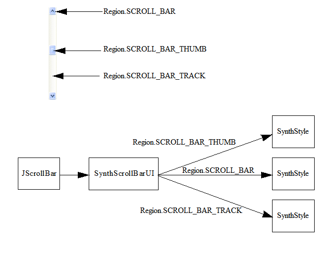
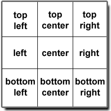

# 合成的外观和感觉

> 原文： [https://docs.oracle.com/javase/tutorial/uiswing/lookandfeel/synth.html](https://docs.oracle.com/javase/tutorial/uiswing/lookandfeel/synth.html)

创建自定义外观或修改现有外观可能是一项艰巨的任务。 [`javax.swing.plaf.synth`](https://docs.oracle.com/javase/8/docs/api/javax/swing/plaf/synth/package-summary.html) 软件包可用于创建自定义外观，而且工作量更少。您可以以编程方式或通过使用外部 XML 文件来创建 Synth 外观。下面的讨论专门用于使用外部 XML 文件创建 Synth 外观。 API 程序文档中讨论了以编程方式创建 Synth c。

使用 Synth 外观，您可以提供“外观”。 Synth 本身就提供了“感觉”。因此，您可以将 Synth L&amp; F 视为“皮肤”。

## 合成架构

每个组件的

Synth 的运行级别比组件更精细 - 这个粒度级别称为“区域”。每个组件都有一个或多个区域。许多组件只有一个区域，例如`JButton`。其他有多个区域，例如`JScrollBar`。 Synth 提供的每个`ComponentUIs`将`SynthStyle`与`ComponentUI`定义的每个区域相关联。例如，Synth 为`JScrollBar`定义了三个区域：轨道，拇指和滚动条本身。 Synd 的`ScrollBarUI`（为`JScrollBar`定义的`ComponentUI`子类）实现将`SynthStyle`与这些区域中的每一个相关联。

<center></center>

`SynthStyle`提供 Synth `ComponentUI`实现使用的样式信息。例如，`SynthStyle`定义前景色和背景色，字体信息等。此外，每个`SynthStyle`都有`SynthPainter`用于绘制区域。例如，`SynthPainter`定义了两种方法`paintScrollBarThumbBackground`和`paintScrollBarThumbBorder`，它们用于绘制滚动条拇指区域。

Synth 中的每个`ComponentUIs`使用`SynthStyleFactory`获得`SynthStyles`。有两种方法可以定义`SynthStyleFactory`：通过 Synth XML 文件或以编程方式。以下代码显示了如何加载指定 Synth-look 外观的 XML 文件，这将创建一个使用 XML 文件中的`SynthStyles`填充的`SynthStyleFactory`实现：

```
  SynthLookAndFeel laf = new SynthLookAndFeel();
  laf.load(MyClass.class.getResourceAsStream("laf.xml"), MyClass.class);
  UIManager.setLookAndFeel(laf);

```

程序化路线涉及创建`SynthStyleFactory`的实现，返回`SynthStyles`。以下代码创建一个自定义`SynthStyleFactory`，为按钮和树返回不同的`SynthStyles`：

```
 class MyStyleFactory extends SynthStyleFactory {
     public SynthStyle getStyle(JComponent c, Region id) {
         if (id == Region.BUTTON) {
             return buttonStyle;
         }
         else if (id == Region.TREE) {
             return treeStyle;
         }
         return defaultStyle;
     }
 }
 SynthLookAndFeel laf = new SynthLookAndFeel();
 UIManager.setLookAndFeel(laf);
 SynthLookAndFeel.setStyleFactory(new MyStyleFactory());

```

## XML 文件

可以在 [`javax.swing.plaf.synth/doc-files/synthFileFormat.html`中找到 Synth XML 文件的 DTD 说明。](https://docs.oracle.com/javase/8/docs/api/javax/swing/plaf/synth/doc-files/synthFileFormat.html)

加载 Synth 外观时，仅呈现具有定义（与区域绑定的“样式”，如下所述）的 GUI 组件（或区域）。任何组件都没有默认行为 - 没有 Synth XML 文件中的样式定义，GUI 是一个空白画布。

要指定组件（或区域）的呈现，您的 XML 文件必须包含&lt; style&gt;然后，_ 使用&lt; bind&gt;将 _ 绑定到该区域。元件。例如，让我们定义一个包含字体，前景色和背景色的样式，然后将该样式绑定到所有组件。在开发它时，在 Synth XML 文件中包含这样的元素是个好主意 - 那么，你还没有定义的任何组件至少会有颜色和字体：__

```
<synth>
  <style id="basicStyle">
    <font name="Verdana" size="16"/>
    <state>
      <color value="WHITE" type="BACKGROUND"/>
      <color value="BLACK" type="FOREGROUND"/>
    </state>
  </style>
  <bind style="basicStyle" type="region" key=".*"/>
</synth>

```

让我们分析一下这个样式定义：

1.  &lt; style&gt; element 是 Synth XML 文件的基本构建块。它包含描述区域渲染所需的所有信息。 &lt; style&gt; element 可以描述多个区域，就像这里所做的那样。但一般来说，最好创建一个&lt; style&gt;每个组件或区域的元素。请注意&lt; style&gt; element 被赋予一个标识符，字符串“basicStyle”。此标识符稍后将在&lt; bind&gt;中使用。元件。

2.  &lt; font&gt; &lt; style&gt;的元素 element 将字体设置为 Verdana，大小为 16。

3.  &lt; state&gt; &lt; style&gt;的元素元素将在下面讨论。 &lt; state&gt;区域的元素可以具有七个可能值中的一个或混合。如果未指定该值，则定义适用于所有状态，这是此处的意图。因此，“所有状态”的背景和前景色在此元素中定义。

4.  最后，&lt; style&gt;刚刚定义的标识符“basicStyle”的元素是 _ 绑定到所有区域的 _。 &lt; bind&gt; element 将“basicStyle”绑定到“region”类型。绑定适用于哪种区域类型由“key”属性给出，在这种情况下，“。*”是“all”的正则表达式。

在创建一些工作示例之前，让我们看一下 Synth XML 文件的各个部分。我们将从&lt; bind&gt;开始元素，显示给定的&lt; style&gt;应用于组件或区域。

## &lt; bind&gt;元件

每当一个&lt; style&gt;如果元素已定义，则必须在其生效之前将其绑定到一个或多个组件或区域。 &lt; bind&gt;元素用于此目的。它需要三个属性：

1.  `style`是先前定义的样式的唯一标识符。

2.  `type`是“名称”或“地区”。如果`type`是名称，请使用`component.getName()`方法获取名称。如果`type`是一个区域，请使用`javax.swing.plaf.synth`包中`Region`类中定义的适当常量。

3.  `key`是一个正则表达式，用于确定样式绑定到哪些组件或区域。

区域是一种识别组件或组件的一部分的方法。区域基于 [`Region`](https://docs.oracle.com/javase/8/docs/api/javax/swing/plaf/synth/Region.html) 类中的常量，通过去掉下划线进行修改：

例如，要标识 SPLIT_PANE 区域，您将使用 SPLITPANE，splitpane 或 SplitPane（不区分大小写）。

将样式绑定到某个区域时，该样式将应用于 _ 具有该区域的所有 _ 组件。您可以将样式绑定到多个区域，并且可以将多个样式绑定到区域。例如，

```
<style id="styleOne">
   <!-- styleOne definition goes here -->
</style>

<style id="styleTwo">
   <!-- styleTwo definition goes here -->
</style>

<bind style="styleOne" type="region" key="Button"/>
<bind style="styleOne" type="region" key="RadioButton"/>
<bind style="styleOne" type="region" key="ArrowButton"/>

<bind style="styleTwo" type="region" key="ArrowButton"/>

```

您可以绑定到各个命名组件，无论它们是 _ 还是 _ 绑定为区域。例如，假设您希望 GUI 中的“确定”和“取消”按钮与所有其他按钮的处理方式不同。首先，使用`component.setName()`方法给出确定和取消按钮名称。然后，您将定义三种样式：一种用于一般按钮（region =“Button”），一种用于 OK 按钮（name =“OK”），另一种用于 Cancel 按钮（name =“Cancel”）。最后，您将绑定这些样式，如下所示：

```
<bind style="styleButton" type="region" key="Button">
<bind style="styleOK" type="name" key="OK">
<bind style="styleCancel" type="name" key="Cancel">

```

结果，“OK”按钮被绑定到“styleButton”和“styleOK”，而“取消”按钮被绑定到“styleButton”和“styleCancel”。 “

当组件或区域绑定到多个样式时，将合并样式

* * *

**Note:** 

正如样式可以绑定到多个区域或名称一样，可以将多个样式绑定到区域或名称。这些多个样式将合并为区域或名称。优先级被赋予文件中稍后定义的样式。

* * *

## &lt; state&gt;元件

&lt; state&gt; element 允许您定义依赖于其“状态”的区域的外观。例如，您通常希望`PRESSED`按钮看起来与`ENABLED`状态下的按钮不同。 &lt; state&gt;有七个可能的值。 Synth XML DTD 中定义的。他们是：

1.  启用
2.  鼠标移到
3.  PRESSED
4.  禁用
5.  FOCUSED
6.  SELECTED
7.  默认

您还可以使用“和”分隔的复合状态，例如，ENABLED 和 FOCUSED。如果未指定值，则定义的外观将应用于所有状态。

例如，这是一种指定每个州画家的风格。所有按钮都以某种方式绘制，除非状态为“PRESSED”，在这种情况下，它们的绘制方式不同：

```
<style id="buttonStyle">
  <property key="Button.textShiftOffset" type="integer" value="1"/>
  <insets top="10" left="10" right="10" bottom="10"/>

  <state>
    <imagePainter method="buttonBackground" path="images/button.png"
                         sourceInsets="10 10 10 10"/>
  </state>
  <state value="PRESSED">
    <color value="#9BC3B1" type="BACKGROUND"/>
    <imagePainter method="buttonBackground" path="images/button2.png"
                        sourceInsets="10 10 10 10"/>
  </state>
</style>
<bind style="buttonStyle" type="region" key="Button"/>

```

忽略&lt; property&gt;和&lt; insets&gt;目前，您可以看到按下的按钮的颜色与未按下的按钮不同。

&lt; state&gt;使用的值是与区域状态最匹配的已定义状态。匹配由与区域状态匹配的值的数量确定。如果没有状态值匹配，则使用没有值的状态。如果有匹配，将选择具有最多个别匹配的状态。例如，以下代码定义了三种状态：

```
<state id="zero">
  <color value="RED" type="BACKGROUND"/>
</state>
<state value="SELECTED and PRESSED" id="one">
  <color value="RED" type="BACKGROUND"/>
</state>
<state value="SELECTED" id="two">
  <color value="BLUE" type="BACKGROUND"/>
</state>

```

如果该区域的状态至少包含 SELECTED 和 PRESSED，则将选择状态 1。如果状态包含 SELECTED，但不包含 PRESSED，则将使用状态二。如果状态既不包含 SELECTED 也不包含 PRESSED，则将使用状态零。

当前状态匹配两个状态定义的相同数量的值时，使用的那个是样式中定义的第一个。例如，`MOUSE_OVER`状态始终为`PRESSED`按钮（除非鼠标悬停在按钮上，否则无法按下按钮）。因此，如果首先声明`MOUSE_OVER`状态，它将始终在`PRESSED`上选择，并且不会为`PRESSED`定义任何绘画。

```
<state value="PRESSED"> 
   <imagePainter method="buttonBackground" path="images/button_press.png"
                          sourceInsets="9 10 9 10" />
   <color type="TEXT_FOREGROUND" value="#FFFFFF"/>      
</state>

<state value="MOUSE_OVER">    
   <imagePainter method="buttonBackground" path="images/button_on.png"
                          sourceInsets="10 10 10 10" />
   <color type="TEXT_FOREGROUND" value="#FFFFFF"/>
</state>

```

上面的代码将正常工作。但是，如果反转文件中`MOUSE_OVER`和`PRESSED`状态的顺序，则永远不会使用`PRESSED`状态。这是因为`PRESSED`状态的任何状态都是 _ 也是 _ a `MOUSE_OVER`状态。由于首先定义了`MOUSE_OVER`状态，因此它将被使用。

## 颜色和字体

&lt;颜色&gt; element 需要两个属性：

1.  `value`可以是`java.awt.Color`常量中的任何一个，例如 RED，WHITE，BLACK，BLUE 等。它也可以是 RGB 值的十六进制表示，例如＃FF00FF 或＃326A3B。

2.  `type`描述颜色适用的位置 - 它可以是 BACKGROUND，FOREGROUND，FOCUS，TEXT_BACKGROUND 或 TEXT_FOREGROUND。

例如：

```
  <style id="basicStyle">
    <state>
      <color value="WHITE" type="BACKGROUND"/>
      <color value="BLACK" type="FOREGROUND"/>
    </state>
  </style>

```

&lt; font&gt; element 有三个属性：

1.  `name` - 字体的名称。例如，Arial 或 Verdana。

2.  `size` - 字体的大小（以像素为单位）。

3.  `style`（可选）-BOLD，ITALIC 或 BOLD ITALIC。如果省略，则会得到普通字体。

例如：

```
  <style id="basicStyle">
    <font name="Verdana" size="16"/>
  </style>

```

每个&lt;颜色&gt;元素和&lt; font&gt; element 有一个替代用法。每个都可以具有`id`属性或`idref`属性。使用`id`属性，您可以使用`idref`属性定义稍后可以重复使用的颜色。例如，

```
<color id="backColor" value="WHITE" type="BACKGROUND"/>
<font id="textFont" name="Verdana" size="16"/>
...
...
...
<color idref="backColor"/>
<font idref="textFont"/>

```

## 插图

`insets`在绘制时添加到组件的大小。例如，如果没有插入，带有`Cancel`标题的按钮将足够大，以包含所选字体中的标题。使用&lt; insets&gt;像这样的元素

```
<insets top="15" left="20" right="20" bottom="15"/>,

```

按钮将在标题上方和下方 15 个像素处以及标题左侧和右侧 20 个像素处变大。

## 绘画与图像

Synth 的文件格式允许通过图像自定义绘画。 Synth 的图像画家将图像分成九个不同的区域：顶部，右上，右下，右下，底部，左下，左，左上和中心。这些区域中的每一个都被绘制到目的地。顶部，左侧，底部和右侧边缘平铺或拉伸，而角部（`sourceInsets`）保持固定。

* * *

**Note:** 

&lt; insets&gt;之间没有任何关系。元素和`sourceInsets`属性。 &lt; insets&gt; element 定义区域占用的空间，而`sourceInsets`属性定义如何绘制图像。 &lt; insets&gt;和`sourceInsets`通常是相似的，但它们不一定是。

* * *

您可以指定是否应使用`paintCenter`属性绘制中心区域。下图显示了九个方面：

<center></center>

我们以创建一个按钮为例。为此，我们可以使用以下图像（显示大于其实际大小）：

<center></center>

左上角的红色框是 10 像素的正方形（包括框边框） - 它显示了绘画时不应拉伸的角落区域。为实现此目的，顶部和左侧`sourceInsets`应设置为 10.我们将使用以下样式和绑定：

```
<style id="buttonStyle">
   <insets top="15" left="20" right="20" bottom="15"/>
   <state>
      <imagePainter method="buttonBackground" path="images/button.png"
        sourceInsets="10 10 10 10"/>
   </state>
</style>
<bind style="buttonStyle" type="region" key="button"/>

```

&lt; state&gt;内的线条 element 指定应使用图像`images/button.png`绘制按钮的背景。该路径相对于传递给 SynthLookAndFeel 的 load 方法的 Class。 `sourceInsets`属性指定图像中不要拉伸的区域。在这种情况下，顶部，左侧，底部和右侧插图均为 10.这将使画家不会在图像的每个角落处拉伸 10 x 10 像素区域。

&lt; bind&gt;将`buttonStyle`绑定到所有按钮。

&lt; imagePainter&gt; element 提供渲染区域的一部分所需的所有信息。它只需要几个属性：

*   method-this 指定`javax.swing.plaf.synth.SynthPainter`类中的哪些方法用于绘制。 `SynthPainter`类包含大约 100 个以`paint`开头的方法。当您确定需要哪一个时，删除`paint`前缀，将剩余的第一个字母更改为小写，并将结果用作`method`属性。例如，`SynthPainter`方法`paintButtonBackground`成为属性`buttonBackground`。

*   path-要使用的图像的路径，相对于传递给 SynthLookAndFeel 的加载方法的 Class。

*   sourceInsets - 以像素为单位的 insets，表示不应拉伸的角区域的宽度和高度它们按顺序映射到顶部，左侧，底部和右侧。

*   paintCenter（可选）：此属性允许您保留图像的中心或删除它（例如，在文本字段中，可以绘制文本）。

下面的列表显示了用于根据&lt; state&gt;加载不同图像的 XML 代码。的按钮

```
  <style id="buttonStyle">
    <property key="Button.textShiftOffset" type="integer" value="1"/>
    <insets top="15" left="20" right="20" bottom="15"/>
    <state>
      <imagePainter method="buttonBackground" path="images/button.png"
                    sourceInsets="10 10 10 10"/>
    </state>
    <state value="PRESSED">
      <imagePainter method="buttonBackground" path="images/button2.png"
                    sourceInsets="10 10 10 10"/>
    </state>
  </style>
  <bind style="buttonStyle" type="region" key="button"/>

```

button2.png 显示 button.png 的郁闷版本，向右移动一个像素。这条线

```
<property key="Button.textShiftOffset" type="integer" value="1"/>

```

相应地移动按钮文本，如下一节中所述。

## &lt; property&gt;元件

&LT;性&gt;元素用于将键值对添加到&lt; style&gt;元件。许多组件使用键值对来配置其视觉外观。

&lt; property&gt; element 有三个属性：

*   `key` - 财产的名称。

*   `type` - 属性的数据类型。

*   `value` - 财产的价值。

有一个属性表（`componentProperties.html`），列出了每个组件支持的属性： [`javax/swing/plaf/synth/doc-files/componentProperties.html`](https://docs.oracle.com/javase/8/docs/api/javax/swing/plaf/synth/doc-files/componentProperties.html) 。

由于 button2.png 图像在按下时将视觉按钮移动一个像素，我们也应该移动按钮文本。有一个按钮属性执行此操作：

```
<property key="Button.textShiftOffset" type="integer" value="1"/>

```

## 一个例子

这是一个例子，使用上面定义的按钮样式。按钮样式，加上“支持样式”，其中包含绑定到所有区域的字体和颜色的定义（类似于上面标题为“XML 文件”一节中显示的“basicStyle”），它们组合在 [`中] `buttonSkin.xml``](../examples/lookandfeel/SynthApplicationProject/src/lookandfeel/buttonSkin.xml)以下是`buttonSkin.xml`的清单：

```
<!-- Synth skin that includes an image for buttons -->
<synth>
  <!-- Style that all regions will use -->
  <style id="backingStyle">
    <!-- Make all the regions that use this skin opaque-->
    <opaque value="TRUE"/>
    <font name="Dialog" size="12"/>
    <state>
      <!-- Provide default colors -->
      <color value="#9BC3B1" type="BACKGROUND"/>
      <color value="RED" type="FOREGROUND"/>
    </state>
  </style>
  <bind style="backingStyle" type="region" key=".*"/>
  <style id="buttonStyle">
    <!-- Shift the text one pixel when pressed -->
    <property key="Button.textShiftOffset" type="integer" value="1"/>
    <insets top="15" left="20" right="20" bottom="15"/>
    <state>
      <imagePainter method="buttonBackground" path="images/button.png"
                    sourceInsets="10 10 10 10"/>
    </state>
    <state value="PRESSED">
      <imagePainter method="buttonBackground" path="images/button2.png"
                    sourceInsets="10 10 10 10"/>
    </state>
  </style>
  <!-- Bind buttonStyle to all JButtons -->
  <bind style="buttonStyle" type="region" key="button"/> 
</synth>

```

我们可以加载这个 XML 文件，以便为名为`SynthApplication.java`的简单应用程序使用 Synth 外观。该应用程序的 GUI 包括一个按钮和一个标签。每次单击该按钮，标签都会递增。

* * *

**Note:** 

即使`buttonSkin.xml`不包含样式，标签也会被绘制。这是因为有一个包含字体和颜色的通用“backingStyle”。

* * *

这是 [``SynthApplication.java``](../examples/lookandfeel/SynthApplicationProject/src/lookandfeel/SynthApplication.java)文件的列表。

* * *

**Try this:** 

单击“启动”按钮以使用 [Java™Web Start](http://www.oracle.com/technetwork/java/javase/javawebstart/index.html) （[下载 JDK 7 或更高版本](http://www.oracle.com/technetwork/java/javase/downloads/index.html)）运行 SynthApplication 示例。或者，要自己编译并运行示例，请参考[示例索引](../examples/lookandfeel/index.html#SynthApplication)。

[](https://docs.oracle.com/javase/tutorialJWS/samples/uiswing/SynthApplicationProject/SynthApplication.jnlp)

* * *

## 绘画与图标

单选按钮和复选框通常通过固定大小的图标呈现其状态。对于这些，您可以创建一个图标并将其绑定到相应的属性（请参阅属性表， [`javax/swing/plaf/synth/doc-files/componentProperties.html`](https://docs.oracle.com/javase/8/docs/api/javax/swing/plaf/synth/doc-files/componentProperties.html) ）。例如，要绘制选中或未选中的单选按钮，请使用以下代码：

```
<style id="radioButton">
   <imageIcon id="radio_off" path="images/radio_button_off.png"/>
   <imageIcon id="radio_on" path="images/radio_button_on.png"/>
   <property key="RadioButton.icon" value="radio_off"/>
   <state value="SELECTED">   
      <property key="RadioButton.icon" value="radio_on"/>
   </state>
</style>
<bind style="radioButton" type="region" key="RadioButton"/>        

```

## 自定义画家

Synth 的文件格式允许通过 [`long-term persistence of JavaBeans components`](http://www.oracle.com/technetwork/java/persistence3-139471.html) 嵌入任意对象。除了 Synth 提供的基于图像的画家之外，这种能力特别有用。例如，以下 XML 代码指定应在文本字段的背景中呈现渐变：

```
<synth>
  <object id="gradient" class="GradientPainter"/>
  <style id="textfield">
    <painter method="textFieldBackground" idref="gradient"/>
  </style>
  <bind style="textfield" type="region" key="textfield"/>
</synth>

```

GradientPainter 类看起来像这样：

```
public class GradientPainter extends SynthPainter {
   public void paintTextFieldBackground(SynthContext context,
                                        Graphics g, int x, int y,
                                        int w, int h) {
      // For simplicity this always recreates the GradientPaint. In a
      // real app you should cache this to avoid garbage.
      Graphics2D g2 = (Graphics2D)g;
      g2.setPaint(new GradientPaint((float)x, (float)y, Color.WHITE,
                 (float)(x + w), (float)(y + h), Color.RED));
      g2.fillRect(x, y, w, h);
      g2.setPaint(null);
   }
}

```

## 结论

在本课程中，我们介绍了使用`javax.swing.plaf.synth`包创建自定义外观。本课程的重点是使用外部 XML 文件来定义外观。下一课将介绍一个示例应用程序，该应用程序使用带有 XML 文件的 Synth 框架创建搜索对话框。