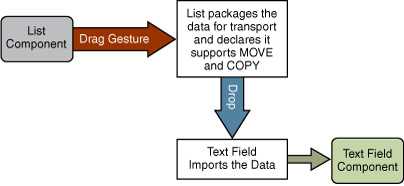
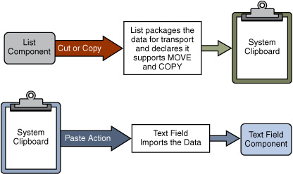

# DnD 简介

> 原文： [https://docs.oracle.com/javase/tutorial/uiswing/dnd/intro.html](https://docs.oracle.com/javase/tutorial/uiswing/dnd/intro.html)

如果您正在编写应用程序，则需要支持在应用程序中的组件之间传输信息的功能。但您也希望您的应用程序能够很好地与其他应用程序一起运行 - 这包括支持在应用程序和其他 Java 应用程序之间以及应用程序和本机应用程序之间传输信息的能力。传输数据的能力有两种形式：

*   拖放（DnD）支持。下图说明从`JList`拖放到`JTextField`组件（箭头显示数据路径）：

    

*   剪贴板通过剪切或复制和粘贴转移。下图显示从`JList`切割（或复制）并粘贴到`JTextField`组件：

    

## 拖放 - 幕后花絮

我们假设有一个名为 Rollo 的用户正在运行 Java 应用程序。他想从列表中拖动一些文本并将其存入文本字段。 （请注意，从本机应用程序拖动到 Java 应用程序时，该过程是相同的。）简而言之，拖放过程的工作方式如下：

*   Rollo 在 _ 源 _ 组件中选择了一行文本：列表。按住鼠标按钮 Rollo 开始拖动文本 - 这会启动 _ 拖动手势 _。
*   当拖动开始时，列表打包 _export_ 的数据并声明它支持的 _ 源动作 _，例如`COPY`，`MOVE`或`LINK`。
*   当 Rollo 拖动数据时，Swing 会不断计算位置并处理渲染。
*   如果 Rollo 在拖动过程中同时按住 Shift 和/或 Control 键，则 _ 用户动作 _ 也是拖动动作的一部分。通常，普通拖动请求`MOVE`操作。拖动时按住 Control 键请求`COPY`动作，同时按住 Shift 和 Control 请求`LINK`动作。
*   一旦 Rollo 在文本字段组件的边界上拖动文本，就会不断轮询 _ 目标 _ 以查看它是否接受或拒绝潜在的丢弃。当他拖动时，目标通过显示 _ 放置位置 _ 来提供反馈，可能是插入光标或突出显示的选择。在这种情况下，文本字段（当前目标）允许替换所选文本和插入新文本。
*   当 Rollo 释放鼠标按钮时，文本组件检查声明的源操作和任何用户操作，然后从可用选项中选择它想要的内容。在这种情况下，文本字段选择在删除点插入新文本。
*   最后，文本字段 _ 导入 _ 数据。

虽然这看起来像是一个令人生畏的过程，但 Swing 会为您处理大部分工作。该框架的设计使您可以插入特定于组件的详细信息，其余的“正常工作”。

更多相关内容将在下一节中介绍。

* * *

**Note:** 

我们 _ 不建议 _ 使用 AWT 类创建自己的拖放支持。这种实现需要在每个组件内部提供重要的复杂支持。在 dnd 系统重新发布之前的版本 1.4 之前，开发人员偶尔会创建自己的 dnd 支持，但它不适用于具有微妙选择和丢弃问题的复杂组件，如树和表。

* * *