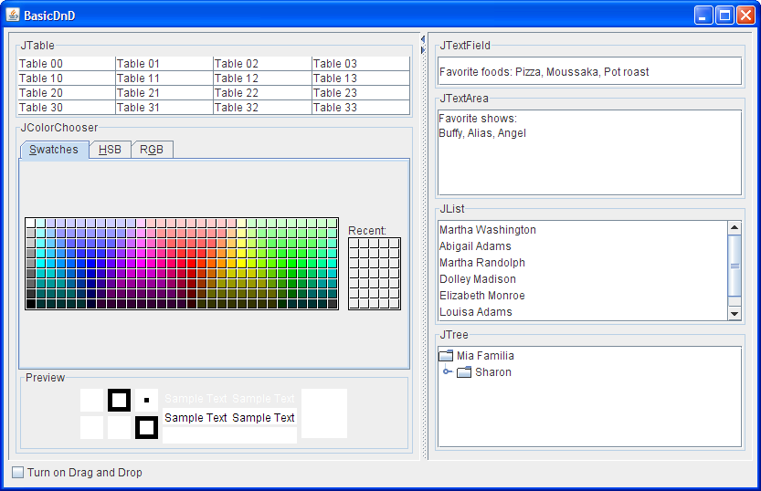

# 演示 - BasicDnD

> 原文： [https://docs.oracle.com/javase/tutorial/uiswing/dnd/basicdemo.html](https://docs.oracle.com/javase/tutorial/uiswing/dnd/basicdemo.html)

现在我们来看一个名为`BasicDnD`的简单演示，它向您展示免费获得的内容。从屏幕截图中可以看出，BasicDnD 包含一个表，一个列表，一个树，一个颜色选择器，一个文本区域和一个文本字段。

除列表的外，所有这些组件都是标准的开箱即用组件*。此列表已自定义，以显示一个对话框，显示丢弃的位置，如果接受丢弃。_

以下区域接受下降：

*   文本域
*   文字区域
*   颜色选择器接受颜色类型的滴，但是为了尝试这个，你需要运行两个演示版本（或包含颜色选择器的另一个演示版）

默认情况下，没有任何对象启用默认拖放。在启动时，您可以选中“打开拖放”复选框以查看免费获得的拖放行为。

_This figure has been reduced to fit on the page.
Click the image to view it at its natural size._

* * *

**Try this:** 

1.  单击“启动”按钮以使用 [Java™Web Start](http://www.oracle.com/technetwork/java/javase/javawebstart/index.html) （[下载 JDK 7 或更高版本](http://www.oracle.com/technetwork/java/javase/downloads/index.html)）运行 BasicDnD。或者，要自己编译并运行示例，请参考[示例索引](../examples/dnd/index.html#BasicDnD)。  

2.  选择列表中的项目，并在按住鼠标按钮的同时开始拖动。没有任何事情发生，因为列表上尚未启用拖动。
3.  选中“打开拖放”复选框。
4.  按下列表中的所选项目并开始拖动。将文本放回列表中。对话框显示实际接受的列表丢失时文本的显示位置。 （列表的默认行为是显示“不接受数据”光标。）
5.  将所选文本拖到文本区域上。文本的插入点由闪烁的插入符号表示。此外，光标更改以指示文本区域将接受文本作为副本。
6.  释放鼠标并观察文本显示在文本区域中。
7.  在其中一个文本区域中选择一些文本。
8.  当光标位于所选文本上方时按下鼠标按钮并开始拖动。
9.  请注意，这次显示拖动操作的光标。成功将此文本放入另一个组件将导致文本从原始组件中删除。
10.  按住 Control 键并再次按下所选文本。开始拖动，现在出现复制光标。将光标移动到文本区域并放下。文本显示在新位置，但不会从原始位置删除。 Control 键可用于更改任何 Move to a Copy。
11.  从颜色选择器中选择一种颜色。所选颜色显示在“预览”面板中。在“预览”面板中的颜色上按住鼠标按钮，然后将其拖到其他组件上。请注意，这些组件都不接受颜色。
12.  尝试将文本，颜色甚至文件放到列表中。对话框将报告尝试的操作。实际丢弃可以通过在 [`BasicDnD.java`](../examples/dnd/BasicDnDProject/src/dnd/BasicDnD.java ) 源文件中注释掉的另外六行代码来实现。

* * *

接下来我们将看一下`TransferHandler`类，拖放机制的主力。