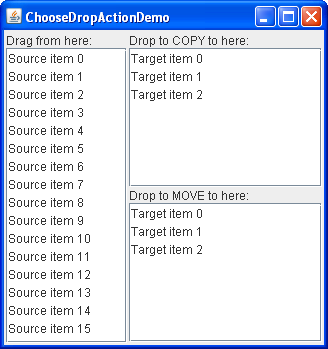

# 演示 - ChooseDropAction

> 原文： [https://docs.oracle.com/javase/tutorial/uiswing/dnd/dropactiondemo.html](https://docs.oracle.com/javase/tutorial/uiswing/dnd/dropactiondemo.html)

以下演示`ChooseDropActionDemo`包含三个列表。正如您在屏幕截图中看到的那样，左侧的列表标记为“从此处拖动”，是拖动源。此列表支持移动和复制，但它不实现导入 - 因此您不能放入它。

在右侧有两个列表作为放置目标。标有“Drop to COPY here”的顶部列表仅允许将数据复制到其中。标有“Drop to MOVE here”的底部列表只允许将数据移动到它。源列表仅允许从中拖动数据。



* * *

**Try this:** 

1.  单击启动按钮以使用 [Java™Web Start](http://www.oracle.com/technetwork/java/javase/javawebstart/index.html) （[下载 JDK 7 或更高版本](http://www.oracle.com/technetwork/java/javase/downloads/index.html)）运行`ChooseDropActionDemo`。或者，要自己编译并运行示例，请参考[示例索引](../examples/dnd/index.html#ChooseDropAction)。 [](https://docs.oracle.com/javase/tutorialJWS/samples/uiswing/ChooseDropActionDemoProject/ChooseDropActionDemo.jnlp) 

2.  在源列表中选择一个项目并拖动到上部目标列表。当您在目标上拖动时，请注意，即使您没有按住 Control 键表示您想要复制操作，也会显示复制 - 拖放鼠标光标。 （请注意，除非您按 Option 键，否则复制光标不会出现在 Macintosh 平台上。）
3.  放下物品。它被插入到目标列表中，但不会从源中删除 - 根据需要。
4.  再次从源列表中拖动，但这次进入较低的目标列表。放下物品。它将插入目标列表并从源列表中删除。
5.  在源列表中选择另一个项目，并在按 Control 键指示 COPY 操作的首选项时，将项目拖动到下一个目标列表。
6.  将项目放入列表中。未插入项目 - 拒绝丢弃。传输处理器的`canImport`方法被编码为拒绝 COPY 操作，但它可以被实现为返回 true，在这种情况下，用户操作将占优势并且将发生复制。

* * *

正如您可能猜到的， [``ChooseDropActionDemo.java``](../examples/dnd/ChooseDropActionDemoProject/src/dnd/ChooseDropActionDemo.java)示例包含两个`TransferHandler`实现：

```java
/**
 * The FromTransferHandler allows dragging from the list and
 * supports both copy and move actions.  This transfer handler
 * does not support import.
 */
class FromTransferHandler extends TransferHandler {
    public int getSourceActions(JComponent comp) {
        return COPY_OR_MOVE;
    }

    private int index = 0;

    public Transferable createTransferable(JComponent comp) {
        index = dragFrom.getSelectedIndex();
        if (index < 0 || index >= from.getSize()) {
            return null;
        }

        return new StringSelection((String)dragFrom.getSelectedValue());
    }

    public void exportDone(JComponent comp, Transferable trans, int action) {
        if (action != MOVE) {
            return;
        }

        from.removeElementAt(index);
    }
}

/**
 * The ToTransferHandler has a constructor that specifies whether the
 * instance will support only the copy action or the move action.
 * This transfer handler does not support export.
 */
class ToTransferHandler extends TransferHandler {
    int action;

    public ToTransferHandler(int action) {
        this.action = action;
    }

    public boolean canImport(TransferHandler.TransferSupport support) {
        // for the demo, we will only support drops (not clipboard paste)
        if (!support.isDrop()) {
            return false;
        }

        // we only import Strings
        if (!support.isDataFlavorSupported(DataFlavor.stringFlavor)) {
            return false;
        }

        // check if the source actions contain the desired action -
        // either copy or move, depending on what was specified when
        // this instance was created
        boolean actionSupported = (action & support.getSourceDropActions()) == action;
        if (actionSupported) {
            support.setDropAction(action);
            return true;
        }

        // the desired action is not supported, so reject the transfer
        return false;
    }

    public boolean importData(TransferHandler.TransferSupport support) {
        // if we cannot handle the import, say so
        if (!canImport(support)) {
            return false;
        }

        // fetch the drop location
        JList.DropLocation dl = (JList.DropLocation)support.getDropLocation();

        int index = dl.getIndex();

        // fetch the data and bail if this fails
        String data;
        try {
            data = (String)support.getTransferable().getTransferData(DataFlavor.stringFlavor);
        } catch (UnsupportedFlavorException e) {
            return false;
        } catch (java.io.IOException e) {
            return false;
        }

        JList list = (JList)support.getComponent();
        DefaultListModel model = (DefaultListModel)list.getModel();
        model.insertElementAt(data, index);

        Rectangle rect = list.getCellBounds(index, index);
        list.scrollRectToVisible(rect);
        list.setSelectedIndex(index);
        list.requestFocusInWindow();

        return true;
    }  
} 

```

附加到源列表的`FromTransferHandler`允许从列表中拖动并支持复制和移动操作。如果您尝试删除此列表，则丢弃将被拒绝，因为`FromTransferHandler`尚未实现`canImport`和`importData`方法。

[COG0]附加到仅移动和仅复制目标列表，包含一个构造器，指定目标列表是仅允许复制还是仅移动。支持复制操作的实例附加到仅复制列表，支持移动操作的实例附加到仅移动列表。

您可能也对[顶级 Drop](toplevel.html) 示例感兴趣，该示例还说明了选择放置操作。

接下来我们看一下显示放置位置。