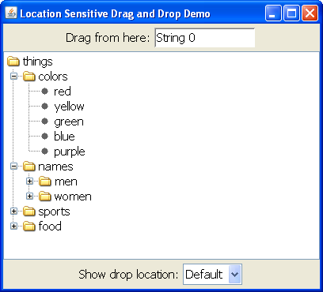

# 演示 - LocationSensitiveDemo

> 原文： [https://docs.oracle.com/javase/tutorial/uiswing/dnd/locsensitivedemo.html](https://docs.oracle.com/javase/tutorial/uiswing/dnd/locsensitivedemo.html)

下面的演示`LocationSensitiveDemo`显示了一个`JTree`，它被配置为支持在任何节点上删除，除了一个名为“names”（或其后代）的节点。使用框架顶部的文本字段作为拖动源（每次从那里拖动时，它将自动递增字符串编号）。

树下方的组合框允许您切换显示放置位置的行为。 Swing 的默认行为是仅在区域可以接受放置时显示放置位置。您可以覆盖此行为以始终显示放置位置（即使该区域无法接受放置）或从不显示放置位置（即使该区域可以接受放置）。



* * *

**Try this:** 

1.  单击启动按钮以使用 [Java™Web Start](http://www.oracle.com/technetwork/java/javase/javawebstart/index.html) （[下载 JDK 7 或更高版本](http://www.oracle.com/technetwork/java/javase/downloads/index.html)）运行`LocationSensitiveDemo`。或者，要自己编译并运行示例，请参考[示例索引](../examples/dnd/index.html#LocationSensitiveDemo)。 [](https://docs.oracle.com/javase/tutorialJWS/samples/uiswing/LocationSensitiveDemoProject/LocationSensitiveDemo.jnlp) 

2.  通过在文本字段中按“字符串 0”顶部并移动鼠标一小段距离来启动拖动。拖到树上向下移动。当您将鼠标悬停在大多数节点上时，鼠标光标和节点突出显示拖动可接受性。将文本拖放到“颜色”节点上。新项目成为该节点的子项，并成为所列颜色的兄弟。
3.  将“String 1”从文本字段拖到树中。尝试将其放在“名称”节点上。当您拖动该节点或其子节点时，Swing 不会提供任何丢弃位置反馈，也不会接受该数据。
4.  将“显示放置位置”组合框更改为“始终”。
5.  重复步骤 1 和 2.现在显示“名称”节点的放置位置，但不能将数据放入该区域。
6.  将“显示放置位置”组合框更改为“从不”。
7.  重复步骤 1 和 2.虽然您仍然可以将数据放入节点，而不是“名称”，但不会显示树的任何部分的放置位置。

* * *

[``LocationSensitiveDemo`` ](../examples/dnd/LocationSensitiveDemoProject/src/dnd/LocationSensitiveDemo.java)的`canImport`方法如下所示：

```
public boolean canImport(TransferHandler.TransferSupport info) {
    // for the demo, we will only support drops (not clipboard paste)
    if (!info.isDrop()) {
        return false;
    }

    String item = (String)indicateCombo.getSelectedItem();

    if (item.equals("Always")) {
        info.setShowDropLocation(true);
    } else if (item.equals("Never")) {
        info.setShowDropLocation(false);
    }

    // we only import Strings
    if (!info.isDataFlavorSupported(DataFlavor.stringFlavor)) {
        return false;
    }

    // fetch the drop location
    JTree.DropLocation dl = (JTree.DropLocation)info.getDropLocation();

    TreePath path = dl.getPath();

    // we do not support invalid paths or descendants of the names folder
    if (path == null || namesPath.isDescendant(path)) {
        return false;
    }

    return true;
}

```

以粗体显示的第一个代码段修改了放置位置反馈机制。如果“始终”，则始终显示放置位置。如果“从不”，则永远不会显示放置位置。否则，默认行为适用。

以粗体显示的第二个代码段包含确定树是否接受数据的逻辑。如果路径不是有效路径或者它不是名称路径（或其后代），则它将返回 false 并且不会接受导入。