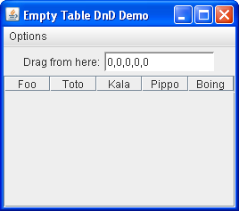

# 空表下降

> 原文： [https://docs.oracle.com/javase/tutorial/uiswing/dnd/emptytable.html](https://docs.oracle.com/javase/tutorial/uiswing/dnd/emptytable.html)

拖放到空表中是一项独特的挑战。坚持正确的步骤：

*   创建空表。
*   创建并附加`TransferHandler`。
*   通过调用`setDragEnabled(true)`启用数据传输。
*   创建滚动窗格并将表添加到滚动窗格。

您运行该应用程序并尝试将有效数据拖到表中但它拒绝丢弃。是什么赋予了？

原因是空表（与空列表或空树不同）不占用滚动窗格中的任何空间。 `JTable`不会自动伸展以填充`JScrollPane`视口的高度 - 它只占用所包含行所需的垂直空间。因此，当您拖动空表时，实际上并不在表上，并且删除失败。

您可以通过调用 [`JTable.setFillsViewportHeight(boolean)`](https://docs.oracle.com/javase/8/docs/api/javax/swing/JTable.html#setFillsViewportHeight-boolean-) 将表配置为允许丢弃视图端口中的任何位置。此属性的默认值为 false，以确保向后兼容性。

以下示例`FillViewportHeightDemo`允许您尝试删除到空表。该演示包含一个包含五列的空表，其下拉模式设置为插入行，一个拖动源提供五个以逗号分隔的自动增量值。

* * *

**Try this:** 

1.  单击启动按钮以使用 [Java™Web Start](http://www.oracle.com/technetwork/java/javase/javawebstart/index.html) （[下载 JDK 7 或更高版本](http://www.oracle.com/technetwork/java/javase/downloads/index.html)）运行`FillViewportHeightDemo`。或者，要自己编译并运行示例，请参考[示例索引](../examples/dnd/index.html#FillViewportHeightDemo)。  

2.  从标记为“从此处拖动”的文本字段拖动到表中。
3.  掉到桌子上。下降被拒绝。
4.  双击拖动源。它将当前值（0,0,0,0,0）存入表中，并递增文本字段中的值。
5.  再次，从文本字段拖动到表。您可以在行的上方或下方插入，但不能插入下方的区域。
6.  从“选项”菜单中，选择“填充视口高度”以启用“fillsViewportHeight”属性。
7.  从“选项”菜单中，选择“重置”以清空表格。
8.  从文本组件拖动到表。您现在可以删除视图端口上的任何位置，并在第 0 行插入数据。

* * *

您可以检查 [``FillViewportHeightDemo.java``](../examples/dnd/FillViewportHeightDemoProject/src/dnd/FillViewportHeightDemo.java)的来源，但要记住的主要一点是，您通常应该在任何接受删除数据的表上调用`setFillsViewportHeight(true)`。