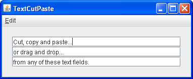

# CCP 中的文本组件

> 原文： [https://docs.oracle.com/javase/tutorial/uiswing/dnd/textpaste.html](https://docs.oracle.com/javase/tutorial/uiswing/dnd/textpaste.html)

如果您使用其中一个 Swing 文本组件（文本字段，密码字段，格式化文本字段或文本区域）实现剪切，复制和粘贴，则您的工作非常简单。这些文本组件使用 [`DefaultEditorKit`](https://docs.oracle.com/javase/8/docs/api/javax/swing/text/DefaultEditorKit.html) ，它提供剪切，复制和粘贴的内置操作。默认编辑器工具包还处理记住最后具有焦点的组件的工作。这意味着如果用户使用菜单或等效键盘启动其中一个操作，则正确的组件将接收操作 - 无需其他代码。

以下演示`TextCutPaste`包含三个文本字段。正如您在屏幕截图中看到的那样，您可以剪切，复制和粘贴任何这些文本字段。他们还支持拖放。



* * *

**Try this:** 

1.  单击启动按钮以使用 [Java™Web Start](http://www.oracle.com/technetwork/java/javase/javawebstart/index.html) （[下载 JDK 7 或更高版本](http://www.oracle.com/technetwork/java/javase/downloads/index.html)）运行`TextCutPaste`。或者，要自己编译并运行示例，请参考[示例索引](../examples/dnd/index.html#TextCutPaste)。 [](https://docs.oracle.com/javase/tutorialJWS/samples/uiswing/TextCutPasteProject/TextCutPaste.jnlp) 

2.  在其中一个文本字段中选择文本。使用“编辑”菜单或等效键盘剪切或复制源中的文本。
3.  将插入符号放在要粘贴文本的位置。
4.  使用菜单或等效的键盘粘贴文本。
5.  使用拖放操作执行相同的操作。

* * *

下面是通过将`DefaultEditorKit`中定义的内置剪切，复制和粘贴操作连接到菜单项来创建“编辑”菜单的代码。这适用于任何来自`JComponent`的组件：

```java
    /**
     * Create an Edit menu to support cut/copy/paste.
     */
    public JMenuBar createMenuBar () {
        JMenuItem menuItem = null;
        JMenuBar menuBar = new JMenuBar();
        JMenu mainMenu = new JMenu("Edit");
        mainMenu.setMnemonic(KeyEvent.VK_E);

        menuItem = new JMenuItem(new DefaultEditorKit.CutAction());
        menuItem.setText("Cut");
        menuItem.setMnemonic(KeyEvent.VK_T);
        mainMenu.add(menuItem);

        menuItem = new JMenuItem(new DefaultEditorKit.CopyAction());
        menuItem.setText("Copy");
        menuItem.setMnemonic(KeyEvent.VK_C);
        mainMenu.add(menuItem);

        menuItem = new JMenuItem(new DefaultEditorKit.PasteAction());
        menuItem.setText("Paste");
        menuItem.setMnemonic(KeyEvent.VK_P);
        mainMenu.add(menuItem);

        menuBar.add(mainMenu);
        return menuBar;
    }

```

接下来，我们将看看如何使用没有`DefaultEditorKit`内置支持的组件来实现相同的功能。