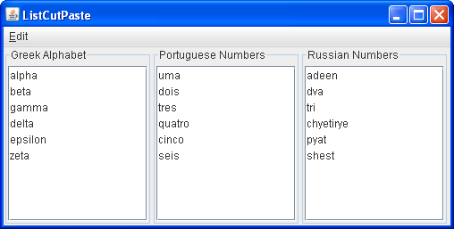

# CCP 在非文本组件中

> 原文： [https://docs.oracle.com/javase/tutorial/uiswing/dnd/listpaste.html](https://docs.oracle.com/javase/tutorial/uiswing/dnd/listpaste.html)

如果您正在使用*而不是*其中一个文本组件的 Swing 组件实现剪切，复制和粘贴，则必须进行一些额外的设置。首先，您需要在操作映射中安装剪切，复制和粘贴操作。以下方法显示了如何执行此操作：

```java
    private void setMappings(JList list) { 
        ActionMap map = list.getActionMap();
        map.put(TransferHandler.getCutAction().getValue(Action.NAME),
                TransferHandler.getCutAction());
        map.put(TransferHandler.getCopyAction().getValue(Action.NAME),
                TransferHandler.getCopyAction());
        map.put(TransferHandler.getPasteAction().getValue(Action.NAME),
                TransferHandler.getPasteAction());

```

设置“编辑”菜单时，您还可以选择添加菜单加速器，以便用户可以键入 Control-C 以启动副本。在以下代码段中，粗体文本显示了如何为剪切操作设置菜单加速器：

```java
    menuItem = new JMenuItem("Cut");
    menuItem.setActionCommand((String)TransferHandler.getCutAction().
             getValue(Action.NAME));
    menuItem.addActionListener(actionListener);
    menuItem.setAccelerator(
      KeyStroke.getKeyStroke(KeyEvent.VK_X, ActionEvent.CTRL_MASK));
    menuItem.setMnemonic(KeyEvent.VK_T);
    mainMenu.add(menuItem);

```

如果已为 CCP 操作设置菜单加速器，则下一步是多余的。如果尚未设置菜单加速键，则需要将 CCP 绑定添加到输入映射。以下代码段显示了如何完成此操作：

```java
    // only required if you have not set the menu accelerators
    InputMap imap = this.getInputMap();
    imap.put(KeyStroke.getKeyStroke("ctrl X"),
        TransferHandler.getCutAction().getValue(Action.NAME));
    imap.put(KeyStroke.getKeyStroke("ctrl C"),
        TransferHandler.getCopyAction().getValue(Action.NAME));
    imap.put(KeyStroke.getKeyStroke("ctrl V"),
        TransferHandler.getPasteAction().getValue(Action.NAME));

```

一旦安装了绑定并且已经设置了编辑菜单，还有另一个问题需要解决：当用户启动剪切，复制或粘贴时，哪个组件应该接收操作？对于文本组件，`DefaultEditorKit`会记住最后具有焦点的组件，并将操作转发给该组件。以下类`TransferActionListener`对非文本 Swing 组件执行相同的功能。这个类可以放入大多数应用程序中：

```java
public class TransferActionListener implements ActionListener,
                                              PropertyChangeListener {
    private JComponent focusOwner = null;

    public TransferActionListener() {
        KeyboardFocusManager manager = KeyboardFocusManager.
           getCurrentKeyboardFocusManager();
        manager.addPropertyChangeListener("permanentFocusOwner", this);
    }

    public void propertyChange(PropertyChangeEvent e) {
        Object o = e.getNewValue();
        if (o instanceof JComponent) {
            focusOwner = (JComponent)o;
        } else {
            focusOwner = null;
        }
    }

    public void actionPerformed(ActionEvent e) {
        if (focusOwner == null)
            return;
        String action = (String)e.getActionCommand();
        Action a = focusOwner.getActionMap().get(action);
        if (a != null) {
            a.actionPerformed(new ActionEvent(focusOwner,
                                              ActionEvent.ACTION_PERFORMED,
                                              null));
        }
    }
}

```

最后，您必须决定如何处理粘贴。在拖放的情况下，您可以在放置位置插入数据。在粘贴的情况下，您没有指向所需粘贴位置的用户的好处。您需要确定对您的应用程序有意义的内容 - 在当前选择之前或之后插入数据可能是最佳解决方案。

以下演示 ListCutPaste 显示了如何在`JList`的实例中实现 CCP。正如您在屏幕截图中看到的那样，有三个列表，您可以剪切，复制和粘贴任何这些列表。他们还支持拖放。对于此演示，将在当前选择之后插入粘贴的数据。如果没有当前选择，则数据将附加到列表的末尾。



* * *

**Try this:** 

1.  单击“启动”按钮以使用 [Java™Web Start](http://www.oracle.com/technetwork/java/javase/javawebstart/index.html) （[下载 JDK 7 或更高版本](http://www.oracle.com/technetwork/java/javase/downloads/index.html)）运行 ListCutPaste。或者，要自己编译并运行示例，请参考[示例索引](../examples/dnd/index.html#ListCutPaste)。 [](https://docs.oracle.com/javase/tutorialJWS/samples/uiswing/ListCutPasteProject/ListCutPaste.jnlp) 

2.  在其中一个列表中选择一个项目。使用“编辑”菜单或等效键盘从源中剪切或复制列表项。
3.  选择要粘贴项目的列表项。
4.  使用菜单或等效的键盘粘贴文本。在当前选择之后粘贴该项目。
5.  使用拖放操作执行相同的操作。

* * *