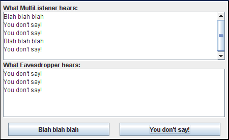

# 事件监听器简介

> 原文： [https://docs.oracle.com/javase/tutorial/uiswing/events/intro.html](https://docs.oracle.com/javase/tutorial/uiswing/events/intro.html)

如果您已阅读任何组件操作页面，则可能已经了解了事件监听器的基础知识。

让我们看一下可能的最简单的事件处理示例。它被称为蜂鸣器，它有一个按钮，当你点击它时会发出蜂鸣声。

单击“启动”按钮以使用 [Java™Web Start](http://www.oracle.com/technetwork/java/javase/javawebstart/index.html) （[下载 JDK 7 或更高版本](http://www.oracle.com/technetwork/java/javase/downloads/index.html)）运行蜂鸣器。或者，要自己编译并运行示例，请参考[示例索引](../examples/events/index.html#Beeper)。

[](https://docs.oracle.com/javase/tutorialJWS/samples/uiswing/BeeperProject/Beeper.jnlp)


您可以在 [`Beeper.java`](../examples/events/BeeperProject/src/events/Beeper.java) 中找到整个程序。以下是实现按钮事件处理的代码：

```java
public class Beeper ... implements ActionListener {
    ...
    //where initialization occurs:
        button.addActionListener(this);
    ...
    public void actionPerformed(ActionEvent e) {
        ...//Make a beep sound...
    }
}

```

`Beeper`类实现 [`ActionListener`](actionlistener.html) 接口，其中包含一个方法：`actionPerformed`。由于`Beeper`实现`ActionListener`，`Beeper`对象可以注册为按钮触发的动作事件的监听器。使用`Button` `addActionListener`方法注册`Beeper`后，每次单击该按钮时都会调用`Beeper`的`actionPerformed`方法。

您在前面的示例中最简单地看到的事件模型非常强大且灵活。任意数量的事件监听器对象都可以侦听来自任意数量的事件源对象的各种事件。例如，程序可能会为每个事件源创建一个监听器。或者程序可能只有一个监听器来处理来自所有源的所有事件。对于来自单个事件源的单一事件，程序甚至可以具有多个监听器。


多个监听器可以注册以从特定源通知特定类型的事件。此外，同一个监听器可以侦听来自不同对象的通知。

每个事件都由一个对象表示，该对象提供有关事件的信息并标识事件源。事件源通常是组件或模型，但其他类型的对象也可以是事件源。

无论何时想要检测特定组件的事件，首先要检查该组件的操作方法部分。组件操作方法部分的列表是 [](../components/componentlist.html) 。操作方法部分提供了处理您最可能关注的事件的示例。例如，在[如何使用颜色选择器](../components/colorchooser.html)中，您将找到一个编写更改监听器的示例，以跟踪颜色选择器中颜色的变化。

以下示例演示了事件监听器可以在多个对象上注册，并且可以将同一事件发送到多个监听器。该示例包含两个事件源（`JButton`实例）和两个事件监听器。其中一个事件监听器（一个名为`MultiListener`的类的实例）侦听来自两个按钮的事件。当它收到一个事件时，它会将事件的“动作命令”（设置为按钮标签上的文本）添加到顶部文本区域。第二个事件监听器（名为`Eavesdropper`的类的实例）仅侦听其中一个按钮上的事件。当它收到一个事件时，它会将动作命令添加到底部文本区域。



* * *

**Try this:** 

1.  单击“启动”按钮以使用 [Java™Web Start](http://www.oracle.com/technetwork/java/javase/javawebstart/index.html) （[下载 JDK 7 或更高版本](http://www.oracle.com/technetwork/java/javase/downloads/index.html)）运行 MultiListener。或者，要自己编译并运行示例，请参考[示例索引](../examples/events/index.html#MultiListener)。 [](https://docs.oracle.com/javase/tutorialJWS/samples/uiswing/MultiListenerProject/MultiListener.jnlp) 

2.  单击 _Blah blah blah_ 按钮。仅注册`MultiListener`对象才能收听此按钮。
3.  点击*你不说了！*按钮。注册了`MultiListener`对象和`Eavesdropper`对象以侦听此按钮。

* * *

您可以在 [`MultiListener.java`](../examples/events/MultiListenerProject/src/events/MultiListener.java) 中找到整个程序。以下是实现按钮事件处理的代码：

```java
public class MultiListener ... implements ActionListener {
    ...
    //where initialization occurs:
        button1.addActionListener(this);
        button2.addActionListener(this);

        button2.addActionListener(new Eavesdropper(bottomTextArea));
    }

    public void actionPerformed(ActionEvent e) {
        topTextArea.append(e.getActionCommand() + newline);
    }
}

class Eavesdropper implements ActionListener {
    ...
    public void actionPerformed(ActionEvent e) {
        myTextArea.append(e.getActionCommand() + newline);
    }
}

```

在上面的代码中，`MultiListener`和`Eavesdropper`都实现了`ActionListener`接口，并使用`JButton` `addActionListener`方法注册为动作监听器。两个类的`actionPerformed`方法的实现都是类似的：它们只是将事件的动作命令添加到文本区域。