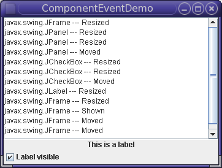

# 如何编写组件监听器

> 原文： [https://docs.oracle.com/javase/tutorial/uiswing/events/componentlistener.html](https://docs.oracle.com/javase/tutorial/uiswing/events/componentlistener.html)

Component 监听器是用于接收组件事件的监听器接口。组件是具有图形表示的对象，该图形表示可以显示在屏幕上并且可以与用户交互。组件的一些示例是典型图形用户界面的按钮，复选框和滚动条。

对处理组件事件感兴趣的类要么实现此接口及其包含的所有方法，要么扩展抽象的 ComponentAdapter 类，仅覆盖感兴趣的方法。然后，使用组件的 addComponentListener 方法向该组件注册从该类创建的监听器对象。当组件的大小，位置或可见性发生更改时，将调用监听器对象中的相关方法，并将 ComponentEvent 传递给它。

在隐藏组件，使组件可见，移动或调整大小之后，`Component`对象会触发一个或多个组件事件。

组件隐藏和组件显示事件仅在调用`Component`的`setVisible`方法时发生。例如，窗口可能会被小型化为图标（图标化）而不会触发组件隐藏事件。

要编写一个简单的 Component listener 程序，请按照下面提到的步骤操作：

*   声明一个实现 Component 监听器的类。例如：

    ```java
    public class ComponentEventDemo ... implements ComponentListener

    ```

*   确定要捕获事件的组件。例如：窗格，标签，复选框等。
*   将 Component Listener 添加到标识的组件。例如：

    ```java
    ....
    label.addComponentListener(this);
    .....
    checkbox.addComponentListener(this);
    ....
    panel.addComponentListener(this);
    ...
    frame.addComponentListener(this);

    ```

*   最后，使用 Component Listener 的四种方法捕获这些组件的不同事件，如下所示：

    ```java
    public void componentHidden(ComponentEvent e) {
            displayMessage(e.getComponent().getClass().getName() + " --- Hidden");
        }

        public void componentMoved(ComponentEvent e) {
            displayMessage(e.getComponent().getClass().getName() + " --- Moved");
        }

        public void componentResized(ComponentEvent e) {
            displayMessage(e.getComponent().getClass().getName() + " --- Resized ");            
        }

        public void componentShown(ComponentEvent e) {
            displayMessage(e.getComponent().getClass().getName() + " --- Shown");

        }

    ```

以下示例演示了组件事件。该窗口包含一个带有标签和复选框的面板。复选框控制标签是否可见。每次窗口，面板，标签或复选框触发组件事件时，文本区域都会显示一条消息。



* * *

**Try this:** 

1.  单击“启动”按钮以使用 [Java™Web Start](http://www.oracle.com/technetwork/java/javase/javawebstart/index.html) （[下载 JDK 7 或更高版本](http://www.oracle.com/technetwork/java/javase/downloads/index.html)）运行 ComponentEventDemo。或者，要自己编译并运行示例，请参考[示例索引](../examples/events/index.html#Beeper)。

    [](https://docs.oracle.com/javase/tutorialJWS/samples/uiswing/ComponentEventDemoProject/ComponentEventDemo.jnlp) 

2.  当窗口出现时，已触发一个或多个组件显示的事件。
3.  单击复选框以隐藏标签。
    标签触发组件隐藏事件。该面板触发组件移动和组件调整大小的事件。该复选框将触发组件移动的事件。
4.  再次单击复选框以显示标签。
    标签触发组件显示的事件。该面板触发组件移动和组件调整大小的事件。该复选框将触发组件移动的事件。
5.  Iconify 然后 deiconify 窗口。
    你做*而不是*得到组件隐藏或显示的事件。如果要通知图标化事件，则应使用窗口监听器或窗口状态监听器。
6.  调整窗口大小。
    您将看到来自所有四个组件的组件大小调整（可能是组件移动）事件 - 标签，复选框，面板和框架。如果框架和面板的布局管理器未使每个组件尽可能宽，则不会调整面板，标签和复选框的大小。

* * *

您可以在 [`ComponentEventDemo.java`](../examples/events/ComponentEventDemoProject/src/events/ComponentEventDemo.java) 中找到演示代码。这里只是与处理组件事件相关的代码：

```java
public class ComponentEventDemo ... implements ComponentListener {
    static JFrame frame;
    JLabel label;
    ...
    public ComponentEventDemo() {
        ...
        JPanel panel = new JPanel(new BorderLayout());
        label = new JLabel("This is a label", JLabel.CENTER);
        label.addComponentListener(this);
        panel.add(label, BorderLayout.CENTER);

        JCheckBox checkbox = new JCheckBox("Label visible", true);
        checkbox.addComponentListener(this);
        panel.add(checkbox, BorderLayout.PAGE_END);
        panel.addComponentListener(this);
        ...
        frame.addComponentListener(this);
    }
    ...
     public void componentHidden(ComponentEvent e) {
        displayMessage(e.getComponent().getClass().getName() + " --- Hidden");
    }

    public void componentMoved(ComponentEvent e) {
        displayMessage(e.getComponent().getClass().getName() + " --- Moved");
    }

    public void componentResized(ComponentEvent e) {
        displayMessage(e.getComponent().getClass().getName() + " --- Resized ");            
    }

    public void componentShown(ComponentEvent e) {
        displayMessage(e.getComponent().getClass().getName() + " --- Shown");

    }

    public static void main(String[] args) {
        ...
        //Create and set up the window.
        frame = new JFrame("ComponentEventDemo");
        ...
        JComponent newContentPane = new ComponentEventDemo();
        frame.setContentPane(newContentPane);
        ...
    }
}

```

_ 所有这些方法也在适配器类中， [`ComponentAdapter`](https://docs.oracle.com/javase/8/docs/api/java/awt/event/ComponentAdapter.html) 。_

| 方法 | 目的 |
| :-- | :-- |
| [componentHidden（ComponentEvent）](https://docs.oracle.com/javase/8/docs/api/java/awt/event/ComponentListener.html#componentHidden-java.awt.event.ComponentEvent-) | 在被调用的组件被隐藏后调用`setVisible`方法被调用。 |
| [componentMoved（ComponentEvent）](https://docs.oracle.com/javase/8/docs/api/java/awt/event/ComponentListener.html#componentMoved-java.awt.event.ComponentEvent-) | 在收听组件相对于其容器移动后调用。例如，如果移动窗口，则窗口将触发组件移动的事件，但它包含的组件不会。 |
| [componentResized（ComponentEvent）](https://docs.oracle.com/javase/8/docs/api/java/awt/event/ComponentListener.html#componentResized-java.awt.event.ComponentEvent-) | 在收听组件的大小（矩形边界）发生变化后调用。 |
| [componentShown（ComponentEvent）](https://docs.oracle.com/javase/8/docs/api/java/awt/event/ComponentListener.html#componentShown-java.awt.event.ComponentEvent-) | 在监听组件变为可见的情况下调用`setVisible`方法的结果。 |

| 方法 | 目的 |
| :-- | :-- |
| [组件 getComponent（）](https://docs.oracle.com/javase/8/docs/api/java/awt/event/ComponentEvent.html#getComponent--) | 返回触发事件的组件。您可以使用它而不是`getSource`方法。 |

## 使用组件监听器的示例

The following table lists the examples that use component listeners.

| 例 | 在哪里描述 | 笔记 |
| :-- | :-- | :-- |
| [`ComponentEventDemo`](../examples/events/index.html#ComponentEventDemo) | 这个部分 | 报告在多个组件上发生的所有组件事件，以演示触发组件事件的环境。 |