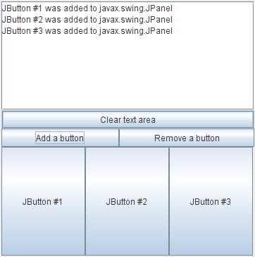

# 如何编写容器侦听器

> 原文： [https://docs.oracle.com/javase/tutorial/uiswing/events/containerlistener.html](https://docs.oracle.com/javase/tutorial/uiswing/events/containerlistener.html)

在将容器添加到容器或从容器中移除组件之后，容器事件由`Container`触发。这些事件仅用于通知 - 无需成功添加或删除组件的容器侦听器。

以下示例演示容器事件。通过单击**添加按钮**或**删除按钮**，您可以在窗口底部的面板中添加或删除按钮。每次向面板添加或从面板中删除按钮时，面板都会触发容器事件，并通知面板的容器侦听器。侦听器在窗口顶部的文本区域中显示描述性消息。

<center></center>

* * *

**Try this:** 

1.  单击“启动”按钮以使用 [Java™Web Start](http://www.oracle.com/technetwork/java/javase/javawebstart/index.html) （[下载 JDK 7 或更高版本](http://www.oracle.com/technetwork/java/javase/downloads/index.html)）运行 ContainerEventDemo。或者，要自己编译并运行示例，请参考[示例索引](../examples/events/index.html#ContainerEventDemo)。 [](https://docs.oracle.com/javase/tutorialJWS/samples/uiswing/ContainerEventDemoProject/ContainerEventDemo.jnlp) 

2.  单击标有**添加按钮**的按钮。
    您会在窗口底部看到一个按钮。容器侦听器通过在窗口顶部显示“JButton＃1 已添加到 javax.swing.JPanel”来响应生成的组件添加事件。
3.  单击标有**的按钮删除按钮**。
    这将从面板中删除最近添加的按钮，从而使容器侦听器接收组件删除的事件。

* * *

您可以在 [`ContainerEventDemo.java`](../examples/events/ContainerEventDemoProject/src/events/ContainerEventDemo.java) 中找到演示代码。这是 demo 的容器事件处理代码：

```
public class ContainerEventDemo ... implements ContainerListener ... {
    ...//where initialization occurs:
        buttonPanel = new JPanel(new GridLayout(1,1));
        buttonPanel.addContainerListener(this);
    ...
    public void componentAdded(ContainerEvent e) {
        displayMessage(" added to ", e);
    }

    public void componentRemoved(ContainerEvent e) {
        displayMessage(" removed from ", e);
    }

    void displayMessage(String action, ContainerEvent e) {
        display.append(((JButton)e.getChild()).getText()
                       + " was"
                       + action
                       + e.getContainer().getClass().getName()
                       + newline);
    }
    ...
}

```

_ 相应的适配器类是 [`ContainerAdapter`](https://docs.oracle.com/javase/8/docs/api/java/awt/event/ContainerAdapter.html) 。_

| 方法 | 目的 |
| :-- | :-- |
| [componentAdded（ContainerEvent）](https://docs.oracle.com/javase/8/docs/api/java/awt/event/ContainerListener.html#componentAdded-java.awt.event.ContainerEvent-) | 在将组件添加到侦听容器之后调用。 |
| [componentRemoved（ContainerEvent）](https://docs.oracle.com/javase/8/docs/api/java/awt/event/ContainerListener.html#componentRemoved-java.awt.event.ContainerEvent-) | 在从侦听容器中删除组件之后调用。 |

| 方法 | 目的 |
| :-- | :-- |
| [组件 getChild（）](https://docs.oracle.com/javase/8/docs/api/java/awt/event/ContainerEvent.html#getChild--) | 返回添加或删除触发此事件的组件。 |
| [Container getContainer（）](https://docs.oracle.com/javase/8/docs/api/java/awt/event/ContainerEvent.html#getContainer--) | 返回触发此事件的容器。您可以使用它而不是`getSource`方法。 |

## 使用容器侦听器的示例

下表列出了使用容器侦听器的示例。

| 例 | 在哪里描述 | 笔记 |
| :-- | :-- | :-- |
| [`ContainerEventDemo`](../examples/events/index.html#ContainerEventDemo) | 这个部分 | 报告在单个面板上发生的所有容器事件，以演示触发容器事件的环境。 |