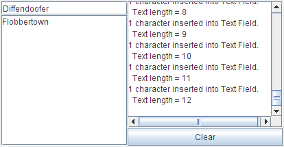

# 如何编写文档监听器

> 原文： [https://docs.oracle.com/javase/tutorial/uiswing/events/documentlistener.html](https://docs.oracle.com/javase/tutorial/uiswing/events/documentlistener.html)

Swing 文本组件使用 [`Document`](https://docs.oracle.com/javase/8/docs/api/javax/swing/text/Document.html) 来表示其内容。当文档内容以任何方式更改时，都会发生文档事件。您将文档监听器附加到文本组件的文档，而不是文本组件本身。有关详细信息，请参阅[实现文档过滤器](../components/generaltext.html#filter)。

以下示例演示两个纯文本组件上的文档事件。



* * *

**Try this:** 

1.  单击“启动”按钮以使用 [Java™Web Start](http://www.oracle.com/technetwork/java/javase/javawebstart/index.html) （[下载 JDK 7 或更高版本](http://www.oracle.com/technetwork/java/javase/downloads/index.html)）运行 DocumentEventDemo。或者，要自己编译并运行示例，请参考[示例索引](../examples/events/index.html#Beeper)。 [](https://docs.oracle.com/javase/tutorialJWS/samples/uiswing/DocumentEventDemoProject/DocumentEventDemo.jnlp) 

2.  键入窗口左上角的文本字段或文本字段下方的文本区域。
    为每个键入的字符触发一个文档事件。
3.  使用退格键删除文本。
    为每个键入的退格键触发一个文档事件。
4.  选择文本，然后通过键入退格键或使用`CTRL-X`（剪切）等键盘命令将其删除。
    整个删除都会触发一个文档事件。
5.  使用`CTRL-C`（复制）和`CTRL-V`（粘贴）等键盘命令将文本从一个文本组件复制到另一个文本组件。
    无论粘贴的文本长度如何，都会针对整个粘贴操作触发一个文档事件。如果在发出粘贴命令之前在目标文本组件中选择了文本，则会触发其他文档事件，因为首先删除所选文本。

* * *

您可以在 [`DocumentEventDemo.java`](../examples/events/DocumentEventDemoProject/src/events/DocumentEventDemo.java) 中找到演示代码。这是演示文档的事件处理代码：

```
public class DocumentEventDemo ... {
    ...//where initialization occurs:
    textField = new JTextField(20);
    textField.addActionListener(new MyTextActionListener());
    textField.getDocument().addDocumentListener(new MyDocumentListener());
    textField.getDocument().putProperty("name", "Text Field");

    textArea = new JTextArea();
    textArea.getDocument().addDocumentListener(new MyDocumentListener());
    textArea.getDocument().putProperty("name", "Text Area");
    ...

class MyDocumentListener implements DocumentListener {
    String newline = "\n";

    public void insertUpdate(DocumentEvent e) {
        updateLog(e, "inserted into");
    }
    public void removeUpdate(DocumentEvent e) {
        updateLog(e, "removed from");
    }
    public void changedUpdate(DocumentEvent e) {
        //Plain text components do not fire these events
    }

    public void updateLog(DocumentEvent e, String action) {
        Document doc = (Document)e.getDocument();
        int changeLength = e.getLength();
        displayArea.append(
            changeLength + " character" +
            ((changeLength == 1) ? " " : "s ") +
            action + doc.getProperty("name") + "." + newline +
            "  Text length = " + doc.getLength() + newline);
    }
}

```

文档监听器不应修改文档的内容;在收听者收到更改通知时，更改已完成。而是编写一个覆盖`insertString`或`remove`方法或两者的自定义文档。有关详细信息，请参阅[聆听文档更改](../components/generaltext.html#doclisteners)。

_`DocumentListener`没有适配器类。_

| 方法 | 目的 |
| :-- | :-- |
| [changedUpdate（DocumentEvent）](https://docs.oracle.com/javase/8/docs/api/javax/swing/event/DocumentListener.html#changedUpdate-javax.swing.event.DocumentEvent-) | 当收听文档中某些文本的样式发生更改时调用。这种事件仅从`StyledDocument`触发 - `PlainDocument`不会触发这些事件。 |
| [insertUpdate（DocumentEvent）](https://docs.oracle.com/javase/8/docs/api/javax/swing/event/DocumentListener.html#insertUpdate-javax.swing.event.DocumentEvent-) | 将文本插入收听的文档时调用。 |
| [removeUpdate（DocumentEvent）](https://docs.oracle.com/javase/8/docs/api/javax/swing/event/DocumentListener.html#removeUpdate-javax.swing.event.DocumentEvent-) | 从收听的文档中删除文本时调用。 |

每个文档事件方法都传递一个实现`DocumentEvent`接口的对象。通常，这是 [`DefaultDocumentEvent`](https://docs.oracle.com/javase/8/docs/api/javax/swing/text/AbstractDocument.DefaultDocumentEvent.html) 的实例，在`AbstractDocument`中定义。

| 方法 | 目的 |
| :-- | :-- |
| [文件 getDocument（）](https://docs.oracle.com/javase/8/docs/api/javax/swing/event/DocumentEvent.html#getDocument--) | 返回触发事件的文档。请注意，`DocumentEvent`接口不会从`EventObject`继承。因此，它不继承`getSource`方法。 |
| [int getLength（）](https://docs.oracle.com/javase/8/docs/api/javax/swing/event/DocumentEvent.html#getLength--) | 返回更改的长度。 |
| [int getOffset（）](https://docs.oracle.com/javase/8/docs/api/javax/swing/event/DocumentEvent.html#getOffset--) | 返回更改的第一个字符的文档中的位置。 |
| [ElementChange getChange（Element）](https://docs.oracle.com/javase/8/docs/api/javax/swing/event/DocumentEvent.html#getChange-javax.swing.text.Element-) | 返回有关文档中哪些元素已更改以及如何更改的详细信息。 [`ElementChange`](https://docs.oracle.com/javase/8/docs/api/javax/swing/event/DocumentEvent.ElementChange.html) 是`DocumentEvent`接口中定义的接口。 |
| [EventType getType（）](https://docs.oracle.com/javase/8/docs/api/javax/swing/event/DocumentEvent.html#getType--) | 返回发生的更改类型。 [`EventType`](https://docs.oracle.com/javase/8/docs/api/javax/swing/event/DocumentEvent.EventType.html) 是`DocumentEvent`接口中定义的类，它枚举了文档可能发生的更改：插入文本，删除文本和更改文本样式。 |

## 使用文档监听器的示例

下表列出了使用文档监听器的示例。

| 例 | 在哪里描述 | 笔记 |
| :-- | :-- | :-- |
| [`DocumentEventDemo`](../examples/events/index.html#DocumentEventDemo) | 这个部分 | 报告文档字段和文本区域的文档上发生的所有文档事件。一个监听器侦听两个文本组件，并使用文档上的客户端属性来确定触发事件的组件。 |
| [`TextComponentDemo`](../examples/components/index.html#TextComponentDemo) | [聆听文件的变更](../components/generaltext.html#doclisteners) | 每次收听文档中的文本发生更改时，都会更新更改日志。此示例中的文档支持样式文本，因此在此示例中调用`changedUpdate`。需要此附加源文件： [`DocumentSizeFilter`](../examples/components/index.html#DocumentSizeFilter) |