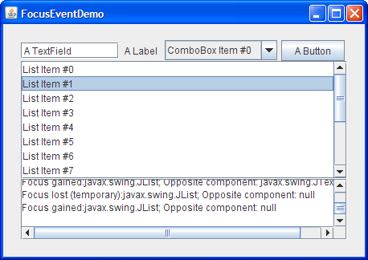

# 如何编写焦点监听器

> 原文： [https://docs.oracle.com/javase/tutorial/uiswing/events/focuslistener.html](https://docs.oracle.com/javase/tutorial/uiswing/events/focuslistener.html)

只要组件获得或失去键盘焦点，就会触发焦点事件。无论焦点的变化是通过鼠标，键盘还是以编程方式发生，都是如此。要熟悉基本焦点概念或获取有关焦点的详细信息，请参阅[如何使用焦点子系统](../misc/focus.html)。

本节介绍如何通过在其上注册`FocusListener`实例来获取特定组件的焦点事件。要仅获得窗口焦点，请改为实现 [`WindowFocusListener`](windowlistener.html) 实例。要获得许多组件的焦点状态，请考虑在`KeyboardFocusManager`类上实现`PropertyChangeListener`实例，如[跟踪](../misc/focus.html#trackingFocus)[中的多个组件](../misc/focus.html)的焦点更改中所述[如何使用焦点子系统](../misc/focus.html) ]。

以下示例演示焦点事件。该窗口显示各种组件。在每个组件上注册的焦点监听器报告每个焦点获取和焦点丢失事件。对于每个事件，报告焦点变化中涉及的另一个组件 _ 相反组件 _。例如，当焦点从按钮转到文本字段时，按钮会触发焦点丢失事件（文本字段作为相反的组件），然后文本字段触发焦点获取事件（带有按钮作为相反的组件）。焦点丢失以及焦点获得的事件可能是暂时的。例如，当窗口失去焦点时，会发生临时焦点丢失事件。弹出菜单上会发生临时焦点获取事件。



## 运行示例

1.  单击“启动”按钮以使用 [Java™Web Start](http://www.oracle.com/technetwork/java/javase/javawebstart/index.html) （[下载 JDK 7 或更高版本](http://www.oracle.com/technetwork/java/javase/downloads/index.html)）运行 FocusEventDemo。或者，要自己编译并运行示例，请参考[示例索引](../examples/events/index.html#FocusEventDemo)。 [](https://docs.oracle.com/javase/tutorialJWS/samples/uiswing/FocusEventDemoProject/FocusEventDemo.jnlp) 

2.  您将在文本区域中看到“Focus gains：JTextField”消息 - 其“相对组件”为空，因为它是第一个具有焦点的组件。
3.  单击标签。没有任何事情发生，因为默认情况下，标签无法获得焦点。
4.  单击组合框。文本字段触发焦点丢失事件，组合框触发焦点获取事件。组合框现在显示它具有焦点，可能在文本周围有一条虚线 - 确切地表示它是如何表示依赖于外观。
    请注意，当焦点从一个组件变为另一个组件时，第一个组件会在第二个组件触发焦点获取事件之前触发焦点丢失事件。
5.  从组合框的菜单中选择一个选项。再次单击组合框。请注意，未报告任何焦点事件。只要用户操作相同的组件，焦点就会停留在该组件上。
6.  单击打印焦点事件的文本区域。没有任何反应，因为文本区域已被`setRequestFocusEnabled(false)`渲染为无法点击。
7.  单击文本字段可将焦点返回到初始组件。
8.  按键盘上的 Tab 键。焦点移动到组合框并跳过标签。
9.  再次按 Tab 键。焦点移动到按钮。
10.  单击另一个窗口，以便 FocusEventDemo 窗口失去焦点。为按钮生成临时的焦点丢失事件。
11.  单击 FocusEventDemo 窗口的顶部。按钮触发了焦点获得的事件。
12.  按键盘上的 Tab 键。焦点移动到列表中。
13.  再次按 Tab 键。焦点移动到文本区域。
    请注意，即使您不允许单击文本区域，也可以选中它。这是因为使用[辅助技术](../misc/access.html)的用户可以确定组件在那里以及它包含什么。该演示通过调用文本区域中的`setRequestFocusEnabled(false)`，禁用文本区域的单击焦点，同时保留其选项卡到焦点功能。该演示可以使用`setFocusable(false)`真正从焦点循环中删除文本区域，但这会使组件对使用辅助技术的人不可用产生不幸的影响。
14.  再次按 Tab 键。焦点从列表移回文本字段。您刚刚完成 _ 焦点循环 _。有关焦点术语和概念的讨论，请参阅[如何使用焦点子系统](../misc/focus.html)中的[介绍](../misc/focus.html#intro)。

该演示的完整代码位于 [`FocusEventDemo.java`](../examples/events/FocusEventDemoProject/src/events/FocusEventDemo.java) 文件中。以下代码段表示焦点事件处理机制：

```java
public class FocusEventDemo ... implements FocusListener ... {
    public FocusEventDemo() {
        ...
        JTextField textField = new JTextField("A TextField");
        textField.addFocusListener(this);
        ...
        JLabel label = new JLabel("A Label");
        label.addFocusListener(this);
        ...
        JComboBox comboBox = new JComboBox(vector);
        comboBox.addFocusListener(this);
        ...
        JButton button = new JButton("A Button");
        button.addFocusListener(this);
        ...
        JList list = new JList(listVector);
        list.setSelectedIndex(1); //It's easier to see the focus change
                                  //if an item is selected.
        list.addFocusListener(this);
        JScrollPane listScrollPane = new JScrollPane(list);

        ...

        //Set up the area that reports focus-gained and focus-lost events.
        display = new JTextArea();
        display.setEditable(false);
        //The method setRequestFocusEnabled prevents a
        //component from being clickable, but it can still
        //get the focus through the keyboard - this ensures
        //user accessibility.
        display.setRequestFocusEnabled(false);
        display.addFocusListener(this);
        JScrollPane displayScrollPane = new JScrollPane(display);

        ...
    }
    ...
    public void focusGained(FocusEvent e) {
        displayMessage("Focus gained", e);
    }

    public void focusLost(FocusEvent e) {
        displayMessage("Focus lost", e);
    }

    void displayMessage(String prefix, FocusEvent e) {
        display.append(prefix
                       + (e.isTemporary() ? " (temporary):" : ":")
                       +  e.getComponent().getClass().getName()
                       + "; Opposite component: " 
                       + (e.getOppositeComponent() != null ?
                          e.getOppositeComponent().getClass().getName() : "null")
                       + newline); 
    }
    ...
}

```

_ 相应的适配器类是 [`FocusAdapter`](https://docs.oracle.com/javase/8/docs/api/java/awt/event/FocusAdapter.html) 。_

| 方法 | 目的 |
| :-- | :-- |
| [focusGained（FocusEvent）](https://docs.oracle.com/javase/8/docs/api/java/awt/event/FocusListener.html#focusGained-java.awt.event.FocusEvent-) | 在收听组件获得焦点后调用。 |
| [focusLost（FocusEvent）](https://docs.oracle.com/javase/8/docs/api/java/awt/event/FocusListener.html#focusLost-java.awt.event.FocusEvent-) | 在收听组件失去焦点后调用。 |

| 方法 | 目的 |
| :-- | :-- |
| [boolean isTemporary（）](https://docs.oracle.com/javase/8/docs/api/java/awt/event/FocusEvent.html#isTemporary--) | 如果焦点丢失或焦点获得事件是临时的，则返回 true 值。 |
| [组件 getComponent（）](https://docs.oracle.com/javase/8/docs/api/java/awt/event/ComponentEvent.html#getComponent--)
（`java.awt.event.ComponentEvent` 中的 _）_ | 返回触发焦点事件的组件。 |
| [组件 getOppositeComponent（）](https://docs.oracle.com/javase/8/docs/api/java/awt/event/FocusEvent.html#getOppositeComponent--) | 返回焦点更改中涉及的其他组件。对于`FOCUS_GAINED`事件，这是失去焦点的组件。对于`FOCUS_LOST`事件，这是获得焦点的组件。如果焦点更改涉及本机应用程序，不同 VM 或上下文中的 Java 应用程序，或者没有其他组件，则返回`null`。 |

下表列出了使用焦点监听器的示例。

| 例 | 在哪里描述 | 笔记 |
| :-- | :-- | :-- |
| [`FocusEventDemo`](../examples/events/index.html#FocusEventDemo) | 这个部分 | 报告在几个组件上发生的所有焦点事件，以演示触发焦点事件的情况。 |
| [`TrackFocusDemo`](../examples/misc/index.html#TrackFocusDemo) | [如何使用焦点子系统](../misc/focus.html) | 自定义组件 [`Picture`](../examples/misc/TrackFocusDemoProject/src/misc/Picture.java) 实现了一个焦点监听器，当它是当前焦点所有者时，在组件周围绘制一个红色边框。 |