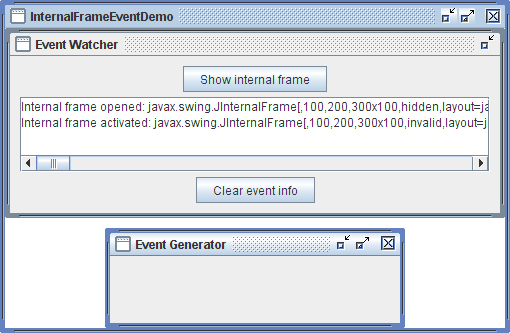

# 如何编写内部帧监听器

> 原文： [https://docs.oracle.com/javase/tutorial/uiswing/events/internalframelistener.html](https://docs.oracle.com/javase/tutorial/uiswing/events/internalframelistener.html)

`InternalFrameListener`类似于`WindowListener`。与窗口监听器一样，内部帧监听器侦听第一次显示“窗口”，处理，图标化，去图标化，激活或停用时发生的事件。在使用内部帧监听器之前，请熟悉[如何编写窗口监听器](windowlistener.html)中的`WindowListener`接口。

下图中显示的应用程序演示了内部帧事件。应用程序从事件生成器框架侦听内部框架事件，显示描述每个事件的消息。



* * *

**Try this:** 

1.  单击“启动”按钮以使用 [Java™Web Start](http://www.oracle.com/technetwork/java/javase/javawebstart/index.html) （[下载 JDK 7 或更高版本](http://www.oracle.com/technetwork/java/javase/downloads/index.html)）运行 InternalFrameEventDemo。或者，要自己编译并运行示例，请参考[示例索引](../examples/events/index.html#InternalFrameEventDemo)。 [](https://docs.oracle.com/javase/tutorialJWS/samples/uiswing/InternalFrameEventDemoProject/InternalFrameEventDemo.jnlp) 

2.  单击**显示内部框**按钮，打开事件生成器内部框架。
    您应该在显示区域看到“打开内部框架”消息。
3.  尝试各种操作，看看会发生什么。例如，单击“事件生成器”以使其激活。单击事件观察器，以便停用事件生成器。单击事件生成器的装饰以图标化，最大化，最小化和关闭窗口。
    参见[如何编写窗口监听器](windowlistener.html)，了解您将看到的事件类型。

* * *

这是内部帧事件处理代码：

```java
public class InternalFrameEventDemo ...
                     implements InternalFrameListener ... {
    ...

    public void internalFrameClosing(InternalFrameEvent e) {
        displayMessage("Internal frame closing", e);
    }

    public void internalFrameClosed(InternalFrameEvent e) {
        displayMessage("Internal frame closed", e);
        listenedToWindow = null;
    }

    public void internalFrameOpened(InternalFrameEvent e) {
        displayMessage("Internal frame opened", e);
    }

    public void internalFrameIconified(InternalFrameEvent e) {
        displayMessage("Internal frame iconified", e);
    }

    public void internalFrameDeiconified(InternalFrameEvent e) {
        displayMessage("Internal frame deiconified", e);
    }

    public void internalFrameActivated(InternalFrameEvent e) {
        displayMessage("Internal frame activated", e);
    }

    public void internalFrameDeactivated(InternalFrameEvent e) {
        displayMessage("Internal frame deactivated", e);
    }

    void displayMessage(String prefix, InternalFrameEvent e) {
        String s = prefix + ": " + e.getSource(); 
        display.append(s + newline);
    }

    public void actionPerformed(ActionEvent e) {
        if (SHOW.equals(e.getActionCommand())) {
            ...
            if (listenedToWindow == null) {
                listenedToWindow = new JInternalFrame("Event Generator",
                                                      true,  //resizable
                                                      true,  //closable
                                                      true,  //maximizable
                                                      true); //iconifiable
                //We want to reuse the internal frame, so we need to
                //make it hide (instead of being disposed of, which is
                //the default) when the user closes it.
                listenedToWindow.setDefaultCloseOperation(
                                        WindowConstants.HIDE_ON_CLOSE);

                listenedToWindow.addInternalFrameListener(this);
                ...
            }
        } 
        ...
    }
}

```

_ 相应的适配器类是 [`InternalFrameAdapter`](https://docs.oracle.com/javase/8/docs/api/javax/swing/event/InternalFrameAdapter.html) 。_

| 方法 | 目的 |
| :-- | :-- |
| [internalFrameOpened（InternalFrameEvent）](https://docs.oracle.com/javase/8/docs/api/javax/swing/event/InternalFrameListener.html#internalFrameOpened-javax.swing.event.InternalFrameEvent-) | 在第一次显示收听的内部帧之后调用。 |
| [internalFrameClosing（InternalFrameEvent）](https://docs.oracle.com/javase/8/docs/api/javax/swing/event/InternalFrameListener.html#internalFrameClosing-javax.swing.event.InternalFrameEvent-) | 响应用户请求调用收听的内部帧。默认情况下，`JInternalFrame`会在用户关闭窗口时隐藏窗口。您可以使用`JInternalFrame` `setDefaultCloseOperation`方法指定另一个选项，该选项必须是`DISPOSE_ON_CLOSE`或`DO_NOTHING_ON_CLOSE`（均在`WindowConstants`中定义，`JInternalFrame`实现的接口）。或者通过在内部框架的监听器中实现`internalFrameClosing`方法，可以将自定义行为（例如调出对话框或保存数据）添加到内部框架关闭。 |
| [internalFrameClosed（InternalFrameEvent）](https://docs.oracle.com/javase/8/docs/api/javax/swing/event/InternalFrameListener.html#internalFrameClosed-javax.swing.event.InternalFrameEvent-) | 在听完内部框架被处理之后调用。 |
| [internalFrameIconified（InternalFrameEvent）](https://docs.oracle.com/javase/8/docs/api/javax/swing/event/InternalFrameEvent.html#internalFrameIconified-javax.swing.event.InternalFrameEvent-)
[internalFrameDeiconified（InternalFrameEvent）](https://docs.oracle.com/javase/8/docs/api/javax/swing/event/InternalFrameEvent.html#internalFrameDeiconified-javax.swing.event.InternalFrameEvent-) | 在收听的内部帧被分别图标化或去图标化之后调用。 |
| [internalFrameActivated（InternalFrameEvent）](https://docs.oracle.com/javase/8/docs/api/javax/swing/event/InternalFrameListener.html#internalFrameActivated-javax.swing.event.InternalFrameEvent-)
[internalFrameDeactivated（InternalFrameEvent）](https://docs.oracle.com/javase/8/docs/api/javax/swing/event/InternalFrameListener.html#internalFrameDeactivated-javax.swing.event.InternalFrameEvent-) | 在分别激活或停用收听的内部帧之后调用。 |

每个内部帧事件方法都有一个参数： [`InternalFrameEvent`](https://docs.oracle.com/javase/8/docs/api/javax/swing/event/InternalFrameEvent.html) 对象。 `InternalFrameEvent`类没有定义通常有用的方法。要获取触发事件的内部框架，请使用`getSource`方法，`InternalFrameEvent`继承自`java.util.EventObject`。

目前没有其他源文件包含内部框架监听器。但是，内部框架监听器与`WindowListener`非常相似，并且有几个 Swing 程序具有窗口监听器：

| 例 | 在哪里描述 | 笔记 |
| :-- | :-- | :-- |
| [`InternalFrameEventDemo`](../examples/events/index.html#InternalFrameEventDemo) | 这个部分 | 报告在一个内部帧上发生的所有内部帧事件，以演示触发内部帧事件的情况。 |
| [`DialogDemo`](../examples/components/index.html#DialogDemo) | [文本组件功能](../components/generaltext.html) | [`CustomDialog.java`](../examples/components/DialogDemoProject/src/components/CustomDialog.java) 使用`setDefaultCloseOperation`而不是窗口监听器来确定用户关闭窗口时要采取的操作。 |
| [`SliderDemo`](../examples/components/index.html#SliderDemo) | [如何使用滑块](../components/slider.html) | 侦听窗口 iconify 和 deiconify 事件，以便在窗口不可见时停止动画。 |