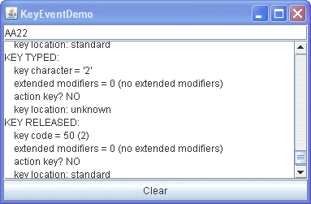

# 如何编写密钥监听器

> 原文： [https://docs.oracle.com/javase/tutorial/uiswing/events/keylistener.html](https://docs.oracle.com/javase/tutorial/uiswing/events/keylistener.html)

关键事件表示用户何时在键盘上键入内容。具体而言，当用户按下或释放键盘键时，具有键盘焦点的组件触发键事件。有关焦点的详细信息，请参阅[如何使用焦点子系统](../misc/focus.html)。

* * *

**Note:** 

要定义对特定键的特殊反应，请使用键绑定而不是键侦听器。有关详细信息，请参阅[如何使用键绑定](../misc/keybinding.html)。

* * *

发送有关两种基本类型的关键事件的通知：

*   键入 Unicode 字符
*   按下或释放键盘上的按键

第一种事件称为 _ 键型 _ 事件。第二种是 _ 按键 _ 或 _ 键释放 _ 事件。

通常，除非您需要知道用户何时按下与字符不对应的键，否则您只对键入事件做出反应。例如，要知道用户何时键入 Unicode 字符 - 无论是通过按一个键（例如“a”）还是按顺序按几个键，您都可以处理键入类型的事件。另一方面，要知道用户何时按下 F1 键，或者用户是否按下了数字键盘上的“3”键，您可以处理按键事件。

* * *

**Note:** 

要触发键盘事件，组件 _ 必须 _ 具有键盘焦点。

* * *

要使组件获得键盘焦点，请按照下列步骤操作：

1.  确保组件的`isFocusable`方法返回`true`。此状态允许组件接收焦点。例如，您可以通过调用标签上的`setFocusable(true)`方法为`JLabel`组件启用键盘焦点。
2.  确保组件在适当时请求焦点。对于自定义组件，请实现在单击组件时调用`requestFocusInWindow`方法的鼠标侦听器。

* * *

**Version note:** 

焦点子系统使用焦点遍历键，例如 Tab 和 Shift Tab。如果您需要阻止焦点遍历键被消耗，您可以调用

```
component.setFocusTraversalKeysEnabled(false)

```

在触发关键事件的组件上。然后，您的程序必须自己处理焦点遍历。或者，您可以使用 [`KeyEventDispatcher`](https://docs.oracle.com/javase/8/docs/api/java/awt/KeyEventDispatcher.html) 类预听所有关键事件。 [焦点页面](../misc/focus.html)具有焦点子系统的详细信息。

* * *

您可以获取有关特定按键事件的详细信息。例如，您可以查询按键事件以确定它是否是从操作键触发的。操作键的示例包括复制，粘贴，向上翻页，撤消以及箭头和功能键。您还可以查询按键或键释放事件，以确定触发事件的键的位置。大多数关键事件都是从标准键盘触发的，但某些键的事件（如 Shift）会提供有关用户是否按下键盘左侧或右侧的 Shift 键的信息。同样，数字“2”可以从标准键盘或数字键盘输入。

对于键类型事件，您可以获取关键字符值以及使用的任何修饰符。

* * *

**Note:** 

您不应该依赖从`getKeyChar`返回的键字符值，除非它涉及键类型事件。

* * *

以下示例演示了关键事件。它由一个可以键入的文本字段组成，后跟一个文本区域，每次文本字段触发一个键事件时都会显示一条消息。窗口底部的按钮可以清除文本字段和文本区域。



* * *

**Try this:** 

1.  单击“启动”按钮以使用 [Java™Web Start](http://www.oracle.com/technetwork/java/javase/javawebstart/index.html) （[下载 JDK 7 或更高版本](http://www.oracle.com/technetwork/java/javase/downloads/index.html)）运行 KeyEventDemo。或者，要自己编译并运行示例，请参考[示例索引](../examples/events/index.html#KeyEventDemo)。 [](https://docs.oracle.com/javase/tutorialJWS/samples/uiswing/KeyEventDemoProject/KeyEventDemo.jnlp) 

2.  通过按下并释放键盘上的 A 键来键入小写的“a”。
    文本字段触发三个事件：按键事件，键输入事件和键释放事件。请注意，键输入事件没有键代码信息，键按下和键释放事件没有键字符信息。到目前为止，没有任何事件来自修改器或操作键，并且按键和键释放事件上报告的键位置很可能是标准的。
3.  按“清除”按钮。
    您可能希望在执行以下每个步骤后执行此操作。
4.  按下并释放 Shift 键。
    文本字段触发两个事件：按键和键释放。文本字段不会触发键入类型的事件，因为 Shift 本身与任何字符都不对应。
5.  按 Shift 和 A 键键入大写的“A”。
    你会看到以下事件，虽然可能不按此顺序：按键（Shift），按键（A），键入键入（'A'），键释放（A），键释放（转移）。请注意，Shift 被列为键入和按键事件的修饰键。
6.  通过按下并释放 Caps Lock 键，然后按 A 键，键入大写的“A”。
    您应该看到以下事件：按键（大写锁定），按键（A），按键键入（'A'），按键释放（A）。请注意，Caps Lock 是 _ 而非 _ 列为修饰键。
7.  按 Tab 键。键事件侦听器未接收 Tab 键按下或键释放事件。这是因为焦点子系统使用焦点遍历键，例如 Tab 和 Shift Tab。再按两次 Tab 键将焦点返回到文本区域。
8.  按功能键，例如 F3。您将看到功能键是一个操作键。
9.  按左 Shift 键，然后按右 Shift 键。按键和键释放事件表示键入了哪个 Shift 键。
10.  如果您的键盘有数字键盘，请按 Num Lock 键。
    至于 Caps Lock，有一个按键事件，但没有按键释放的事件。
11.  按数字键盘上的“2”键。您会看到数字'2'的按键，键输入和键释放事件。
12.  按标准键盘上的“2”键。再次，您会看到三个事件消息。两个键的键输入事件是相同的。但是按键和按键释放的事件表示不同的密钥代码和不同的密钥位置。
13.  再次按 Num Lock 键。一个密钥释放事件被触发。

* * *

您可以在 [`KeyEventDemo.java`](../examples/events/KeyEventDemoProject/src/events/KeyEventDemo.java) 中找到示例代码。这是演示的关键事件处理代码：

```
public class KeyEventDemo ...  implements KeyListener ... {
    ...//where initialization occurs:
        typingArea = new JTextField(20);
        typingArea.addKeyListener(this);

        //Uncomment this if you wish to turn off focus
        //traversal.  The focus subsystem consumes
        //focus traversal keys, such as Tab and Shift Tab.
        //If you uncomment the following line of code, this
        //disables focus traversal and the Tab events 
        //become available to the key event listener.
        //typingArea.setFocusTraversalKeysEnabled(false);
    ...
    /** Handle the key typed event from the text field. */
    public void keyTyped(KeyEvent e) {
        displayInfo(e, "KEY TYPED: ");
    }

    /** Handle the key-pressed event from the text field. */
    public void keyPressed(KeyEvent e) {
        displayInfo(e, "KEY PRESSED: ");
    }

    /** Handle the key-released event from the text field. */
    public void keyReleased(KeyEvent e) {
        displayInfo(e, "KEY RELEASED: ");
    }
    ...
    private void displayInfo(KeyEvent e, String keyStatus){

        //You should only rely on the key char if the event
        //is a key typed event.
        int id = e.getID();
        String keyString;
        if (id == KeyEvent.KEY_TYPED) {
            char c = e.getKeyChar();
            keyString = "key character = '" + c + "'";
        } else {
            int keyCode = e.getKeyCode();
            keyString = "key code = " + keyCode
                    + " ("
                    + KeyEvent.getKeyText(keyCode)
                    + ")";
        }

        int modifiersEx = e.getModifiersEx();
        String modString = "extended modifiers = " + modifiersEx;
        String tmpString = KeyEvent.getModifiersExText(modifiersEx);
        if (tmpString.length() > 0) {
            modString += " (" + tmpString + ")";
        } else {
            modString += " (no extended modifiers)";
        }

        String actionString = "action key? ";
        if (e.isActionKey()) {
            actionString += "YES";
        } else {
            actionString += "NO";
        }

        String locationString = "key location: ";
        int location = e.getKeyLocation();
        if (location == KeyEvent.KEY_LOCATION_STANDARD) {
            locationString += "standard";
        } else if (location == KeyEvent.KEY_LOCATION_LEFT) {
            locationString += "left";
        } else if (location == KeyEvent.KEY_LOCATION_RIGHT) {
            locationString += "right";
        } else if (location == KeyEvent.KEY_LOCATION_NUMPAD) {
            locationString += "numpad";
        } else { // (location == KeyEvent.KEY_LOCATION_UNKNOWN)
            locationString += "unknown";
        }

        ...//Display information about the KeyEvent...
    }
}

```

_ 相应的适配器类是 [`KeyAdapter`](https://docs.oracle.com/javase/8/docs/api/java/awt/event/KeyAdapter.html) 。_

| 方法 | 目的 |
| :-- | :-- |
| [keyTyped（KeyEvent）](https://docs.oracle.com/javase/8/docs/api/java/awt/event/KeyListener.html#keyTyped-java.awt.event.KeyEvent-) | 在用户在侦听组件中键入 Unicode 字符后调用。 |
| [keyPressed（KeyEvent）](https://docs.oracle.com/javase/8/docs/api/java/awt/event/KeyListener.html#keyPressed-java.awt.event.keyPressed-) | 在用户按下某个键并且收听的组件具有焦点时调用。 |
| [keyReleased（KeyEvent）](https://docs.oracle.com/javase/8/docs/api/java/awt/event/KeyListener.html#keyReleased-java.awt.event.KeyEvent-) | 在用户释放键时，在收听的组件具有焦点时调用。 |

`KeyEvent`类从 [`InputEvent`](https://docs.oracle.com/javase/8/docs/api/java/awt/event/InputEvent.html) 类继承了许多有用的方法，例如`getModifiersEx`，以及来自 [`ComponentEvent`](https://docs.oracle.com/javase/8/docs/api/java/awt/event/ComponentEvent.html) 和[的一些有用方法`AWTEvent`](https://docs.oracle.com/javase/8/docs/api/java/awt/AWTEvent.html) 类。有关完整列表，请参阅[鼠标监听器](mouselistener.html)页面中的 [InputEvent 类](mouselistener.html#inputevent)表。

| 方法 | 目的 |
| :-- | :-- |
| [int getKeyChar（）](https://docs.oracle.com/javase/8/docs/api/java/awt/event/KeyEvent.html#getKeyChar--) | 获取与此事件关联的 Unicode 字符。仅对键类型事件依赖此值。 |
| [int getKeyCode（）](https://docs.oracle.com/javase/8/docs/api/java/awt/event/KeyEvent.html#getKeyCode--) | 获得与此事件关联的密钥代码。密钥代码标识用户按下或释放的键盘上的特定键。 `KeyEvent`类为常见键定义了许多键代码常量。例如，`VK_A`指定标记为 **A** 的键，`VK_ESCAPE`指定 Escape 键。 |
| [String getKeyText（int）](https://docs.oracle.com/javase/8/docs/api/java/awt/event/KeyEvent.html#getKeyText-int-)
[String getKeyModifiersText（int）](https://docs.oracle.com/javase/8/docs/api/java/awt/event/KeyEvent.html#getKeyModifiersText-int-) | 分别返回事件的键代码和修饰键的文本描述。 |
| [int getModifiersEx（）](https://docs.oracle.com/javase/8/docs/api/java/awt/event/InputEvent.html#getModifiersEx--)
[String getModifiersExText（int modifiers）](https://docs.oracle.com/javase/8/docs/api/java/awt/event/InputEvent.html#getModifiersExText-int-) | 返回此事件的扩展修饰符掩码。有一些从`InputEvent`类继承的方法。扩展修饰符表示所有模态键的状态。 `getModifiersExText`方法返回一个描述扩展修饰键和鼠标键的字符串。由于`getModifiersEx`和`getModifiersExText`方法提供了关于关键事件的更多信息，因此它们优于`getKeyText`或`getKeyModifiersText`方法。 |
| [boolean isActionKey（）](https://docs.oracle.com/javase/8/docs/api/java/awt/event/KeyEvent.html#isActionKey--) | 如果触发事件的键是操作键，则返回 true。操作键的示例包括剪切，复制，粘贴，向上翻页，大写锁定，箭头和功能键。此信息仅对按键和键释放事件有效。 |
| [int getKeyLocation（）](https://docs.oracle.com/javase/8/docs/api/java/awt/event/KeyEvent.html#getKeyLocation--) | 返回触发此事件的键的位置。这提供了一种区分键盘上出现不止一次的键的方法，例如两个移位键。可能的值为`KEY_LOCATION_STANDARD`，`KEY_LOCATION_LEFT`，`KEY_LOCATION_RIGHT`，`KEY_LOCATION_NUMPAD`或`KEY_LOCATION_UNKNOWN`。此方法始终为键类型事件返回`KEY_LOCATION_UNKNOWN`。 |

下表列出了使用键侦听器的示例。

| 例 | 在哪里描述 | 笔记 |
| :-- | :-- | :-- |
| [`KeyEventDemo`](../examples/events/index.html#KeyEventDemo) | 这个部分 | 报告文本字段上发生的所有关键事件，以演示触发关键事件的环境。 |