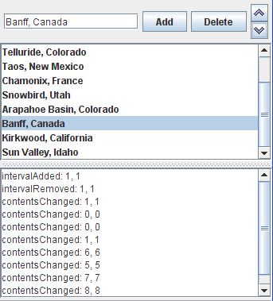

# 如何编写列表数据监听器

> 原文： [https://docs.oracle.com/javase/tutorial/uiswing/events/listdatalistener.html](https://docs.oracle.com/javase/tutorial/uiswing/events/listdatalistener.html)

当可变[列表](../components/list.html)的内容发生变化时，会发生列表数据事件。由于模型 - 而不是组件 - 触发这些事件，您必须使用列表模型注册列表数据监听器。如果您没有显式创建具有可变列表模型的列表，那么您的列表是不可变的，并且其模型不会触发这些事件。

* * *

**Note:** 

[组合框](../components/combobox.html)模型也列出了火灾列表数据事件。但是，除非您[创建自定义组合框模型](../components/combobox.html#datsun)，否则通常不需要了解它们。

* * *

以下示例演示了可变列表中的列表数据事件：



* * *

**Try this:** 

1.  单击“启动”按钮以使用 [Java™Web Start](http://www.oracle.com/technetwork/java/javase/javawebstart/index.html) （[下载 JDK 7 或更高版本](http://www.oracle.com/technetwork/java/javase/downloads/index.html)）运行 ListDataEventDemo。或者，要自己编译并运行示例，请参考[示例索引](../examples/events/index.html#ListDataEventDemo)。 [](https://docs.oracle.com/javase/tutorialJWS/samples/uiswing/ListDataEventDemoProject/ListDataEventDemo.jnlp) 

2.  输入您最喜爱的滑雪胜地的名称，然后单击**添加**按钮。发生`intervalAdded`事件。
3.  在列表中选择一些连续项目，然后单击**删除**按钮。发生`intervalRemoved`事件。
4.  选择一个项目，然后使用箭头按钮在列表中向上或向下移动它。触发了两个`contentsChanged`事件 - 一个用于移动的项目，另一个用于移位的项目。

* * *

您可以在 [`ListDataEventDemo.java`](../examples/events/ListDataEventDemoProject/src/events/ListDataEventDemo.java) 中找到演示代码。以下是在列表模型上注册列表数据监听器并实现监听器的代码：

```java
//...where member variables are declared...
private DefaultListModel listModel;
...
//Create and populate the list model
listModel = new DefaultListModel();
...
listModel.addListDataListener(new MyListDataListener());

class MyListDataListener implements ListDataListener {
    public void contentsChanged(ListDataEvent e) {
        log.append("contentsChanged: " + e.getIndex0() +
                   ", " + e.getIndex1() + newline);
    }
    public void intervalAdded(ListDataEvent e) {
        log.append("intervalAdded: " + e.getIndex0() +
                   ", " + e.getIndex1() + newline);
    }
    public void intervalRemoved(ListDataEvent e) {
        log.append("intervalRemoved: " + e.getIndex0() +
                   ", " + e.getIndex1() + newline);
    }
} 

```

_`ListDataListener`没有相应的适配器类。_

| 方法 | 目的 |
| :-- | :-- |
| [intervalAdded（ListDataEvent）](https://docs.oracle.com/javase/8/docs/api/javax/swing/event/ListDataListener.html#intervalAdded-javax.swing.event.ListDataEvent-) | 在将一个或多个项目添加到列表时调用。 |
| [intervalRemoved（ListDataEvent）](https://docs.oracle.com/javase/8/docs/api/javax/swing/event/ListDataListener.html#intervalRemoved-javax.swing.event.ListDataEvent-) | 从列表中删除一个或多个项目时调用。 |
| [contentsChanged（ListDataEvent）](https://docs.oracle.com/javase/8/docs/api/javax/swing/event/ListDataListener.html#contentsChanged-javax.swing.event.ListDataEvent-) | 当列表中的一个或多个项目的内容发生更改时调用。 |

| 方法 | 目的 |
| :-- | :-- |
| [对象 getSource（）](https://docs.oracle.com/javase/8/docs/api/java/util/EventObject.html#getSource--)
（`java.util.EventObject`中的*）_ | 返回触发事件的对象。 |
| [int getIndex0（）](https://docs.oracle.com/javase/8/docs/api/javax/swing/event/ListDataEvent.html#getIndex0--) | 返回其值已更改的第一个项的索引。 |
| [int getIndex1（）](https://docs.oracle.com/javase/8/docs/api/javax/swing/event/ListDataEvent.html#getIndex1--) | 返回其值已更改的最后一项的索引。 |
| [int getType（）](https://docs.oracle.com/javase/8/docs/api/javax/swing/event/ListDataEvent.html#getType--) | 返回事件类型。可能的值为：`CONTENTS_CHANGED`，`INTERVAL_ADDED`或`INTERVAL_REMOVED`。 |

下表列出了使用列表数据监听器的示例。

| 例 | 在哪里描述 | 笔记 |
| :-- | :-- | :-- |
| [`ListDataEventDemo`](../examples/events/index.html#ListDataEventDemo) | 这个部分 | 报告列表中发生的所有列表数据事件。 |