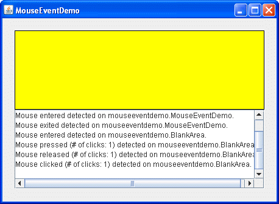

# 如何编写鼠标监听器

> 原文： [https://docs.oracle.com/javase/tutorial/uiswing/events/mouselistener.html](https://docs.oracle.com/javase/tutorial/uiswing/events/mouselistener.html)

当用户使用鼠标（或类似的输入设备）与组件交互时，鼠标事件会通知。当光标进入或退出组件的屏幕区域时以及当用户按下或释放其中一个鼠标按钮时，会发生鼠标事件。

跟踪光标的运动涉及比跟踪其他鼠标事件更多的系统开销。这就是鼠标运动事件被分成鼠标运动监听器类型的原因（参见[如何编写鼠标运动监听器](mousemotionlistener.html)）。

要跟踪鼠标滚轮事件，您可以注册鼠标滚轮监听器。有关详细信息，请参阅[如何编写鼠标滚轮监听器](mousewheellistener.html)。

如果应用程序需要检测鼠标事件和鼠标移动事件，请使用 [`MouseInputAdapter`](https://docs.oracle.com/javase/8/docs/api/javax/swing/event/MouseInputAdapter.html) 类。该类实现 [`MouseInputListener`](https://docs.oracle.com/javase/8/docs/api/javax/swing/event/MouseInputListener.html) ，这是一个实现`MouseListener`和`MouseMotionListener`接口的便捷接口。但是，`MouseInputListener`接口未实现`MouseWheelListener`接口。

或者，使用相应的 AWT [`MouseAdapter`](https://docs.oracle.com/javase/8/docs/api/java/awt/event/MouseAdapter.html) 类，它实现`MouseListener`，`MouseMotionListener`和`MouseWheelListener`接口。

以下示例显示了一个鼠标监听器。在窗口的顶部是一个空白区域（由名为`BlankArea`的类实现）。鼠标监听器侦听`BlankArea`及其容器（`MouseEventDemo`的实例）上的事件。每次发生鼠标事件时，都会在空白区域下显示描述性消息。通过将光标移动到空白区域的顶部并偶尔按下鼠标按钮，可以触发鼠标事件。



* * *

**Try this:** 

1.  单击“启动”按钮以使用 [Java™Web Start](http://www.oracle.com/technetwork/java/javase/javawebstart/index.html) （[下载 JDK 7 或更高版本](http://www.oracle.com/technetwork/java/javase/downloads/index.html)）运行 MouseEventDemo。或者，要自己编译并运行示例，请参考[示例索引](../examples/events/index.html#MouseEventDemo)。 [](https://docs.oracle.com/javase/tutorialJWS/samples/uiswing/MouseEventDemoProject/MouseEventDemo.jnlp) 

2.  将光标移动到窗口顶部的黄色矩形中。
    您将看到一个或多个鼠标输入事件。
3.  按住鼠标左键而不移动鼠标。
    你会看到一个鼠标按下的事件。您可能会看到一些额外的鼠标事件，例如鼠标退出然后鼠标输入。
4.  释放鼠标按钮。
    你会看到一个鼠标释放的事件。如果您没有移动鼠标，则会出现鼠标单击的事件。
5.  再次按住鼠标按钮，然后拖动鼠标，使光标最终到达窗口外。释放鼠标按钮。
    您将看到一个鼠标按下事件，然后是鼠标退出事件，然后是鼠标释放事件。你是 _ 而不是 _ 通知光标的动作。要获得鼠标移动事件，您需要实现[鼠标移动监听器。](mousemotionlistener.html)

* * *

您可以在 [`MouseEventDemo.java`](../examples/events/MouseEventDemoProject/src/events/MouseEventDemo.java) 和 [`BlankArea.java`](../examples/events/MouseEventDemoProject/src/events/BlankArea.java) 中找到演示代码。这是 demo 的鼠标事件处理代码：

```
public class MouseEventDemo ... implements MouseListener {
        //where initialization occurs:
        //Register for mouse events on blankArea and the panel.
        blankArea.addMouseListener(this);
        addMouseListener(this);
    ...

    public void mousePressed(MouseEvent e) {
       saySomething("Mouse pressed; # of clicks: "
                    + e.getClickCount(), e);
    }

    public void mouseReleased(MouseEvent e) {
       saySomething("Mouse released; # of clicks: "
                    + e.getClickCount(), e);
    }

    public void mouseEntered(MouseEvent e) {
       saySomething("Mouse entered", e);
    }

    public void mouseExited(MouseEvent e) {
       saySomething("Mouse exited", e);
    }

    public void mouseClicked(MouseEvent e) {
       saySomething("Mouse clicked (# of clicks: "
                    + e.getClickCount() + ")", e);
    }

    void saySomething(String eventDescription, MouseEvent e) {
        textArea.append(eventDescription + " detected on "
                        + e.getComponent().getClass().getName()
                        + "." + newline);
    }
}

```

| 方法 | 目的 |
| :-- | :-- |
| [mouseClicked（MouseEvent）](https://docs.oracle.com/javase/8/docs/api/java/awt/event/MouseListener.html#mouseClicked-java.awt.event.MouseEvent-) | 在用户单击收听的组件后调用。 |
| [mouseEntered（MouseEvent）](https://docs.oracle.com/javase/8/docs/api/java/awt/event/MouseListener.html#mouseEntered-java.awt.event.MouseEvent-) | 在光标进入侦听组件的边界后调用。 |
| [mouseExited（MouseEvent）](https://docs.oracle.com/javase/8/docs/api/java/awt/event/MouseListener.html#mouseExited-java.awt.event.MouseEvent-) | 在光标退出已侦听组件的边界之后调用。 |
| [mousePressed（MouseEvent）](https://docs.oracle.com/javase/8/docs/api/java/awt/event/MouseListener.html#mousePressed-java.awt.event.MouseEvent-) | 当用户按下鼠标按钮时，在光标位于收听组件上方时调用。 |
| [mouseReleased（MouseEvent）](https://docs.oracle.com/javase/8/docs/api/java/awt/event/MouseListener.html#mouseReleased-java.awt.event.MouseEvent-) | 用户在鼠标按下收听组件后释放鼠标按钮后调用。 |

[`MouseAdapter`](https://docs.oracle.com/javase/8/docs/api/java/awt/event/MouseAdapter.html) 类（AWT 适配器类）是抽象的。它的所有方法都是空的。因此，开发人员可以为特定于应用程序的事件定义方法。您也可以使用 [`MouseInputAdapter`](https://docs.oracle.com/javase/8/docs/api/javax/swing/event/MouseInputAdapter.html) 类，它具有`MouseListener`和`MouseMotionListener`提供的所有方法。

| 方法 | 目的 |
| :-- | :-- |
| [int getClickCount（）](https://docs.oracle.com/javase/8/docs/api/java/awt/event/MouseEvent.html#getClickCount--) | 返回用户所做的快速连续点击次数（包括此事件）。例如，双击返回 2。 |
| [int getX（）](https://docs.oracle.com/javase/8/docs/api/java/awt/event/MouseEvent.html#getX--)
[int getY（）](https://docs.oracle.com/javase/8/docs/api/java/awt/event/MouseEvent.html#getY--)
[Point getPoint（）](https://docs.oracle.com/javase/8/docs/api/java/awt/event/MouseEvent.html#getPoint--) | 返回事件发生的（x，y）位置，相对于触发事件的组件。 |
| [int getXOnScreen（）](https://docs.oracle.com/javase/8/docs/api/java/awt/event/MouseEvent.html#getXOnScreen--)
[int getYOnScreen（）](https://docs.oracle.com/javase/8/docs/api/java/awt/event/MouseEvent.html#getYOnScreen--)
[int getLocationOnScreen（）](https://docs.oracle.com/javase/8/docs/api/java/awt/event/MouseEvent.html#getLocationOnScreen--) | 返回事件的绝对（x，y）位置。这些坐标相对于多屏幕环境的虚拟坐标系。否则，这些坐标相对于与 Component 的图形配置关联的坐标系。 |
| [int getButton（）](https://docs.oracle.com/javase/8/docs/api/java/awt/event/MouseEvent.html#getButton--) | 返回哪个鼠标按钮（如果有）具有已更改的状态。返回以下常量之一：`NOBUTTON`，`BUTTON1`，`BUTTON2`或`BUTTON3`。 |
| [boolean isPopupTrigger（）](https://docs.oracle.com/javase/8/docs/api/java/awt/event/MouseEvent.html#isPopupTrigger--) | 如果鼠标事件应该导致弹出菜单出现，则返回`true`。因为弹出窗口触发器是依赖于平台的，所以如果您的程序使用弹出菜单，则应该为所有鼠标按下和鼠标释放的事件调用`isPopupTrigger`，这些事件可以通过弹出窗口显示的组件触发。有关弹出菜单的更多信息，请参见[打开弹出菜单](../components/menu.html#popup)。 |
| [String getMouseModifiersText（int）](https://docs.oracle.com/javase/8/docs/api/java/awt/event/MouseEvent.html#getMouseModifiersText-int-) | 返回描述在事件期间处于活动状态的修改键和鼠标按钮的`String`，例如“Shift”或“Ctrl + Shift”。可以使用 awt.properties 文件本地化这些字符串。 |

`MouseEvent`类继承了 [InputEvent](https://docs.oracle.com/javase/8/docs/api/java/awt/event/InputEvent.html) 中的许多有用方法以及来自 [`ComponentEvent`](https://docs.oracle.com/javase/8/docs/api/java/awt/event/ComponentEvent.html) 和 [`AWTEvent`](https://docs.oracle.com/javase/8/docs/api/java/awt/AWTEvent.html) 类的几种方便方法。

| 方法 | 目的 |
| :-- | :-- |
| [int getID（）](https://docs.oracle.com/javase/8/docs/api/java/awt/AWTEvent.html#getID--)
（`java.awt.AWTEvent` 中的 _）_ | 返回事件类型，该类型定义特定操作。例如，MouseEvent id 反映每个鼠标事件的鼠标按钮的状态。可以通过 MouseEvent id 指定以下状态：`MouseEvent.MOUSE_PRESSED`，`MouseEvent.MOUSE_RELEASED`和`MouseEvent.MOUSE_CLICKED`。 |
| [组件 getComponent（）](https://docs.oracle.com/javase/8/docs/api/java/awt/event/ComponentEvent.html#getComponent--)
（`ComponentEvent` 中的 _）_ | 返回触发事件的组件。您可以使用此方法代替`getSource`方法。 |
| [int getWhen（）](https://docs.oracle.com/javase/8/docs/api/java/awt/event/InputEvent.html#getWhen--) | 返回此事件发生的时间戳。时间戳越高，事件发生的时间越近。 |
| [boolean isAltDown（）](https://docs.oracle.com/javase/8/docs/api/java/awt/event/InputEvent.html#isAltDown--)
[boolean isControlDown（）](https://docs.oracle.com/javase/8/docs/api/java/awt/event/InputEvent.html#isControlDown--)
[boolean isMetaDown（）](https://docs.oracle.com/javase/8/docs/api/java/awt/event/InputEvent.html#isMetaDown--)
[boolean isShiftDown（）](https://docs.oracle.com/javase/8/docs/api/java/awt/event/InputEvent.html#isShiftDown--)
 | 在事件被触发时返回单个修饰键的状态。 |
| [int getModifiers（）](https://docs.oracle.com/javase/8/docs/api/java/awt/event/InputEvent.html#getModifiers--) | 触发事件时返回所有修饰键和鼠标按钮的状态。您可以使用此方法确定在触发鼠标事件时按下（或释放）了哪个鼠标按钮。 `InputEvent`类定义了这些常数，用于`getModifiers`方法：`ALT_MASK`，`BUTTON1_MASK`，`BUTTON2_MASK`，`BUTTON3_MASK`，`CTRL_MASK`，`META_MASK`和`SHIFT_MASK`。例如，如果按下右键，则以下表达式为真：

```
(mouseEvent.getModifiers() & InputEvent.BUTTON3_MASK)
== InputEvent.BUTTON3_MASK

```

 |
| [int getModifiersEx（）](https://docs.oracle.com/javase/8/docs/api/java/awt/event/InputEvent.html#getModifiersEx--) | 返回此事件的扩展修饰符掩码。扩展修饰符表示事件发生后鼠标按钮和所有模态键的状态，例如 ALT，CTRL，META。您可以使用以下预定义位掩码之一检查修改器的状态：`SHIFT_DOWN_MASK`，`CTRL_DOWN_MASK`，`META_DOWN_MASK`，`ALT_DOWN_MASK`，`BUTTON1_DOWN_MASK`，`BUTTON2_DOWN_MASK`，`BUTTON3_DOWN_MASK`或`ALT_GRAPH_DOWN_MASK`。例如，要检查按钮 1 是否已关闭，但按钮 2 和 3 是否已启动，您将使用以下代码段：

```
if (event.getModifiersEx() & (BUTTON1_DOWN_MASK &#124;
                              BUTTON2_DOWN_MASK &#124;
                              BUTTON3_DOWN_MASK)
                               == BUTTON1_DOWN_MASK) {
    ...
}

```

 |
| [int getModifiersExText（int）](https://docs.oracle.com/javase/8/docs/api/java/awt/event/InputEvent.html#getModifiersExText-int-) | 返回描述扩展修饰键和鼠标按钮的字符串，例如“Shift”，“Button1”或“Ctrl + Shift”。可以通过更改 awt.properties 文件来本地化这些字符串。 |

[`MouseInfo`](https://docs.oracle.com/javase/8/docs/api/java/awt/MouseInfo.html) 类提供了在应用程序运行时随时获取有关鼠标指针位置的信息的方法。

| 方法 | 目的 |
| :-- | :-- |
| [getPointerInfo（）](https://docs.oracle.com/javase/8/docs/api/java/awt/MouseInfo.html#getPointerInfo--) | 返回表示鼠标指针当前位置的`PointerInfo`实例。 |
| [getNumberOfButtons（）](https://docs.oracle.com/javase/8/docs/api/java/awt/MouseInfo.html#getNumberOfButtons--) | 如果系统不支持鼠标，则返回鼠标或`-1`上的按钮数。 |

下表列出了使用鼠标监听器的示例。

| 例 | 在哪里描述 | 笔记 |
| :-- | :-- | :-- |
| [`MouseEventDemo`](../examples/events/index.html#MouseEventDemo) | 这个部分 | 报告在空白面板中发生的所有鼠标事件，以演示触发鼠标事件的环境。 |
| [`GlassPaneDemo`](../examples/components/index.html#GlassPaneDemo) | [如何使用根窗格](../components/rootpane.html) | 使用`MouseInputAdapter`的子类在根窗格的玻璃窗格上侦听鼠标事件和鼠标移动事件。将事件重新分派给底层组件。 |
| [`TableSortDemo`](../examples/components/index.html#TableSortDemo) | [如何使用表格](../components/table.html) | 在表头上侦听鼠标事件。对所选列中的数据进行排序。 |
| [`PopupMenuDemo`](../examples/components/index.html#PopupMenuDemo) | [如何使用菜单](../components/menu.html) | 显示弹出菜单以响应鼠标单击。 |
| [`TrackFocusDemo`](../examples/misc/index.html#TrackFocusDemo) | [如何使用焦点子系统](../misc/focus.html) | 自定义组件`Picture`实现了一个鼠标监听器，当用户单击该组件时，该监听器会请求焦点。 |