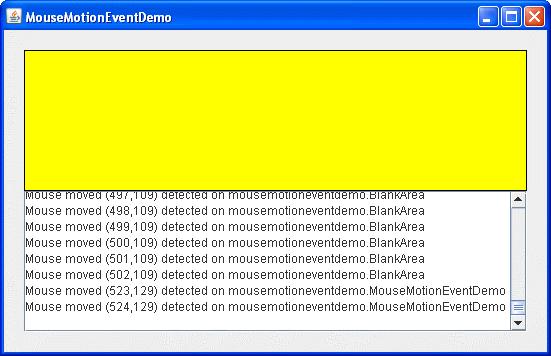

# 如何编写鼠标 - 运动监听器

> 原文： [https://docs.oracle.com/javase/tutorial/uiswing/events/mousemotionlistener.html](https://docs.oracle.com/javase/tutorial/uiswing/events/mousemotionlistener.html)

当用户使用鼠标（或类似的输入设备）移动屏幕上的光标时，鼠标移动事件会发出通知。有关侦听其他类型鼠标事件（如点击）的信息，请参阅[如何编写鼠标侦听器](mouselistener.html)。有关侦听鼠标滚轮事件的信息，请参阅[如何编写鼠标滚轮侦听器](mousewheellistener.html)。

如果应用程序需要检测鼠标事件和鼠标移动事件，请使用 [`MouseInputAdapter`](https://docs.oracle.com/javase/8/docs/api/javax/swing/event/MouseInputAdapter.html) 类，它实现 [`MouseInputListener`](https://docs.oracle.com/javase/8/docs/api/javax/swing/event/MouseInputListener.html) 一个方便的接口，实现`MouseListener` ]和`MouseMotionListener`接口。

或者，使用实现`MouseMotionListener`接口的相应 [`MouseAdapter`](https://docs.oracle.com/javase/8/docs/api/java/awt/event/MouseAdapter.html) AWT 类创建`MouseMotionEvent`并覆盖特定事件的方法。

以下演示代码包含鼠标移动侦听器。此演示与[如何编写鼠标侦听器](mouselistener.html)部分中描述的演示完全相同，只是将`MouseMotionListener`接口替换为`MouseListener`接口。此外，MouseMotionEventDemo 实现`mouseDragged`和`mouseMoved`方法而不是鼠标侦听器方法，并显示坐标而不是点击次数。

<center></center>

* * *

**Try this:** 

1.  单击“启动”按钮以使用 [Java™Web Start](http://www.oracle.com/technetwork/java/javase/javawebstart/index.html) （[下载 JDK 7 或更高版本](http://www.oracle.com/technetwork/java/javase/downloads/index.html)）运行 MouseMotionEventDemo。或者，要自己编译并运行示例，请参考[示例索引](../examples/events/index.html#MouseMotionEventDemo)。 [](https://docs.oracle.com/javase/tutorialJWS/samples/uiswing/MouseMotionEventDemoProject/MouseMotionEventDemo.jnlp) 

2.  将光标移动到窗口顶部的黄色矩形中。
    您将看到一个或多个鼠标移动的事件。
3.  按住鼠标按钮，然后移动鼠标，使光标位于黄色矩形之外。
    你会看到鼠标拖动的事件。

* * *

您可以在 [`MouseMotionEventDemo.java`](../examples/events/MouseMotionEventDemoProject/src/events/MouseMotionEventDemo.java) 和 [`BlankArea.java`](../examples/events/MouseMotionEventDemoProject/src/events/BlankArea.java) 中找到演示代码。 `MouseMotionEventDemo`的以下代码片段实现了鼠标移动事件处理：

```
public class MouseMotionEventDemo extends JPanel 
                                  implements MouseMotionListener {
    //...in initialization code:
        //Register for mouse events on blankArea and panel.
        blankArea.addMouseMotionListener(this);
        addMouseMotionListener(this);
        ...
    }

    public void mouseMoved(MouseEvent e) {
       saySomething("Mouse moved", e);
    }

    public void mouseDragged(MouseEvent e) {
       saySomething("Mouse dragged", e);
    }

    void saySomething(String eventDescription, MouseEvent e) {
        textArea.append(eventDescription 
                        + " (" + e.getX() + "," + e.getY() + ")"
                        + " detected on "
                        + e.getComponent().getClass().getName()
                        + newline);
    }
}

```

SelectionDemo 示例绘制一个矩形，说明用户当前的拖动。要绘制矩形，应用程序必须为三种鼠标事件实现事件处理程序：鼠标按下，鼠标拖动和鼠标释放。要获知所有这些事件，处理程序必须同时实现`MouseListener`和`MouseMotionListener`接口，并注册为鼠标侦听器和鼠标移动侦听器。为了避免必须定义空方法，处理程序不直接实现任何一个侦听器接口。相反，它扩展了`MouseInputAdapter`，如下面的代码片段所示。

```
...//where initialization occurs:
    MyListener myListener = new MyListener();
    addMouseListener(myListener);
    addMouseMotionListener(myListener);
...
private class MyListener extends MouseInputAdapter {
    public void mousePressed(MouseEvent e) {
        int x = e.getX();
        int y = e.getY();
        currentRect = new Rectangle(x, y, 0, 0);
        updateDrawableRect(getWidth(), getHeight());
        repaint();
    }

    public void mouseDragged(MouseEvent e) {
        updateSize(e);
    }

    public void mouseReleased(MouseEvent e) {
        updateSize(e);
    }

    void updateSize(MouseEvent e) {
        int x = e.getX();
        int y = e.getY();
        currentRect.setSize(x - currentRect.x,
                            y - currentRect.y);
        updateDrawableRect(getWidth(), getHeight());
        Rectangle totalRepaint = rectToDraw.union(previouseRectDrawn); 
        repaint(totalRepaint.x, totalRepaint.y,
                totalRepaint.width, totalRepaint.height);
    }
}

```

_ 相应的适配器类别为 [`MouseMotionAdapter`](https://docs.oracle.com/javase/8/docs/api/java/awt/event/MouseMotionAdapter.html) 和 [`MouseAdapter`](https://docs.oracle.com/javase/8/docs/api/java/awt/event/MouseAdapter.html ) 。_

| 方法 | 目的 |
| :-- | :-- |
| [mouseDragged（MouseEvent）](https://docs.oracle.com/javase/8/docs/api/java/awt/event/MouseMotionListener.html#mouseDragged-java.awt.event.MouseEvent-) | 响应用户在按住鼠标按钮的同时移动鼠标而调用。触发最近鼠标按下的事件的组件触发此事件，即使光标不再在该组件上。 |
| [mouseMoved（MouseEvent）](https://docs.oracle.com/javase/8/docs/api/java/awt/event/MouseMotionListener.html#mouseMoved-java.awt.event.MouseEvent-) | 响应用户在没有按下鼠标按钮的情况下移动鼠标而调用。此事件由当前在光标下的组件触发。 |

每个鼠标运动事件方法都有一个参数 - 而 _ 而不是 _ 称为`MouseMotionEvent`！相反，每个鼠标移动事件方法都使用`MouseEvent`参数。有关使用`MouseEvent`对象的信息，请参阅 [MouseEvent API](mouselistener.html#mouseevent) 。

下表列出了使用鼠标移动侦听器的示例。

| 例 | 在哪里描述 | 笔记 |
| :-- | :-- | :-- |
| [`MouseMotionEventDemo`](../examples/events/index.html#MouseMotionEventDemo) | 这个部分 | 报告在空白面板中发生的所有鼠标移动事件，以演示触发鼠标移动事件的环境。 |
| [`LayeredPaneDemo`](../examples/components/index.html#LayeredPaneDemo) 和
[`LayeredPaneDemo2`](../examples/components/index.html#LayeredPaneDemo2) | [如何使用分层窗格](../components/layeredpane.html) | 在分层窗格内移动 Duke 图像以响应鼠标移动事件。 |
| [`SelectionDemo`](../examples/painting/index.html#SelectionDemo) |  | 允许用户拖动矩形以选择图像的一部分。使用`MouseInputAdapter`的子类来监听鼠标事件和鼠标移动事件。 |
| [`GlassPaneDemo`](../examples/components/index.html#GlassPaneDemo) | [如何使用根窗格](../components/rootpane.html) | 使用`MouseInputAdapter`的子类在根窗格的玻璃窗格上侦听鼠标事件和鼠标移动事件。将事件重新分配到基础组件。 |
| [`ScrollDemo`](../examples/components/index.html#ScrollDemo) | [如何使用滚动窗格](../components/scrollpane.html) | 标签子类 ScrollablePicture 使用鼠标移动监听器，即使用户将光标拖到窗口外，也允许用户滚动图片。 |