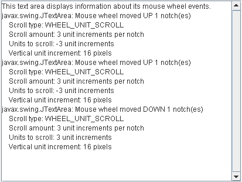

# 如何编写鼠标滚轮监听器

> 原文： [https://docs.oracle.com/javase/tutorial/uiswing/events/mousewheellistener.html](https://docs.oracle.com/javase/tutorial/uiswing/events/mousewheellistener.html)

鼠标滚轮事件在鼠标滚轮旋转时通知。有关收听其他鼠标事件（如点击）的信息，请参阅[如何编写鼠标监听器](mouselistener.html)。有关收听鼠标拖动事件的信息，请参阅[如何编写鼠标 - 运动监听器](mousemotionlistener.html)。并非所有鼠标都有轮子，在这种情况下，鼠标轮事件永远不会产生。无法以编程方式检测鼠标是否配备鼠标滚轮。

或者，使用实现`MouseWheelListener`接口的相应 [`MouseAdapter`](https://docs.oracle.com/javase/8/docs/api/java/awt/event/MouseAdapter.html) AWT 类创建`MouseWheelEvent`并覆盖特定事件的方法。

通常没有必要实现鼠标滚轮监听器，因为鼠标滚轮主要用于滚动。滚动窗格会自动注册对鼠标滚轮作出适当反应的鼠标滚轮监听器。

但是，要创建要在滚动窗格内使用的自定义组件，您可能需要自定义其滚动行为 - 特别是您可能需要设置单位和块增量。例如，对于文本区域，滚动一个单位意味着滚动一行文本。块增量通常会滚动整个“页面”或视口的大小。有关更多信息，请参阅[如何使用滚动窗格](../components/scrollpane.html)页面中的[实现滚动 - 精明客户端](../components/scrollpane.html#scrollable)。

要生成鼠标滚轮事件，光标必须是 _ 超过 _ 注册的组件以侦听鼠标滚轮事件。发生的滚动类型（`WHEEL_UNIT_SCROLL`或`WHEEL_BLOCK_SCROLL`）取决于平台。鼠标滚轮滚动的数量也取决于平台。可以通过平台的鼠标控制面板设置滚动的类型和数量。

以下示例演示鼠标滚轮事件。



* * *

**Try this:** 

1.  单击“启动”按钮以使用 [Java™Web Start](http://www.oracle.com/technetwork/java/javase/javawebstart/index.html) （[下载 JDK 7 或更高版本](http://www.oracle.com/technetwork/java/javase/downloads/index.html)）运行 MouseWheelEventDemo。或者，要自己编译并运行示例，请参考[示例索引](../examples/events/index.html#MouseWheelEventDemo)。 [](https://docs.oracle.com/javase/tutorialJWS/samples/uiswing/MouseWheelEventDemoProject/MouseWheelEventDemo.jnlp) 

2.  将光标移到文本区域上。
3.  将鼠标滚轮远离您。您将在 _ 向上 _ 方向看到一个或多个鼠标滚轮事件。
4.  沿相反方向旋转鼠标滚轮。您将在 _ 向下 _ 方向看到鼠标滚轮事件。
5.  尝试更改鼠标滚轮在系统鼠标控制面板上的滚动行为，以查看输出如何变化。您不需要重新启动演示以查看更改是否生效。

* * *

对于使用鼠标滚轮的单位增量的系统，MouseWheelEventDemo 的输出可能如下所示：

```
javax.swing.JTextArea: Mouse wheel moved UP 1 notch(es)
    Scroll type: WHEEL_UNIT_SCROLL
    Scroll amount: 3 unit increments per notch
    Units to scroll: -3 unit increments
    Vertical unit increment: 16 pixels

```

由`getScrollAmount`方法返回的滚动量表示将滚动多少个单位并始终显示正数。通过`getUnitsToScroll`方法返回的滚动单位在向下滚动时为正，向上滚动时为负。使用`getUnitIncrement`方法从垂直滚动条获得垂直单元的像素数。在前面的示例中，将鼠标滚轮向上滚动一个凹槽应该会导致文本区域向上滚动 48 像素（3x16）。

对于使用块增量进行鼠标滚轮滚动的系统，对于鼠标滚轮的相同移动，输出可能如下所示：

```
javax.swing.JTextArea: Mouse wheel moved UP 1 notch(es)
    Scroll type: WHEEL_BLOCK_SCROLL
    Vertical block increment: 307 pixels

```

使用`getBlockIncrement`方法从垂直滚动条获得垂直块增量。在这种情况下，将鼠标滚轮向上滚动一个凹口意味着文本区域应向上滚动 307 个像素。

在 [`MouseWheelEventDemo.java`](../examples/events/MouseWheelEventDemoProject/src/events/MouseWheelEventDemo.java) 文件中找到演示代码。以下代码段与鼠标滚轮事件处理有关：

```
public class MouseWheelEventDemo ... implements MouseWheelListener ... {
    public MouseWheelEventDemo() {
        //where initialization occurs:
        //Register for mouse-wheel events on the text area.
        textArea.addMouseWheelListener(this);
        ...
    }

    public void mouseWheelMoved(MouseWheelEvent e) {
       String message;
       int notches = e.getWheelRotation();
       if (notches < 0) {
           message = "Mouse wheel moved UP "
                        + -notches + " notch(es)" + newline;
       } else {
           message = "Mouse wheel moved DOWN "
                        + notches + " notch(es)" + newline;
       }
       if (e.getScrollType() == MouseWheelEvent.WHEEL_UNIT_SCROLL) {
           message += "    Scroll type: WHEEL_UNIT_SCROLL" + newline;
           message += "    Scroll amount: " + e.getScrollAmount()
                   + " unit increments per notch" + newline;
           message += "    Units to scroll: " + e.getUnitsToScroll()
                   + " unit increments" + newline;
           message += "    Vertical unit increment: "
               + scrollPane.getVerticalScrollBar().getUnitIncrement(1)
               + " pixels" + newline;
       } else { //scroll type == MouseWheelEvent.WHEEL_BLOCK_SCROLL
           message += "    Scroll type: WHEEL_BLOCK_SCROLL" + newline;
           message += "    Vertical block increment: "
               + scrollPane.getVerticalScrollBar().getBlockIncrement(1)
               + " pixels" + newline;
       }
       saySomething(message, e);
    }
    ...
}

```

_ 虽然`MouseWheelListener`只有一个方法，但它有相应的适配器类 - `MouseAdapter`。此功能使应用程序只有一个适配器类实例，以便组件从鼠标指针管理所有类型的事件。_

| 方法 | 目的 |
| :-- | :-- |
| [mouseWheelMoved（MouseWheelEvent）](https://docs.oracle.com/javase/8/docs/api/java/awt/event/MouseWheelListener.html#mouseWheelMoved-java.awt.event.MouseWheelEvent-) | 旋转鼠标滚轮时调用。 |

| 方法 | 目的 |
| :-- | :-- |
| [int getScrollType（）](https://docs.oracle.com/javase/8/docs/api/java/awt/event/MouseWheelEvent.html#getScrollType--) | 返回要使用的滚动类型。可能的值为`WHEEL_BLOCK_SCROLL`和`WHEEL_UNIT_SCROLL`，由本机平台确定。 |
| [int getWheelRotation（）](https://docs.oracle.com/javase/8/docs/api/java/awt/event/MouseWheelEvent.html#getWheelRotation--) | 返回鼠标滚轮旋转的槽口数。如果鼠标滚轮朝向用户（向下）旋转，则该值为正。如果鼠标滚轮远离用户（向上）旋转，则该值为负。 |
| [int getScrollAmount（）](https://docs.oracle.com/javase/8/docs/api/java/awt/event/MouseWheelEvent.html#getScrollAmount--) | 返回每个陷口应滚动的单位数。这始终为正数，仅在滚动类型为`MouseWheelEvent.WHEEL_UNIT_SCROLL`时有效。 |
| [int getUnitsToScroll（）](https://docs.oracle.com/javase/8/docs/api/java/awt/event/MouseWheelEvent.html#getUnitsToScroll--) | 返回正或负单位以滚动当前事件。这仅在滚动类型为`MouseWheelEvent.WHEEL_UNIT_SCROLL`时有效。 |

下表列出了使用鼠标滚轮监听器的示例。

| 例 | 在哪里描述 | 笔记 |
| :-- | :-- | :-- |
| [`MouseWheelEventDemo`](../examples/events/index.html#MouseWheelEventDemo) | 这个部分 | 报告文本区域内发生的所有鼠标滚轮事件，以演示触发鼠标滚轮事件的情况。 |