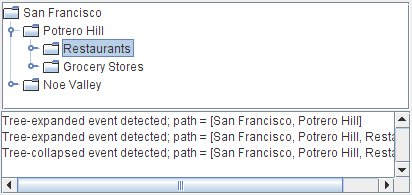

# 如何编写树扩展监听器

> 原文： [https://docs.oracle.com/javase/tutorial/uiswing/events/treeexpansionlistener.html](https://docs.oracle.com/javase/tutorial/uiswing/events/treeexpansionlistener.html)

有时使用[树](../components/tree.html)时，您可能需要在分支展开或折叠时做出反应。例如，您可能需要加载或保存数据。

两种监听器报告扩展和崩溃事件：_ 树扩展 _ 监听器和 _ 树将扩展 _ 监听器。本页讨论 _ 树扩展 _ 监听器。有关 Tree-Will-Expand 监听器的说明，请参见[如何编写树将扩展监听器](treewillexpandlistener.html)。

树扩展侦听器检测何时发生了扩展或崩溃。通常，除非需要防止扩展或崩溃，否则应实现树扩展侦听器。

此示例演示了一个简单的树扩展侦听器。每次发生树扩展事件时，窗口底部的文本区域都会显示一条消息。这是一个简单明了的简单演示。要查看可以否决扩展的更有趣的版本，请参阅[如何编写树将扩展监听器](treewillexpandlistener.html)。

<center></center>

* * *

**Try this:** 

1.  单击“启动”按钮以使用 [Java™Web Start](http://www.oracle.com/technetwork/java/javase/javawebstart/index.html) （[下载 JDK 7 或更高版本](http://www.oracle.com/technetwork/java/javase/downloads/index.html)）运行 TreeExpandEventDemo。或者，要自己编译并运行示例，请参考[示例索引](../examples/events/index.html#TreeExpandEventDemo)。 [](https://docs.oracle.com/javase/tutorialJWS/samples/uiswing/TreeExpandEventDemoProject/TreeExpandEventDemo.jnlp) 

2.  展开节点。触发了树扩展事件。
3.  折叠节点。触发了树崩溃的事件。

* * *

以下代码显示程序如何处理扩展事件。您可以在 [`TreeExpandEventDemo.java`](../examples/events/TreeExpandEventDemoProject/src/events/TreeExpandEventDemo.java) 中找到此示例的源代码。

```
public class TreeExpandEventDemo ... {
    ...
    void saySomething(String eventDescription, TreeExpansionEvent e) {
        textArea.append(eventDescription + "; "
                        + "path = " + e.getPath()
                        + newline);
    }

    class DemoArea ... implements TreeExpansionListener {
        ...
        public DemoArea() {
            ...
            tree.addTreeExpansionListener(this);
            ...
        }
        ...
        // Required by TreeExpansionListener interface.
        public void treeExpanded(TreeExpansionEvent e) {
            saySomething("Tree-expanded event detected", e);
        }

        // Required by TreeExpansionListener interface.
        public void treeCollapsed(TreeExpansionEvent e) {
            saySomething("Tree-collapsed event detected", e);
        }
    }
}

```

_`TreeExpansionListener`没有适配器类。_

| 方法 | 目的 |
| :-- | :-- |
| [treeCollapsed（TreeExpansionEvent）](https://docs.oracle.com/javase/8/docs/api/javax/swing/event/TreeExpansionListener.html#treeCollapsed-javax.swing.event.TreeExpansionEvent-) | 在树节点崩溃后调用。 |
| [treeExpanded（TreeExpansionEvent）](https://docs.oracle.com/javase/8/docs/api/javax/swing/event/TreeExpansionListener.html#treeExpanded-javax.swing.event.TreeExpansionEvent-) | 在树节点扩展后调用。 |

| 方法 | 目的 |
| :-- | :-- |
| [对象 getSource（）](https://docs.oracle.com/javase/8/docs/api/java/util/EventObject.html#getSource--) | 返回触发事件的对象。 |
| [TreePath getPath（）](https://docs.oracle.com/javase/8/docs/api/javax/swing/event/TreeExpansionEvent.html#getPath--) | 返回 [`TreePath`](https://docs.oracle.com/javase/8/docs/api/javax/swing/tree/TreePath.html) 对象，该对象标识从树的根到折叠/展开节点的每个节点（包括）。 |

下表列出了使用树扩展侦听器的示例。

| 例 | 在哪里描述 | 笔记 |
| :-- | :-- | :-- |
| [`TreeExpandEventDemo`](../examples/events/index.html#TreeExpandEventDemo) | 这个部分 | 每当发生树扩展事件时显示消息。 |
| [`TreeExpandEventDemo2`](../examples/events/index.html#TreeExpandEventDemo2) | [如何编写树将扩展监听器](treewillexpandlistener.html) | 向`TreeExpandEventDemo`添加 tree-will-expand 监听器。 |