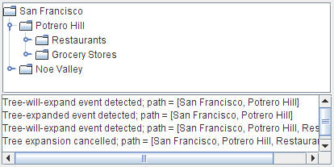

# 如何编写 Tree-Will-Expand 监听器

> 原文： [https://docs.oracle.com/javase/tutorial/uiswing/events/treewillexpandlistener.html](https://docs.oracle.com/javase/tutorial/uiswing/events/treewillexpandlistener.html)

_tree-will-expand_ 侦听器可防止[树](../components/tree.html)节点扩展或折叠。要在发生扩展或崩溃后立即通知 _，您应该使用 _ 树扩展监听器 _。_

该演示将一个 tree-will-expand 监听器添加到[如何编写树扩展监听器](treeexpansionlistener.html)中讨论的`TreeExpandEventDemo`示例中。这里添加的代码演示了 _tree-will-expand_ 侦听器可以防止节点扩展和崩溃：每次尝试扩展节点时，侦听器都会提示您进行确认。



* * *

**Try this:** 

1.  单击“启动”按钮以使用 [Java™Web Start](http://www.oracle.com/technetwork/java/javase/javawebstart/index.html) （[下载 JDK 7 或更高版本](http://www.oracle.com/technetwork/java/javase/downloads/index.html)）运行 TreeExpandEventDemo2。或者，要自己编译并运行示例，请参考[示例索引](../examples/events/index.html#TreeExpandEventDemo2)。 [](https://docs.oracle.com/javase/tutorialJWS/samples/uiswing/TreeExpandEventDemo2Project/TreeExpandEventDemo2.jnlp) 

2.  单击 **Potrero Hill** 节点左侧的图形。这告诉树您要扩展节点。
    出现一个对话框，询问您是否确实要扩展节点。
3.  单击“展开”或关闭对话框。
    文本区域中的消息告诉您发生了 tree-will-expand 事件和树扩展事件。在每条消息的末尾是扩展节点的路径。
4.  尝试展开另一个节点，但这次按对话框中的“取消扩展”按钮。
    节点不扩展。文本区域中的消息告诉您发生了 tree-will-expand 事件，并且您取消了树扩展。
5.  折叠 **Potrero Hill** 节点。
    节点在没有出现对话框的情况下折叠，因为事件处理程序的`treeWillCollapse`方法允许崩溃发生，无争议。

* * *

以下代码段显示了此程序添加到`TreeExpandEventDemo`的代码。粗线可防止树扩展。您可以在 [`TreeExpandEventDemo2.java`](../examples/events/TreeExpandEventDemo2Project/src/events/TreeExpandEventDemo2.java) 中找到所有演示的源代码。

```
public class TreeExpandEventDemo2 ... {
    ...
    class DemoArea ... implements ... TreeWillExpandListener {
        ...
        public DemoArea() {
            ...
            tree.addTreeWillExpandListener(this);
            ...
        }
        ...
        //Required by TreeWillExpandListener interface.
        public void treeWillExpand(TreeExpansionEvent e) 
                    throws ExpandVetoException {
            saySomething("Tree-will-expand event detected", e);
            //...show a dialog...
            if (/* user said to cancel the expansion */) {
                //Cancel expansion.
                saySomething("Tree expansion cancelled", e);
                throw new ExpandVetoException(e);
            }
        }

        //Required by TreeWillExpandListener interface.
        public void treeWillCollapse(TreeExpansionEvent e) {
            saySomething("Tree-will-collapse event detected", e);
        }
        ...
    }
}

```

_`TreeWillExpandListener`没有适配器类。_

| 方法 | 目的 |
| :-- | :-- |
| [treeWillCollapse（TreeExpansionEvent）](https://docs.oracle.com/javase/8/docs/api/javax/swing/event/TreeWillExpandListener.html#treeWillCollapse-javax.swing.event.TreeExpansionEvent-) | 在树节点崩溃之前调用。为了防止崩溃，您实现此方法应该抛出 [`ExpandVetoException`](https://docs.oracle.com/javase/8/docs/api/javax/swing/tree/ExpandVetoException.html) 事件。 |
| [treeWillExpand（TreeExpansionEvent）](https://docs.oracle.com/javase/8/docs/api/javax/swing/event/TreeWillExpandListener.html#treeWillExpand-javax.swing.event.TreeExpansionEvent-) | 在树节点扩展之前调用。为防止发生扩展，此方法的实现应抛出 [`ExpandVetoException`](https://docs.oracle.com/javase/8/docs/api/javax/swing/tree/ExpandVetoException.html) 事件。 |

有关前面方法的 [`TreeExpansionEvent`](https://docs.oracle.com/javase/8/docs/api/javax/swing/event/TreeExpansionEvent.html) 参数的信息，请参见[树扩展事件 API](treeexpansionlistener.html#api) 。

本节中介绍的 [`TreeExpandEventDemo2`](../examples/events/index.html#TreeExpandEventDemo2) 是我们使用 tree-will-expand 监听器的唯一示例。