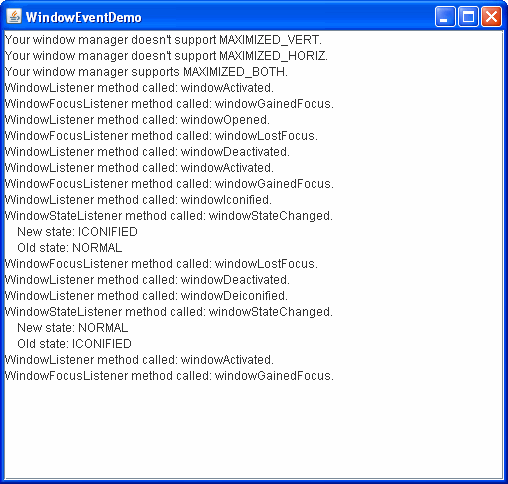

# 如何编写窗口监听器

> 原文： [https://docs.oracle.com/javase/tutorial/uiswing/events/windowlistener.html](https://docs.oracle.com/javase/tutorial/uiswing/events/windowlistener.html)

本节介绍如何实现三种与窗口相关的事件处理器：`WindowListener`，`WindowFocusListener`和`WindowStateListener`。所有三个监听器都处理`WindowEvent`对象。所有三个事件处理器中的方法都是由 abstract `WindowAdapter`类实现的。

当在窗口（例如[帧](../components/frame.html)或[对话框](../components/dialog.html)）上注册了适当的监听器时，窗口事件在窗口活动或状态发生后立即触发。如果此窗口接收键盘输入，则窗口被视为“焦点所有者”。

以下窗口活动或状态可以在窗口事件之前：

*   打开一个窗口 - 第一次显示一个窗口。
*   关闭窗口 - 从屏幕上删除窗口。
*   图标化窗口 - 将窗口缩小为桌面上的图标。
*   对窗口进行去屏蔽 - 将窗口恢复为原始大小。
*   聚焦窗口 - 包含“焦点所有者”的窗口。
*   激活的窗口（框架或对话框） - 此窗口是聚焦窗口，或拥有聚焦窗口。
*   停用窗口 - 此窗口失去焦点。有关焦点的更多信息，请参阅 [AWT 焦点子系统](https://docs.oracle.com/javase/6/docs/api/java/awt/doc-files/FocusSpec.html)规范。
*   Maximizing the window — Increasing a window's size to the maximum allowable size, either in the vertical direction, the horizontal direction, or both directions.

    `WindowListener`接口定义处理大多数窗口事件的方法，例如用于打开和关闭窗口的事件，窗口的激活和取消激活，以及窗口的图标化和取消图标化。

    另外两个窗口监听器接口是`WindowFocusListener`和`WindowStateListener`。 `WindowFocusListener`包含检测窗口何时成为焦点所有者或丢失焦点所有者状态的方法。 `WindowStateListener`有一种方法可以检测窗口状态的变化，例如当窗口被图标化，去图标化，最大化或恢复正常时。

    虽然您可以使用`WindowListener`方法来检测某些窗口状态，例如图标化，但`WindowStateListener`可能更可取的原因有两个：它只有一种方法可供您实现，并且它提供了对最大化的支持。

    * * *

    **Note:** Not all window managers/native platforms support all window states. The `java.awt.Toolkit` method [`isFrameStateSupported(int)`](https://docs.oracle.com/javase/8/docs/api/java/awt/Toolkit.html#isFrameStateSupported-int-) can be used to determine whether a particular window state is supported by a particular window manager. The WindowEventDemo example, described later in this section, shows how this method can be used.

    * * *

    窗口监听器通常用于实现自定义窗口关闭行为。例如，窗口监听器用于在关闭窗口之前保存数据，或在最后一个窗口关闭时退出程序。

    用户不一定需要实现窗口监听器来指定用户关闭窗口时应该执行的操作。默认情况下，当用户关闭窗口时，窗口变为不可见。要指定不同的行为，请使用`JFrame`或`JDialog`类的`setDefaultCloseOperation`方法。要实现窗口关闭处理器，请使用`setDefaultCloseOperation(WindowConstants.DO_NOTHING_ON_CLOSE)`方法使窗口监听器能够提供所有窗口关闭任务。有关如何使用`setDefaultCloseOperation`的详细信息，请参见[对窗口关闭事件](../components/frame.html#windowevents)的响应。

    When the last displayable window within the Java virtual machine (VM) is disposed of, the VM may terminate. Note, however, that there can be a delay before the program exits automatically, and that under some circumstances the program might keep running. It is quicker and safer to explicitly exit the program using `System.exit(int)`. See [AWT Threading Issues](https://docs.oracle.com/javase/8/docs/api/java/awt/doc-files/AWTThreadIssues.html#Autoshutdown) for more information.

    窗口监听器通常还用于在窗口图标化时停止线程和释放资源，并在窗口取消图标化时再次启动。这避免了不必要地使用处理器或其他资源。例如，当包含动画的窗口被图标化时，它应该停止其动画线程并释放任何大缓冲区。当窗口被去图标化时，它可以再次启动线程并重新创建缓冲区。

    以下示例演示窗口事件。不可编辑的文本区域报告其窗口触发的所有窗口事件。该演示实现了`WindowListener`，`WindowFocusListener`和`WindowStateListener`接口中的所有方法。您可以在 [`WindowEventDemo.java`](../examples/events/WindowEventDemoProject/src/events/WindowEventDemo.java) 中找到演示代码。

    

    * * *

    **Try this:** 

    1.  单击“启动”按钮以使用 [Java™Web Start](http://www.oracle.com/technetwork/java/javase/javawebstart/index.html) （[下载 JDK 7 或更高版本](http://www.oracle.com/technetwork/java/javase/downloads/index.html)）运行 WindowEventDemo。或者，要自己编译并运行示例，请参考[示例索引](../examples/events/index.html#WindowEventDemo)。 [](https://docs.oracle.com/javase/tutorialJWS/samples/uiswing/WindowEventDemoProject/WindowEventDemo.jnlp) 

    2.  出现该窗口时，已显示多条消息。一行报告您的窗口管理器是否支持 MAXIMIZED_BOTH。如果窗口管理器不支持其他窗口状态，则还会报告此情况。接下来，显示几行，报告窗口的窗口监听器已接收到窗口打开，激活和获得焦点事件。窗口中显示的所有消息也会发送到标准输出。
    3.  单击另一个窗口。将显示“窗口失去焦点”和“窗口已停用”消息。如果此窗口不是框架或对话框，则它将接收激活或停用的事件。
    4.  单击 WindowEventDemo 窗口。您将看到“窗口激活”和“窗口获得焦点”消息。
    5.  使用窗口控件对窗口进行图标化。显示两个图标化消息，一个来自窗口监听器，另一个来自窗口状态监听器。除非您正在查看标准输出，否则在窗口取消图标化之前不会显示消息。还报告了窗口停用和窗口丢失焦点事件。
    6.  取消图标化窗口。显示两个 deiconification 消息，一个来自窗口监听器，另一个来自窗口状态监听器。 `WindowStateListener`类中的`windowStateChanged`方法提供的信息与使用`WindowListener`类中的`windowIconified`和`windowDeiconified`方法获得的信息相同。还报告了窗口激活和窗口获得焦点事件。
    7.  如果您的外观和感觉提供了一种方法，请最大化窗口。请注意，某些窗口管理器上运行的某些外观（例如 dtwm 上的 Java 外观）提供了一种最大化窗口的方法，但不会报告任何事件。这是因为 dtwm 通过调整窗口大小来模仿最大化，但它不是真正的最大化事件。一些外观和感觉提供了一种在垂直或水平方向上最大化窗口的方法。尝试使用窗口控件来查看可用的选项。
    8.  使用窗口控件关闭窗口。将显示一个窗口关闭消息。窗口关闭后，窗口关闭消息将发送到标准输出。

    * * *

    这是 demo 的窗口事件处理代码：

    ```java
    public class WindowEventDemo extends JFrame implements WindowListener,
                                                WindowFocusListener,
                                                WindowStateListener {
        ...
        static WindowEventDemo frame = new WindowEventDemo("WindowEventDemo");
        JTextArea display;
        ...

        private void addComponentsToPane() {
            display = new JTextArea();
            display.setEditable(false);
            JScrollPane scrollPane = new JScrollPane(display);
            scrollPane.setPreferredSize(new Dimension(500, 450));
            getContentPane().add(scrollPane, BorderLayout.CENTER);

            addWindowListener(this);
            addWindowFocusListener(this);
            addWindowStateListener(this);

            checkWM();
        }

        public WindowEventDemo(String name) {
            super(name);
        }

        //Some window managers don't support all window states.

        public void checkWM() {
            Toolkit tk = frame.getToolkit();
            if (!(tk.isFrameStateSupported(Frame.ICONIFIED))) {
                displayMessage(
                        "Your window manager doesn't support ICONIFIED.");
            }  else displayMessage(
                    "Your window manager supports ICONIFIED.");
            if (!(tk.isFrameStateSupported(Frame.MAXIMIZED_VERT))) {
                displayMessage(
                        "Your window manager doesn't support MAXIMIZED_VERT.");
            }  else displayMessage(
                    "Your window manager supports MAXIMIZED_VERT.");
            if (!(tk.isFrameStateSupported(Frame.MAXIMIZED_HORIZ))) {
                displayMessage(
                        "Your window manager doesn't support MAXIMIZED_HORIZ.");
            } else displayMessage(
                    "Your window manager supports MAXIMIZED_HORIZ.");
            if (!(tk.isFrameStateSupported(Frame.MAXIMIZED_BOTH))) {
                displayMessage(
                        "Your window manager doesn't support MAXIMIZED_BOTH.");
            } else {
                displayMessage(
                        "Your window manager supports MAXIMIZED_BOTH.");
            }
        }

        public void windowClosing(WindowEvent e) {
            displayMessage("WindowListener method called: windowClosing.");
            //A pause so user can see the message before
            //the window actually closes.
            ActionListener task = new ActionListener() {
                boolean alreadyDisposed = false;
                public void actionPerformed(ActionEvent e) {
                    if (frame.isDisplayable()) {
                        alreadyDisposed = true;
                        frame.dispose();
                    }
                }
            };
            Timer timer = new Timer(500, task); //fire every half second
            timer.setInitialDelay(2000);        //first delay 2 seconds
            timer.setRepeats(false);
            timer.start();
        }

        public void windowClosed(WindowEvent e) {
            //This will only be seen on standard output.
            displayMessage("WindowListener method called: windowClosed.");
        }

        public void windowOpened(WindowEvent e) {
            displayMessage("WindowListener method called: windowOpened.");
        }

        public void windowIconified(WindowEvent e) {
            displayMessage("WindowListener method called: windowIconified.");
        }

        public void windowDeiconified(WindowEvent e) {
            displayMessage("WindowListener method called: windowDeiconified.");
        }

        public void windowActivated(WindowEvent e) {
            displayMessage("WindowListener method called: windowActivated.");
        }

        public void windowDeactivated(WindowEvent e) {
            displayMessage("WindowListener method called: windowDeactivated.");
        }

        public void windowGainedFocus(WindowEvent e) {
            displayMessage("WindowFocusListener method called: windowGainedFocus.");
        }

        public void windowLostFocus(WindowEvent e) {
            displayMessage("WindowFocusListener method called: windowLostFocus.");
        }

        public void windowStateChanged(WindowEvent e) {
            displayStateMessage(
              "WindowStateListener method called: windowStateChanged.", e);
        }

        void displayMessage(String msg) {
            display.append(msg + newline);
            System.out.println(msg);
        }

        void displayStateMessage(String prefix, WindowEvent e) {
            int state = e.getNewState();
            int oldState = e.getOldState();
            String msg = prefix
                       + newline + space
                       + "New state: "
                       + convertStateToString(state)
                       + newline + space
                       + "Old state: "
                       + convertStateToString(oldState);
            displayMessage(msg);
        }

        String convertStateToString(int state) {
            if (state == Frame.NORMAL) {
                return "NORMAL";
            }
            String strState = " ";
            if ((state & Frame.ICONIFIED) != 0) {
                strState += "ICONIFIED";
            }
            //MAXIMIZED_BOTH is a concatenation of two bits, so
            //we need to test for an exact match.
            if ((state & Frame.MAXIMIZED_BOTH) == Frame.MAXIMIZED_BOTH) {
                strState += "MAXIMIZED_BOTH";
            } else {
                if ((state & Frame.MAXIMIZED_VERT) != 0) {
                    strState += "MAXIMIZED_VERT";
                }
                if ((state & Frame.MAXIMIZED_HORIZ) != 0) {
                    strState += "MAXIMIZED_HORIZ";
                }
                if (" ".equals(strState)){
                    strState = "UNKNOWN";
                }
            }
            return strState.trim();
        }
    }

    ```

    The window listener API consists of three window listener interfaces and the `WindowEvent` class. Their methods are listed in the following tables:
    *   [WindowListener 接口](#windowlistener)
    *   [WindowFocusListener 接口](#windowfocuslistener)
    *   [WindowStateListener 接口](#windowstatelistener)
    *   [WindowEvent 类](#windowevent)The methods from all three interfaces are available through the [`WindowAdapter`](https://docs.oracle.com/javase/8/docs/api/java/awt/event/WindowAdapter.html) class.

    | 方法 | 目的 |
    | :-- | :-- |
    | [windowOpened（WindowEvent）](https://docs.oracle.com/javase/8/docs/api/java/awt/event/WindowListener.html#windowOpened-java.awt.event.WindowEvent-) | 在听取窗口第一次显示之后调用。 |
    | [windowClosing（WindowEvent）](https://docs.oracle.com/javase/8/docs/api/java/awt/event/WindowListener.html#windowClosing-java.awt.event.WindowEvent-) | 响应用户请求关闭收听窗口而调用。要实际关闭窗口，监听器应调用窗口的`dispose`或`setVisible(false)`方法。 |
    | [windowClosed（WindowEvent）](https://docs.oracle.com/javase/8/docs/api/java/awt/event/WindowListener.html#windowClosed-java.awt.event.WindowEvent-) | 在收听窗口关闭后调用。 |
    | [windowIconified（WindowEvent）](https://docs.oracle.com/javase/8/docs/api/java/awt/event/WindowListener.html#windowIconified-java.awt.event.WindowEvent-)
    [windowDeiconified（WindowEvent）](https://docs.oracle.com/javase/8/docs/api/java/awt/event/WindowListener.html#windowDeiconified-java.awt.event.WindowEvent-) | 在收听窗口被分别图标化或去图标化之后调用。 |
    | [windowActivated（WindowEvent）](https://docs.oracle.com/javase/8/docs/api/java/awt/event/WindowListener.html#windowActivated-java.awt.event.WindowEvent-)
    [windowDeactivated（WindowEvent）](https://docs.oracle.com/javase/8/docs/api/java/awt/event/WindowListener.html#windowDeactivated-java.awt.event.WindowEvent-) | 分别在激活或停用收听窗口后调用。这些方法不会发送到非框架或对话框的窗口。因此，首选确定窗口增益或失去焦点的`windowGainedFocus`和`windowLostFocus`方法。 |

    | 方法 | 目的 |
    | :-- | :-- |
    | [windowGainedFocus（WindowEvent）](https://docs.oracle.com/javase/8/docs/api/java/awt/event/WindowFocusListener.html#windowGainedFocus-java.awt.event.WindowEvent-)
    [windowLostFocus（WindowEvent）](https://docs.oracle.com/javase/8/docs/api/java/awt/event/WindowFocusListener.html#windowLostFocus-java.awt.event.WindowEvent-) | 分别在收听窗口获得或失去焦点后调用。 |

    | 方法 | 目的 |
    | :-- | :-- |
    | [windowStateChanged（WindowEvent）](https://docs.oracle.com/javase/8/docs/api/java/awt/event/WindowStateListener.html#windowStateChanged-java.awt.event.WindowEvent-) | 在收听窗口的状态通过图标化，去图标化，最大化或恢复正常而改变之后调用。状态可通过`WindowEvent`作为按位掩码使用。 `java.awt.Frame`中定义的可能值为：

    *   NORMAL。表示未设置状态位。
    *   ICONIFIED。
    *   MAXIMIZED_HORIZ。
    *   MAXIMIZED_VERT。
    *   MAXIMIZED_BOTH。连接`MAXIMIZED_HORIZ`和`MAXIMIZED_VERT`。窗口管理器可以支持`MAXIMIZED_BOTH`，而不支持`MAXIMIZED_HORIZ`或`MAXIMIZED_VERT`。 [`java.awt.Toolkit`](https://docs.oracle.com/javase/8/docs/api/java/awt/Toolkit.html) 方法 [`isFrameStateSupported(int)`](https://docs.oracle.com/javase/8/docs/api/java/awt/Toolkit.html#isFrameStateSupported-int-) 可用于确定窗口管理器支持的状态。

     |

    | 方法 | 目的 |
    | :-- | :-- |
    | [Window getWindow（）](https://docs.oracle.com/javase/8/docs/api/java/awt/event/WindowEvent.html#getWindow--) | 返回触发事件的窗口。您可以使用它而不是`getSource`方法。 |
    | [Window getOppositeWindow（）](https://docs.oracle.com/javase/8/docs/api/java/awt/event/WindowEvent.html#getOppositeWindow--) | 返回此焦点或激活更改中涉及的其他窗口。对于`WINDOW_ACTIVATED`或`WINDOW_GAINED_FOCUS`事件，这将返回失去激活或焦点的窗口。对于`WINDOW_DEACTIVATED`或`WINDOW_LOST_FOCUS`事件，这将返回获得激活或焦点的窗口。对于在不同 VM 或上下文中具有 Java 应用程序或没有其他窗口的任何其他类型的`WindowEvent`，将返回`null`。 |
    | [int getOldState（）](https://docs.oracle.com/javase/8/docs/api/java/awt/event/WindowEvent.html#getOldState--)
    [int getNewState（）](https://docs.oracle.com/javase/8/docs/api/java/awt/event/WindowEvent.html#getNewState--) | 对于`WINDOW_STATE_CHANGED`事件，这些方法将窗口的先前或新状态作为按位掩码返回。 |

    The following table lists the examples that use window listeners.

    | 例 | 在哪里描述 | 笔记 |
    | :-- | :-- | :-- |
    | [`WindowEventDemo`](../examples/events/index.html#WindowEventDemo) | 这个部分 | 报告在一个窗口上发生的所有窗口事件，以演示触发窗口事件的情况。 |
    | [`SliderDemo`](../examples/components/index.html#SliderDemo) | [如何使用滑块](../components/slider.html) | 侦听窗口 iconify 和 deiconify 事件，以便在窗口不可见时停止动画。 |
    | [`InternalFrameEventDemo`](../examples/events/index.html#InternalFrameEventDemo) | [如何编写内部帧监听器](internalframelistener.html) | 报告在一个内部帧上发生的所有内部帧事件，以演示触发内部帧事件的情况。内部帧事件类似于窗口事件。 |
    | [`DialogDemo`](../examples/components/index.html#DialogDemo) | [文本组件功能](../components/generaltext.html) | [`CustomDialog.java`](../examples/components/DialogDemoProject/src/components/CustomDialog.java) 使用`setDefaultCloseOperation`而不是窗口监听器来确定用户关闭窗口时要采取的操作。 |
    | [`Framework`](../examples/components/index.html#Framework) | - | 一个允许创建和销毁多个窗口的演示。 |