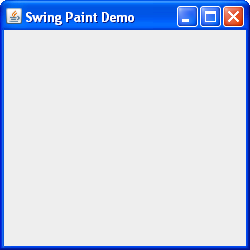

# 创建演示应用程序（步骤 1）

> 原文： [https://docs.oracle.com/javase/tutorial/uiswing/painting/step1.html](https://docs.oracle.com/javase/tutorial/uiswing/painting/step1.html)

所有图形用户界面都需要某种主要应用程序框架来显示。在 Swing 中，这是`javax.swing.JFrame`的一个实例。因此，我们的第一步是实例化这个类，并确保一切按预期工作。请注意，在 Swing 中编程时，您的 GUI 创建代码应放在事件调度线程（EDT）上。这将防止可能导致僵局的潜在竞争条件。以下代码清单显示了如何完成此操作。



javax.swing.JFrame 的实例


单击“启动”按钮以使用 [Java™Web Start](http://www.oracle.com/technetwork/java/javase/javawebstart/index.html) （[下载 JDK 7 或更高版本](http://www.oracle.com/technetwork/java/javase/downloads/index.html)）运行 SwingPaintDemo1。或者，要自己编译并运行示例，请参考[示例索引](../examples/painting/index.html#SwingPaintDemo1)。

[](https://docs.oracle.com/javase/tutorialJWS/samples/uiswing/SwingPaintDemo1Project/SwingPaintDemo1.jnlp)

```
package painting;

import javax.swing.SwingUtilities;
import javax.swing.JFrame;

public class SwingPaintDemo1 {

    public static void main(String[] args) {
        SwingUtilities.invokeLater(new Runnable() {
            public void run() {
                createAndShowGUI();
            }
        });
    }

    private static void createAndShowGUI() {
        System.out.println("Created GUI on EDT? "+
                SwingUtilities.isEventDispatchThread());
        JFrame f = new JFrame("Swing Paint Demo");
        f.setDefaultCloseOperation(JFrame.EXIT_ON_CLOSE);
        f.setSize(250,250);
        f.setVisible(true);
    }
}

```

这将创建框架，设置其标题，并使一切可见。我们使用`SwingUtilities` helper 类在 Event Dispatch Thread 上构造这个 GUI。请注意，默认情况下，当用户单击“关闭”按钮时，`JFrame`不会退出应用程序。我们通过调用`setDefaultCloseOperation`方法，传入适当的参数来提供此行为。此外，我们明确将帧的大小设置为 250 x 250 像素。一旦我们开始向框架添加组件，则不需要此步骤。

练习：

1.  编译并运行应用程序。
2.  测试最小化和最大化按钮。
3.  单击关闭按钮（应用程序应退出。）