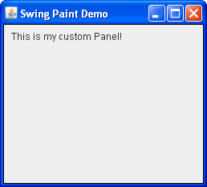

# 创建演示应用程序（步骤 2）

> 原文： [https://docs.oracle.com/javase/tutorial/uiswing/painting/step2.html](https://docs.oracle.com/javase/tutorial/uiswing/painting/step2.html)

接下来，我们将向框架添加自定义绘图表面。为此，我们将创建`javax.swing.JPanel`（一个通用的轻量级容器）的子类，它将提供用于呈现我们的自定义绘制的代码。

<center>

一个 javax.swing.JPanel 子类

</center>

单击“启动”按钮以使用 [Java™Web Start](http://www.oracle.com/technetwork/java/javase/javawebstart/index.html) （[下载 JDK 7 或更高版本](http://www.oracle.com/technetwork/java/javase/downloads/index.html)）运行 SwingPaintDemo2。或者，要自己编译并运行示例，请参考[示例索引](../examples/painting/index.html#SwingPaintDemo2)。

[](https://docs.oracle.com/javase/tutorialJWS/samples/uiswing/SwingPaintDemo2Project/SwingPaintDemo2.jnlp)

```
package painting;

import javax.swing.SwingUtilities;
import javax.swing.JFrame;
import javax.swing.JPanel;
import javax.swing.BorderFactory;
import java.awt.Color;
import java.awt.Dimension;
import java.awt.Graphics; 
public class SwingPaintDemo2 {

    public static void main(String[] args) {
        SwingUtilities.invokeLater(new Runnable() {
            public void run() {
                createAndShowGUI(); 
            }
        });
    }

    private static void createAndShowGUI() {
        System.out.println("Created GUI on EDT? "+
        SwingUtilities.isEventDispatchThread());
        JFrame f = new JFrame("Swing Paint Demo");
        f.setDefaultCloseOperation(JFrame.EXIT_ON_CLOSE);
        f.add(new MyPanel());
        f.pack();
        f.setVisible(true);
    }
}

class MyPanel extends JPanel {

    public MyPanel() {
        setBorder(BorderFactory.createLineBorder(Color.black));
    }

    public Dimension getPreferredSize() {
        return new Dimension(250,200);
    }

    public void paintComponent(Graphics g) {
        super.paintComponent(g);       

        // Draw Text
        g.drawString("This is my custom Panel!",10,20);
    }  
} 

```

您将注意到的第一个更改是我们现在正在导入许多其他类，例如`JPanel`，`Color`和`Graphics`。由于一些较旧的 AWT 类仍然在现代 Swing 应用程序中使用，因此在一些 import 语句中看到`java.awt`包是正常的。我们还定义了一个名为`MyPanel`的自定义`JPanel`子类，它包含了大部分新代码。

`MyPanel`类定义有一个构造函数，用于在其边缘周围设置黑色边框。这是一个可能很难看到的细微细节（如果是，只是注释掉`setBorder`的调用然后重新编译。）`MyPanel`也会覆盖`getPreferredSize`，它会返回所需的宽度和高度。 panel（在这种情况下 250 是宽度，200 是高度。）因此，`SwingPaintDemo`类不再需要指定帧的大小（以像素为单位）。它只是将面板添加到框架，然后调用`pack`。

`paintComponent`方法是您进行所有自定义绘制的地方。此方法由`javax.swing.JComponent`定义，然后由子类重写以提供其自定义行为。它的唯一参数是 [`java.awt.Graphics`](https://docs.oracle.com/javase/8/docs/api/java/awt/Graphics.html) 对象，它提供了许多绘制 2D 形状和获取有关应用程序图形环境的信息的方法。在大多数情况下，此方法实际接收的对象将是 [`java.awt.Graphics2D`](https://docs.oracle.com/javase/8/docs/api/java/awt/Graphics2D.html) （`Graphics`子类）的实例，它为复杂的 2D 图形渲染提供支持。

大多数标准 Swing 组件的外观都由单独的“UI Delegate”对象实现。 `super.paintComponent(g)`的调用将图形上下文传递给组件的 UI 委托，该委托绘制了面板的背景。有关此过程的详细信息，请参阅上述 SDN 文章中标题为“绘画和 UI 代理”的部分。

练习：

1.  现在您已经在屏幕上绘制了一些自定义文本，请尝试像以前一样最小化和恢复应用程序。
2.  用另一个窗口遮挡文本的一部分，然后移开该窗口以重新显示自定义文本。在这两种情况下，绘制子系统都将确定组件已损坏，并确保调用`paintComponent`方法。