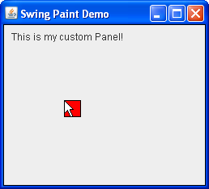

# 创建演示应用程序（步骤 3）

> 原文： [https://docs.oracle.com/javase/tutorial/uiswing/painting/step3.html](https://docs.oracle.com/javase/tutorial/uiswing/painting/step3.html)

最后，我们将添加事件处理代码，以便在用户单击或拖动鼠标时以编程方式重新绘制组件。为了使我们的自定义绘画尽可能高效，我们将跟踪鼠标坐标并仅重新绘制已更改的屏幕区域。这是建议的最佳实践，可以使您的应用程序尽可能高效地运行。



完成的申请


Figure 3: The Completed Application

单击“启动”按钮以使用 [Java™Web Start](http://www.oracle.com/technetwork/java/javase/javawebstart/index.html) （[下载 JDK 7 或更高版本](http://www.oracle.com/technetwork/java/javase/downloads/index.html)）运行 SwingPaintDemo3。或者，要自己编译并运行示例，请参考[示例索引](../examples/painting/index.html#SwingPaintDemo3)。

[](https://docs.oracle.com/javase/tutorialJWS/samples/uiswing/SwingPaintDemo3Project/SwingPaintDemo3.jnlp)

```java
package painting;

import javax.swing.SwingUtilities;
import javax.swing.JFrame;
import javax.swing.JPanel;
import javax.swing.BorderFactory;
import java.awt.Color;
import java.awt.Dimension;
import java.awt.Graphics;
import java.awt.event.MouseEvent;
import java.awt.event.MouseListener;
import java.awt.event.MouseAdapter;
import java.awt.event.MouseMotionListener;
import java.awt.event.MouseMotionAdapter;

public class SwingPaintDemo3 {

    public static void main(String[] args) {
        SwingUtilities.invokeLater(new Runnable() {
            public void run() {
                createAndShowGUI(); 
            }
        });
    }

    private static void createAndShowGUI() {
        System.out.println("Created GUI on EDT? "+
        SwingUtilities.isEventDispatchThread());
        JFrame f = new JFrame("Swing Paint Demo");
        f.setDefaultCloseOperation(JFrame.EXIT_ON_CLOSE); 
        f.add(new MyPanel());
        f.pack();
        f.setVisible(true);
    } 
}

class MyPanel extends JPanel {

    private int squareX = 50;
    private int squareY = 50;
    private int squareW = 20;
    private int squareH = 20;

    public MyPanel() {

        setBorder(BorderFactory.createLineBorder(Color.black));

        addMouseListener(new MouseAdapter() {
            public void mousePressed(MouseEvent e) {
                moveSquare(e.getX(),e.getY());
            }
        });

        addMouseMotionListener(new MouseAdapter() {
            public void mouseDragged(MouseEvent e) {
                moveSquare(e.getX(),e.getY());
            }
        }); 
    }
    private void moveSquare(int x, int y) {
        int OFFSET = 1;
        if ((squareX!=x) || (squareY!=y)) {
            repaint(squareX,squareY,squareW+OFFSET,squareH+OFFSET);
            squareX=x;
            squareY=y;
            repaint(squareX,squareY,squareW+OFFSET,squareH+OFFSET);
        } 
    } 

    public Dimension getPreferredSize() {
        return new Dimension(250,200);
    }

    protected void paintComponent(Graphics g) {
        super.paintComponent(g);       
        g.drawString("This is my custom Panel!",10,20);
        g.setColor(Color.RED);
        g.fillRect(squareX,squareY,squareW,squareH);
        g.setColor(Color.BLACK);
        g.drawRect(squareX,squareY,squareW,squareH);
    }  
}

```

此更改首先从`java.awt.event`包导入各种鼠标类，使应用程序能够响应用户的鼠标活动。已更新构造器以注册鼠标按下和拖动的事件监听器。每当收到`MouseEvent`时，它将被转发到`moveSquare`方法，该方法更新方块的坐标并以智能方式重新绘制组件。请注意，默认情况下，放置在这些事件处理器中的任何代码都将在 Event Dispatch Thread 上执行。

但最重要的变化是`repaint`方法的调用。此方法由`java.awt.Component`定义，并且是允许您以编程方式重绘任何给定组件的表面的机制。它有一个无参数版本（重新绘制整个组件）和一个多参数版本（仅重新绘制指定区域。）此区域也称为*剪辑*。调用`repaint`的多 arg 版本需要一些额外的努力，但保证您的绘图代码不会浪费重新绘制未更改的屏幕区域的周期。

因为我们手动设置剪辑，所以我们的`moveSquare`方法不是一次调用重绘方法，而是调用两次。第一次调用告诉 Swing 重新绘制以前之前的方块*所在的组件区域*（继承的行为使用 UI 委托以当前背景颜色填充该区域。）第二次调用绘制了区域广场*目前*所在的组件。值得注意的一点是，尽管我们在同一个事件处理器中连续两次调用了重绘，但 Swing 足够聪明，可以在一次绘制操作中获取该信息并重新绘制屏幕的这些部分。换句话说，Swing 不会连续两次重新绘制该组件，即使这是代码似乎正在执行的操作。

练习：

1.  注释掉第一次重绘的调用，并注意单击或拖动鼠标时会发生什么。因为该行负责填充背景，您应该注意到所有方块在绘制后都保留在屏幕上。
2.  屏幕上有多个方块，最小化并恢复应用程序框架。怎么了？您应该注意到，最大化屏幕的行为会导致系统完全重新绘制组件表面，这将擦除除当前正方形之外的所有方块。
3.  注释掉两次重绘的调用，并在 paintComponent 方法的末尾添加一行来调用零重绘版本的重绘。应用程序似乎恢复到其原始行为，但现在绘制效率较低，因为现在正在绘制组件的整个表面区域。您可能会注意到性能较慢，尤其是在应用程序最大化的情况下。