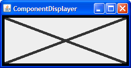
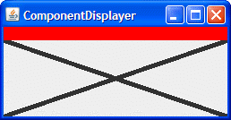

# 问题和练习：执行自定义绘画

> 原文： [https://docs.oracle.com/javase/tutorial/uiswing/QandE/questions-ch6.html](https://docs.oracle.com/javase/tutorial/uiswing/QandE/questions-ch6.html)

## 问题

1\. `JComponent`定义的哪种方法描绘了组件的内部？

2.以下哪个代码段描绘了一个 100x100 像素的矩形（已填充或未填充）？

一个。 `g.fillRect(x, y, 100, 100)`
b。 `g.fillRect(x, y, 99, 99)`
c。 `g.drawRect(x, y, 100, 100)`
d。 b 和 c
e。 a 和 c

3.您将使用什么代码使组件使用 50％透明度的背景颜色执行下一个绘制操作？

## 演习

1.使用标准边框和自定义组件绘制，实现一个首选大小为 250x100 的组件，默认情况下是不透明的，具有 5 像素黑色边框，并绘制“X”（使用 5 像素粗线）在前景色中，如下图所示。

2.实现一个 10x10 像素的图标，并绘制一个填充 10x10 区域的实心矩形。如果启用了图标的组件，则矩形应为红色;如果禁用，灰色。制作使用自定义`Icon`作为中间按钮的`ButtonDemo.java`的副本，而不是显示`middle.gif`。以下图片显示了图标的外观。

|  |  |

3.实现一个边框，在其组件顶部绘制一条红色的 15 像素高的条纹。通过将其替换为在练习 1 中创建的组件的边框来测试此边框。结果应如下图所示。  [检查你的答案。](answers-ch6.html)