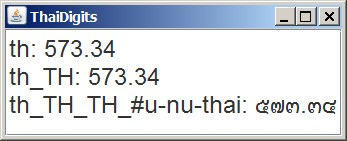

# 创建区域设置

> 原文： [https://docs.oracle.com/javase/tutorial/i18n/locale/create.html](https://docs.oracle.com/javase/tutorial/i18n/locale/create.html)

有几种方法可以创建`Locale`对象。无论使用何种技术，创建都可以像指定语言代码一样简单。但是，您可以通过设置区域（也称为“国家/地区”）和变体代码来进一步区分区域设置。如果您使用的是 JDK 7 或更高版本，则还可以指定脚本代码和 Unicode 语言环境扩展。

创建`Locale`对象的四种方法是：

*   [`Locale.Builder`类](#builder)
*   [`Locale`构造函数](#constructors)
*   [`Locale.forLanguageTag`工厂方法](#factory)
*   [`Locale`常数](#constants)

* * *

**Version Note:** The `Locale.Builder` class and the `forLanguageTag` method were added in the Java SE 7 release.

* * *

[`Locale.Builder`](https://docs.oracle.com/javase/8/docs/api/java/util/Locale.Builder.html) 实用程序类可用于构造符合 IETF BCP 47 语法的`Locale`对象。例如，要指定法语和加拿大的国家/地区，您可以调用`Locale.Builder`构造函数，然后按如下方式链接 setter 方法：

```
Locale aLocale = new Locale.Builder().setLanguage("fr").setRegion("CA").build();

```

下一个示例为美国和英国的英语创建`Locale`对象：

```
Locale bLocale = new Locale.Builder().setLanguage("en").setRegion("US").build();
Locale cLocale = new Locale.Builder().setLanguage("en").setRegion("GB").build();

```

最后一个示例为俄语创建一个`Locale`对象：

```
Locale dLocale = new Locale.Builder().setLanguage("ru").setScript("Cyrl").build();

```

`Locale`类中有三个可用于创建`Locale`对象的构造函数：

*   [`Locale(String language)`](https://docs.oracle.com/javase/8/docs/api/java/util/Locale.html#Locale-java.lang.String-)
*   [`Locale(String language, String country)`](https://docs.oracle.com/javase/8/docs/api/java/util/Locale.html#Locale-java.lang.String-java.lang.String-)
*   [`Locale(String language, String country, String variant)`](https://docs.oracle.com/javase/8/docs/api/java/util/Locale.html#Locale-java.lang.String-java.lang.String-java.lang.String-)

以下示例为加拿大的法语，美国和英国的英语以及俄语创建`Locale`对象。

```
aLocale = new Locale("fr", "CA");
bLocale = new Locale("en", "US");
cLocale = new Locale("en", "GB");
dLocale = new Locale("ru");

```

在 JDK 7 之前的版本中，无法在`Locale`对象上设置脚本代码。

如果您的语言标记字符串符合 IETF BCP 47 标准，则可以使用 Java SE 7 发行版中引入的 [`forLanguageTag(String)`](https://docs.oracle.com/javase/8/docs/api/java/util/Locale.html#forLanguageTag-java.lang.String-) 工厂方法。例如：

```
Locale aLocale = Locale.forLanguageTag("en-US");
Locale bLocale = Locale.forLanguageTag("ja-JP-u-ca-japanese");

```

为方便起见，`Locale`类为某些语言和国家/地区提供[常量](https://docs.oracle.com/javase/8/docs/api/java/util/Locale.html#field_summary)。例如：

```
cLocale = Locale.JAPAN;
dLocale = Locale.CANADA_FRENCH;

```

指定语言常量时，`Locale`的区域部分未定义。接下来的三个语句创建等效的`Locale`对象：

```
j1Locale = Locale.JAPANESE;
j2Locale = new Locale.Builder().setLanguage("ja").build();
j3Locale = new Locale("ja");

```

由以下三个语句创建的`Locale`对象也是等效的：

```
j4Locale = Locale.JAPAN;
j5Locale = new Locale.Builder().setLanguage("ja").setRegion("JP").build();
j6Locale = new Locale("ja", "JP");

```

## 代码

以下部分讨论语言代码和可选脚本，区域和变体代码。

### 语言代码

语言代码是符合 ISO 639 标准的两个或三个小写字母。您可以在 [http://www.loc.gov/standards/iso639-2/php/code_list.php](http://www.loc.gov/standards/iso639-2/php/code_list.php) 找到 ISO 639 代码的完整列表。

下表列出了一些语言代码。

<caption>Sample Language Codes</caption>
| 语言代码 | 描述 |
| --- | --- |
| `de` | 德语 |
| `en` | 英语 |
| `fr` | 法国 |
| `ru` | 俄语 |
| `ja` | 日本 |
| `jv` | 爪哇 |
| `ko` | 朝鲜的 |
| `zh` | 中文 |

### 脚本代码

脚本代码以大写字母开头，后跟三个小写字母，符合 ISO 15924 标准。您可以在 [http://unicode.org/iso15924/iso15924-codes.html](http://unicode.org/iso15924/iso15924-codes.html) 中找到 ISO 15924 代码的完整列表。

下表列出了一些脚本代码。

<caption>Sample Script Codes</caption>
| 脚本代码 | 描述 |
| --- | --- |
| `Arab` | 阿拉伯 |
| `Cyrl` | 西里尔 |
| `Kana` | 片假名 |
| `Latn` | 拉丁 |

检索`Locale`的脚本信息有三种方法：

*   [`getScript()`](https://docs.oracle.com/javase/8/docs/api/java/util/Locale.html#getScript--) - 返回`Locale`对象的 4 个字母的脚本代码。如果没有为语言环境定义脚本，则返回空字符串。
*   [`getDisplayScript()`](https://docs.oracle.com/javase/8/docs/api/java/util/Locale.html#getDisplayScript--) - 返回适合显示给用户的语言环境脚本的名称。如果可能，将为默认语言环境本地化名称。因此，例如，如果脚本代码是“Latn”，则返回的 diplay 脚本名称将是英语语言环境的字符串“Latin”。
*   [`getDisplayScript(Locale)`](https://docs.oracle.com/javase/8/docs/api/java/util/Locale.html#getDisplayScript-java.util.Locale-) - 如果可能，返回本地化的指定`Locale`的显示名称。

### 区域代码

区域（国家/地区）代码包含符合 ISO 3166 标准的两个或三个大写字母，或符合 UN M.49 标准的三个数字。可在 [http://www.chemie.fu-berlin.de/diverse/doc/ISO_3166.html](http://www.chemie.fu-berlin.de/diverse/doc/ISO_3166.html) 找到代码的副本。

下表包含几个示例国家和地区代码。

<caption>Sample Region Codes</caption>
| A-2 代码 | A-3 代码 | 数字代码 | 描述 |
| --- | --- | --- | --- |
| `AU` | `AUS` | `036` | 澳大利亚 |
| `BR` | `BRA` | `076` | 巴西 |
| `CA` | `CAN` | `124` | 加拿大 |
| `CN` | `CHN` | `156` | 中国 |
| `DE` | `DEU` | `276` | 德国 |
| `FR` | `FRA` | `250` | 法国 |
| `IN` | `IND` | `356` | 印度 |
| `RU` | `RUS` | `643` | 俄罗斯联邦 |
| `US` | `USA` | `840` | 美国 |

可选的`variant`代码可用于进一步区分`Locale`。例如，变体代码可用于指示区域代码未涵盖的辩证差异。

* * *

**Version Note:**  Prior to the Java SE 7 release, the variant code was sometimes used to identify differences that were not specific to the language or region. For example, it might have been used to identify differences between computing platforms, such as Windows or UNIX. Under the IETF BCP 47 standard, this use is discouraged.

To define non-language-specific variations relevant to your environment, use the extensions mechanism, as explained in [BCP 47 Extensions](extensions.html).

* * *

从符合 IETF BCP 47 标准的 Java SE 7 版本开始，变体代码专门用于指示定义语言或其方言的其他变体。 IETF BCP 47 标准对变体子标签强加了语法限制。您可以在 [http://www.iana.org/assignments/language-subtag-registry](http://www.iana.org/assignments/language-subtag-registry) 上查看变体代码列表（搜索 _ 变体 _）。

例如，Java SE 使用变体代码来支持泰语。按照惯例，`th`和`th_TH`语言环境的`NumberFormat`对象将使用常见的阿拉伯数字形状或阿拉伯数字来格式化泰语数字。但是，`th_TH_TH`区域设置的`NumberFormat`使用泰国数字形状。 [`ThaiDigits.java`](examples/ThaiDigits.java) 的摘录证明了这一点：

```
String outputString = new String();
Locale[] thaiLocale = {
             new Locale("th"),
             new Locale("th", "TH"),
             new Locale("th", "TH", "TH")
         };

for (Locale locale : thaiLocale) {
    NumberFormat nf = NumberFormat.getNumberInstance(locale);
    outputString = outputString + locale.toString() + ": ";
    outputString = outputString + nf.format(573.34) + "\n";
}

```

以下是此示例的屏幕截图：

<center></center>