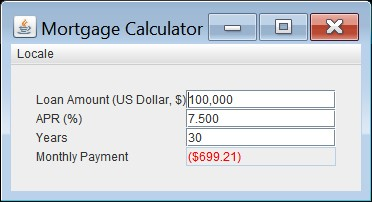
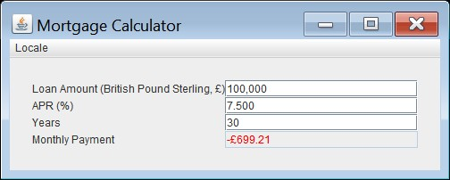

# 使用预定义格式

> 原文： [https://docs.oracle.com/javase/tutorial/i18n/format/numberFormat.html](https://docs.oracle.com/javase/tutorial/i18n/format/numberFormat.html)

通过调用 [`NumberFormat`](https://docs.oracle.com/javase/8/docs/api/java/text/NumberFormat.html) 类提供的方法，您可以根据 [`Locale`](https://docs.oracle.com/javase/8/docs/api/java/util/Locale.html) 格式化数字，货币和百分比。下面的材料演示了一个名为 [`NumberFormatDemo.java`](examples/NumberFormatDemo.java) 的示例程序的格式化技术。

您可以使用 [`NumberFormat`](https://docs.oracle.com/javase/8/docs/api/java/text/NumberFormat.html) 方法格式化基本类型数字，例如`double`及其相应的包装器对象，例如 [`Double`](https://docs.oracle.com/javase/8/docs/api/java/lang/Double.html) 。

以下代码示例根据 [`Locale`](https://docs.oracle.com/javase/8/docs/api/java/util/Locale.html) 格式化 [`Double`](https://docs.oracle.com/javase/8/docs/api/java/lang/Double.html) 。调用 [`getNumberInstance`](https://docs.oracle.com/javase/8/docs/api/java/text/NumberFormat.html#getNumberInstance-java.util.Locale-) 方法返回 [`NumberFormat`](https://docs.oracle.com/javase/8/docs/api/java/text/NumberFormat.html) 的特定于语言环境的实例。 [`format`](https://docs.oracle.com/javase/8/docs/api/java/text/Format.html#format-java.lang.Object-) 方法接受 [`Double`](https://docs.oracle.com/javase/8/docs/api/java/lang/Double.html) 作为参数，并返回 [`String`](https://docs.oracle.com/javase/8/docs/api/java/lang/String.html) 中的格式化数字。

```
static public void displayNumber(Locale currentLocale) {

    Integer quantity = new Integer(123456);
    Double amount = new Double(345987.246);
    NumberFormat numberFormatter;
    String quantityOut;
    String amountOut;

    numberFormatter = NumberFormat.getNumberInstance(currentLocale);
    quantityOut = numberFormatter.format(quantity);
    amountOut = numberFormatter.format(amount);
    System.out.println(quantityOut + "   " + currentLocale.toString());
    System.out.println(amountOut + "   " + currentLocale.toString());
}

```

此示例打印以下内容;它显示了相同数字的格式如何随 [`Locale`](https://docs.oracle.com/javase/8/docs/api/java/util/Locale.html) 而变化：

```
123 456   fr_FR
345 987,246   fr_FR
123.456   de_DE
345.987,246   de_DE
123,456   en_US
345,987.246   en_US

```

### 使用阿拉伯数字以外的数字形状

默认情况下，当文本包含数字值时，将使用阿拉伯数字显示这些值。如果首选其他 Unicode 数字形状，请使用 [`java.awt.font.NumericShaper`](https://docs.oracle.com/javase/8/docs/api/java/awt/font/NumericShaper.html) 类。 `NumericShaper` API 使您可以在任何 Unicode 数字形状中显示内部表示为 ASCII 值的数值。有关详细信息，请参阅[将拉丁数字转换为其他 Unicode 数字](../text/shapedDigits.html)。

此外，某些区域设置具有变体代码，这些代码指定使用 Unicode 数字形状代替阿拉伯数字，例如泰语的区域设置。有关详细信息，请参阅[创建区域设置](../locale/create.html)中的[变体代码](../locale/create.html#variant-code)部分。

## 货币

如果您正在编写业务应用程序，则可能需要格式化和显示货币。您可以使用与数字相同的方式格式化货币，除非您调用 [`getCurrencyInstance`](https://docs.oracle.com/javase/8/docs/api/java/text/NumberFormat.html#getCurrencyInstance-java.util.Locale-) 来创建格式化程序。当您调用 [`format`](https://docs.oracle.com/javase/8/docs/api/java/text/NumberFormat.html#format-double-) 方法时，它会返回 [`String`](https://docs.oracle.com/javase/8/docs/api/java/lang/String.html) ，其中包含格式化的数字和相应的货币符号。

此代码示例演示如何以特定于语言环境的方式格式化货币：

```
static public void displayCurrency( Locale currentLocale) {

    Double currencyAmount = new Double(9876543.21);
    Currency currentCurrency = Currency.getInstance(currentLocale);
    NumberFormat currencyFormatter = 
        NumberFormat.getCurrencyInstance(currentLocale);

    System.out.println(
        currentLocale.getDisplayName() + ", " +
        currentCurrency.getDisplayName() + ": " +
        currencyFormatter.format(currencyAmount));
}

```

前面几行代码生成的输出如下：

```
French (France), Euro: 9 876 543,21 €
German (Germany), Euro: 9.876.543,21 €
English (United States), US Dollar: $9,876,543.21

```

乍一看，这个输出可能看起来不对，因为数值都是一样的。当然，9 876 543,21€不等于$ 9,876,543.21。但是，请记住 [`NumberFormat`](https://docs.oracle.com/javase/8/docs/api/java/text/NumberFormat.html) 类不知道汇率。属于 [`NumberFormat`](https://docs.oracle.com/javase/8/docs/api/java/text/NumberFormat.html) 类货币的方法但不转换它们。

请注意， [`Currency`](https://docs.oracle.com/javase/8/docs/api/java/util/Currency.html) 类的设计使得任何给定货币永远不会有多个 [`Currency`](https://docs.oracle.com/javase/8/docs/api/java/util/Currency.html) 实例。因此，没有公共构造函数。如前面的代码示例所示，使用 [`getInstance`](https://docs.oracle.com/javase/8/docs/api/java/util/Currency.html#getInstance-java.util.Locale-) 方法获得 [`Currency`](https://docs.oracle.com/javase/8/docs/api/java/util/Currency.html) 实例。

样本 [`InternationalizedMortgageCalculator.java`](examples/InternationalizedMortgageCalculator.java) 也演示了如何使用 [`Currency`](https://docs.oracle.com/javase/8/docs/api/java/util/Currency.html) 类。 （请注意，此示例不转换货币值。）以下使用 en-US 语言环境：

<center></center>

以下使用 en-UK 语言环境：

<center></center>

样本 [`InternationalizedMortgageCalculator.java`](examples/InternationalizedMortgageCalculator.java) 需要以下资源文件：

*   [`resources/Resources.properties`](examples/resources/Resources.properties)
*   [`resources/Resources_ar.properties`](examples/resources/Resources_ar.properties)
*   [`resources/Resources_fr.properties`](examples/resources/Resources_fr.properties)

[`Currency`](https://docs.oracle.com/javase/8/docs/api/java/util/Currency.html) 类包含检索货币相关信息的其他方法：

*   [`getAvailableCurrencies`](https://docs.oracle.com/javase/8/docs/api/java/util/Currency.html#getAvailableCurrencies--) ：返回 JDK 中的所有可用货币

*   [`getCurrencyCode`](https://docs.oracle.com/javase/8/docs/api/java/util/Currency.html#getCurrencyCode--) ：返回 [`Currency`](https://docs.oracle.com/javase/8/docs/api/java/util/Currency.html) 实例的 ISO 4217 数字代码

*   [`getSymbol`](https://docs.oracle.com/javase/8/docs/api/java/util/Currency.html#getSymbol--) ：返回 [`Currency`](https://docs.oracle.com/javase/8/docs/api/java/util/Currency.html) 实例的符号。您可以选择将 [`Locale`](https://docs.oracle.com/javase/8/docs/api/java/util/Locale.html) 对象指定为参数。请考虑以下摘录：

    ```
    Locale enGBLocale = 
        new Locale.Builder().setLanguage("en").setRegion("GB").build();

    Locale enUSLocale =
        new Locale.Builder().setLanguage("en").setRegion("US").build();

    Currency currencyInstance = Currency.getInstance(enUSLocale);

    System.out.println(
        "Symbol for US Dollar, en-US locale: " +
        currencyInstance.getSymbol(enUSLocale));

    System.out.println(
        "Symbol for US Dollar, en-UK locale: " +
        currencyInstance.getSymbol(enGBLocale));

    ```

    摘录打印出以下内容：

    ```
    Symbol for US Dollar, en-US locale: $
    Symbol for US Dollar, en-UK locale: USD

    ```

    此摘录表明货币符号可能因区域设置而异。

*   [`getDisplayName`](https://docs.oracle.com/javase/8/docs/api/java/util/Currency.html#getDisplayName--) ：返回 [`Currency`](https://docs.oracle.com/javase/8/docs/api/java/util/Currency.html) 实例的显示名称。与 [`getSymbol`](https://docs.oracle.com/javase/8/docs/api/java/util/Currency.html#getSymbol--) 方法类似，您可以选择指定 [`Locale`](https://docs.oracle.com/javase/8/docs/api/java/util/Locale.html) 对象。

### 对 ISO 4217 货币代码的可扩展支持

[ISO 4217](http://www.iso.org/iso/support/faqs/faqs_widely_used_standards/widely_used_standards_other/currency_codes.htm) 是国际标准组织发布的标准。它指定三个字母的代码（和等效的三位数字代码）来表示货币和资金。该标准由外部机构维护，独立于 Java SE 平台发布。

假设一个国家采用不同的货币，ISO 4217 维护机构发布货币更新。要实现此更新，从而在运行时取代默认货币，请创建名为 `_&lt; JAVA_HOME&gt;的属性文件。_ /lib/currency.properties` 。此文件包含 [ISO 3166](http://www.iso.org/iso/country_codes/iso_3166_code_lists/country_names_and_code_elements.htm) 国家/地区代码的键/值对以及 ISO 4217 货币数据。值部分由三个以逗号分隔的 ISO 4217 货币值组成：字母代码，数字代码和次要单元。以散列字符（`#`）开头的任何行都被视为注释行。例如：

```
# Sample currency property for Canada
CA=CAD,124,2

```

`CAD`代表加元; `124`是加元的数字代码; `2`是次要单位，是货币表示小数货币所需的小数位数。例如，以下属性文件将默认加拿大货币取代为没有任何小于美元的单位的加元：

```
CA=CAD,124,0
```

## 百分比

您还可以使用 [`NumberFormat`](https://docs.oracle.com/javase/8/docs/api/java/text/NumberFormat.html) 类的方法来设置百分比格式。要获取特定于语言环境的格式化程序，请调用 [`getPercentInstance`](https://docs.oracle.com/javase/8/docs/api/java/text/NumberFormat.html#getPercentInstance-java.util.Locale-) 方法。使用此格式化程序，小数部分（例如 0.75）显示为 75％。

以下代码示例显示如何格式化百分比。

```
static public void displayPercent(Locale currentLocale) {

    Double percent = new Double(0.75);
    NumberFormat percentFormatter;
    String percentOut;

    percentFormatter = NumberFormat.getPercentInstance(currentLocale);
    percentOut = percentFormatter.format(percent);
    System.out.println(percentOut + "   " + currentLocale.toString());
}

```

此示例打印以下内容：

```
75 %   fr_FR
75%   de_DE
75%   en_US

```