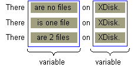

# 处理复数

> 原文： [https://docs.oracle.com/javase/tutorial/i18n/format/choiceFormat.html](https://docs.oracle.com/javase/tutorial/i18n/format/choiceFormat.html)

如果复数和单数形式都可能，则消息中的单词可能会有所不同。使用`ChoiceFormat`类，您可以将数字映射到单词或短语，从而允许您构造语法正确的消息。

在英语中，单词的复数和单数形式通常是不同的。当您构建引用数量的消息时，这可能会出现问题。例如，如果您的消息报告磁盘上的文件数，则可能存在以下变化：

```
There are no files on XDisk.
There is one file on XDisk.
There are 2 files on XDisk.

```

解决此问题的最快方法是创建一个`MessageFormat`模式，如下所示：

```
There are {0,number} file(s) on {1}.

```

不幸的是，前面的模式会导致错误的语法：

```
There are 1 file(s) on XDisk.

```

如果你使用 [`ChoiceFormat`](https://docs.oracle.com/javase/8/docs/api/java/text/ChoiceFormat.html) 类，你可以做得更好。在本节中，您将学习如何通过一个名为 [`ChoiceFormatDemo`](examples/ChoiceFormatDemo.java) 的示例程序处理消息中的复数形式。该程序还使用`MessageFormat`类，这在前一节[处理复合消息](messageFormat.html)中讨论过。

首先，确定消息中的变量：

<center></center>

接下来，使用参数替换消息中的变量，创建可应用于`MessageFormat`对象的模式：

```
There {0} on {1}.

```

磁盘名称的参数（由`{1}`表示）很容易处理。您只需将其视为`MessageFormat`模式中的任何其他`String`变量。此参数与参数值数组中索引 1 处的元素匹配。 （参见[第 7 步](#step7)。）

由于以下几个原因，处理参数`{0}`更复杂：

*   此参数替换的短语因文件数而异。要在运行时构造此短语，您需要将文件数映射到特定的`String`。例如，数字 1 将映射到包含短语`is one file`的`String`。 `ChoiceFormat`类允许您执行必要的映射。
*   如果磁盘包含多个文件，则该短语包含整数。 `MessageFormat`类允许您在短语中插入数字。

## 2.创建 ResourceBundle

因为必须翻译消息文本，所以将其隔离在`ResourceBundle`中：

```
ResourceBundle bundle = ResourceBundle.getBundle(
    "ChoiceBundle", currentLocale);

```

示例程序使用属性文件备份`ResourceBundle`。 [`ChoiceBundle_en_US.properties`](examples/ChoiceBundle_en_US.properties) 包含以下行：

```
pattern = There {0} on {1}.
noFiles = are no files
oneFile = is one file
multipleFiles = are {2} files

```

此属性文件的内容显示了如何构造和格式化消息。第一行包含`MessageFormat`的模式。 （参见[步骤 1](#step1) 。）其他行包含将替换模式中的参数`{0}`的短语。 `multipleFiles`键的短语包含参数`{2}`，它将被一个数字替换。

这是属性文件的法语版本， [`ChoiceBundle_fr_FR.properties`](examples/ChoiceBundle_fr_FR.properties)

```
pattern = Il {0} sur {1}.
noFiles = n'y a pas de fichiers
oneFile = y a un fichier
multipleFiles = y a {2} fichiers

```

## 3.创建消息格式化程序

在此步骤中，您实例化`MessageFormat`并设置其`Locale`：

```
MessageFormat messageForm = new MessageFormat("");
messageForm.setLocale(currentLocale);

```

## 4.创建选择格式化程序

`ChoiceFormat`对象允许您根据`double`编号选择特定的`String`。 `double`数字的范围以及它们映射到的`String`对象在数组中指定：

```
double[] fileLimits = {0,1,2};
String [] fileStrings = {
    bundle.getString("noFiles"),
    bundle.getString("oneFile"),
    bundle.getString("multipleFiles")
};

```

`ChoiceFormat`将`double`数组中的每个元素映射到`String`数组中具有相同索引的元素。在示例代码中，0 映射到通过调用`bundle.getString("noFiles")`返回的`String`。巧合的是，索引与`fileLimits`数组中的值相同。如果代码将`fileLimits[0]`设置为 7，`ChoiceFormat`会将数字 7 映射到`fileStrings[0]`。

在实例化`ChoiceFormat`时指定`double`和`String`数组：

```
ChoiceFormat choiceForm = new ChoiceFormat(fileLimits, fileStrings);

```

## 5.应用模式

还记得你在第 1 步中构建的模式吗？是时候从`ResourceBundle`中检索模式并将其应用到`MessageFormat`对象：

```
String pattern = bundle.getString("pattern");
messageForm.applyPattern(pattern);

```

## 6.分配格式

在此步骤中，为`MessageFormat`对象分配在步骤 4 中创建的`ChoiceFormat`对象：

```
Format[] formats = {choiceForm, null, NumberFormat.getInstance()};
messageForm.setFormats(formats);

```

`setFormats`方法将`Format`对象分配给消息模式中的参数。在调用`setFormats`方法之前，必须调用`applyPattern`方法。下表显示了`Format`数组的元素如何与消息模式中的参数相对应：

## `ChoiceFormatDemo`程序的`Format`数组

| 数组元素 | 模式参数 |
| --- | --- |
| `choiceForm` | `{0}` |
| `null` | `{1}` |
| `NumberFormat.getInstance()` | `{2}` |

在运行时，程序将变量分配给它传递给`MessageFormat`对象的参数数组。数组中的元素对应于模式中的参数。例如，`messageArgument[1]`映射到模式参数`{1}`，它是包含磁盘名称的`String`。在上一步中，程序将`ChoiceFormat`对象分配给模式的参数`{0}`。因此，分配给`messageArgument[0]`的编号决定了`ChoiceFormat`对象选择的`String`。如果`messageArgument[0]`大于或等于 2，则包含短语`are {2} files`的`String`将替换模式中的参数`{0}`。分配给`messageArgument[2]`的编号将替换为模式参数`{2}`。这是尝试这个的代码：

```
Object[] messageArguments = {null, "XDisk", null};

for (int numFiles = 0; numFiles < 4; numFiles++) {
    messageArguments[0] = new Integer(numFiles);
    messageArguments[2] = new Integer(numFiles);
    String result = messageForm.format(messageArguments);
    System.out.println(result);
}

```

## 8.运行演示程序

将程序显示的消息与步骤 2 的`ResourceBundle`中的短语进行比较。请注意`ChoiceFormat`对象选择正确的短语，`MessageFormat`对象使用该短语构造正确的消息。 `ChoiceFormatDemo`程序的输出如下：

```
currentLocale = en_US
There are no files on XDisk.
There is one file on XDisk.
There are 2 files on XDisk.
There are 3 files on XDisk.

currentLocale = fr_FR
Il n'y a pas des fichiers sur XDisk.
Il y a un fichier sur XDisk.
Il y a 2 fichiers sur XDisk.
Il y a 3 fichiers sur XDisk.

```