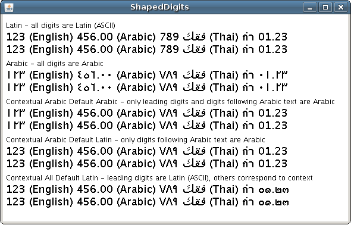

# 将拉丁数字转换为其他 Unicode 数字

> 原文： [https://docs.oracle.com/javase/tutorial/i18n/text/shapedDigits.html](https://docs.oracle.com/javase/tutorial/i18n/text/shapedDigits.html)

默认情况下，当文本包含数字值时，将使用拉丁（欧洲）数字显示这些值。如果首选其他 Unicode 数字形状，请使用 [`java.awt.font.NumericShaper`](https://docs.oracle.com/javase/8/docs/api/java/awt/font/NumericShaper.html) 类。 `NumericShaper` API 使您可以在任何 Unicode 数字形状中显示内部表示为 ASCII 值的数值。

以下代码片段来自 [`ArabicDigits`](examples/ArabicDigits.java) 示例，显示如何使用`NumericShaper`实例将拉丁数字转换为阿拉伯数字。确定整形动作的线是粗体。

```
ArabicDigitsPanel(String fontname) {
    HashMap map = new HashMap();
    Font font = new Font(fontname, Font.PLAIN, 60);
    map.put(TextAttribute.FONT, font);
    map.put(TextAttribute.NUMERIC_SHAPING,
        NumericShaper.getShaper(NumericShaper.ARABIC));

    FontRenderContext frc = new FontRenderContext(null, false, false);
    layout = new TextLayout(text, map, frc);
}

// ...

public void paint(Graphics g) {
    Graphics2D g2d = (Graphics2D)g;
    layout.draw(g2d, 10, 50);
}

```

获取阿拉伯数字的`NumericShaper`实例并将其放入 [`TextLayout.NUMERIC_SHAPING`](https://docs.oracle.com/javase/8/docs/api/java/awt/font/TextAttribute.html#NUMERIC_SHAPING) 属性键的`HashMap`中。哈希映射传递给`TextLayout`实例。在`paint`方法中渲染文本后，数字将显示在所需的脚本中。在此示例中，拉丁数字 0 到 9 绘制为阿拉伯数字。

<center></center>

前面的示例使用`NumericShaper.ARABIC`常量来检索所需的整形器，但 [`NumericShaper`](https://docs.oracle.com/javase/8/docs/api/java/awt/font/NumericShaper.html#field_summary) 类为许多语言提供常量。这些常量被定义为位掩码，被称为`NumericShaper` _ 位掩码的常量 _。

## 基于枚举的范围常量

指定特定数字组的另一种方法是使用 [`NumericShaper.Range`](https://docs.oracle.com/javase/8/docs/api/java/awt/font/NumericShaper.Range.html) 枚举类型（枚举）。这个在 Java SE 7 版本中引入的枚举也提供了一组[常量](https://docs.oracle.com/javase/8/docs/api/java/awt/font/NumericShaper.Range.html#field_summary)。虽然这些常量是使用不同的机制定义的，但`NumericShaper.ARABIC`位掩码在功能上等同于`NumericShaper.Range.ARABIC`枚举，并且每种常量类型都有相应的`getShaper`方法：

*   [`getShaper(int singleRange)`](https://docs.oracle.com/javase/8/docs/api/java/awt/font/NumericShaper.html#getShaper-int-)
*   [`getShaper(NumericShaper.Range singleRange)`](https://docs.oracle.com/javase/8/docs/api/java/awt/font/NumericShaper.html#getShaper-java.awt.font.NumericShaper.Range-)

[`ArabicDigitsEnum`](examples/ArabicDigitsEnum.java) 示例与 ArabicDigits 示例相同，只是它使用`NumericShaper.Range`枚举来指定语言脚本：

```
ArabicDigitsEnumPanel(String fontname) {
    HashMap map = new HashMap();
    Font font = new Font(fontname, Font.PLAIN, 60);
    map.put(TextAttribute.FONT, font);
    map.put(TextAttribute.NUMERIC_SHAPING,
        NumericShaper.getShaper(NumericShaper.Range.ARABIC));
    FontRenderContext frc = new FontRenderContext(null, false, false);
    layout = new TextLayout(text, map, frc);
}

```

两个`getShaper`方法都接受`singleRange`参数。使用常量类型，您可以指定一系列特定于脚本的数字。基于位掩码的常量可以使用`OR`操作数组合，或者您可以创建一组`NumericShaper.Range`枚举。以下显示如何使用每个常量类型定义范围：

```
NumericShaper.MONGOLIAN | NumericShaper.THAI |
NumericShaper.TIBETAN
EnumSet.of(
    NumericShaper.Range.MONGOLIAN,
    NumericShaper.Range.THAI,
    NumericShaper.Range.TIBETAN)

```

您可以使用基于位掩码的整形器的 [`getRanges`](https://docs.oracle.com/javase/8/docs/api/java/awt/font/NumericShaper.html#getRanges--) 方法或基于枚举的整形器的 [`getRangeSet`](https://docs.oracle.com/javase/8/docs/api/java/awt/font/NumericShaper.html#getRangeSet--) 方法查询`NumericShaper`对象以确定它支持的范围。

* * *

**Note:** 

您可以使用传统的基于位掩码的常量或基于`Range`枚举的常量。在决定使用哪个时，请考虑以下几点：

*   `Range` API 需要 JDK 7 或更高版本。
*   `Range` API 涵盖了比位掩码 API 更多的 Unicode 范围。
*   位掩码 API 比`Range` API 快一点。

* * *

## 根据语言背景渲染数字

[`ArabicDigits`](examples/ArabicDigits.java) 示例旨在将着色器用于特定语言，但有时必须根据语言上下文呈现数字。例如，如果数字前面的文本使用泰语脚本，则首选泰语数字。如果文本以藏文显示，则首选藏文数字。

您可以使用`getContextualShaper`方法之一完成此操作：

*   [getContextualShaper（int ranges）](https://docs.oracle.com/javase/8/docs/api/java/awt/font/NumericShaper.html#getContextualShaper-int-)
*   [getContextualShaper（int ranges，int defaultContext）](https://docs.oracle.com/javase/8/docs/api/java/awt/font/NumericShaper.html#getContextualShaper-int-int-)
*   [getContextualShaper（Set&lt; NumericShaper.Range&gt; range）](https://docs.oracle.com/javase/8/docs/api/java/awt/font/NumericShaper.html#getContextualShaper-java.util.Set-)
*   [getContextualShaper（Set&lt; NumericShaper.Range&gt; range，NumericShaper.Range defaultContext）](https://docs.oracle.com/javase/8/docs/api/java/awt/font/NumericShaper.html#getContextualShaper-java.util.Set-java.awt.font.NumericShaper.Range-)

前两个方法使用位掩码常量，后两个使用枚举常量。接受`defaultContext`参数的方法使您可以指定在文本之前显示数值时使用的初始整形器。如果未定义默认上下文，则使用拉丁形状显示任何前导数字。

[`ShapedDigits`](examples/ShapedDigits.java) 示例显示了整形器的工作原理。显示五个文本布局：

1.  第一种布局不使用整形器;所有数字均显示为拉丁文。
2.  无论语言上下文如何，第二种布局都将所有数字整形为阿拉伯数字。
3.  第三种布局采用了使用阿拉伯数字的上下文整形器。默认上下文定义为阿拉伯语。
4.  第四种布局采用使用阿拉伯数字的上下文整形器，但整形器不指定默认上下文。
5.  第五种布局采用了使用`ALL_RANGES`位掩码的上下文整形器，但整形器未指定默认上下文。

<center></center>

以下代码行显示了如何定义整形器：

1.  没有使用整形器。
2.  `NumericShaper arabic = NumericShaper.getShaper(NumericShaper.ARABIC);`
3.  `NumericShaper contextualArabic = NumericShaper.getContextualShaper(NumericShaper.ARABIC, NumericShaper.ARABIC);`
4.  `NumericShaper contextualArabicASCII = NumericShaper.getContextualShaper(NumericShaper.ARABIC);`
5.  `NumericShaper contextualAll = NumericShaper.getContextualShaper(NumericShaper.ALL_RANGES);`

有关更多实现细节，请参见 [`ShapedDigits.java`](examples/ShapedDigits.java) 示例。