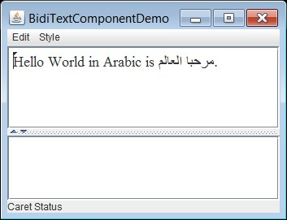
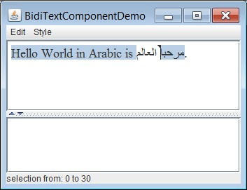
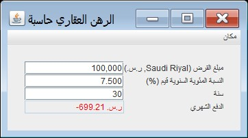

# 使用 JTextComponent 类的双向文本

> 原文： [https://docs.oracle.com/javase/tutorial/i18n/text/bidi.html](https://docs.oracle.com/javase/tutorial/i18n/text/bidi.html)

本节讨论如何使用 [`JTextComponent`](https://docs.oracle.com/javase/8/docs/api/javax/swing/text/JTextComponent.html) 类处理双向文本。双向文本是包含从左到右和从右到左两个方向运行的文本的文本。双向文本的示例是包含数字（从左到右运行）的阿拉伯文本（从右向左运行）。显示和管理双向文本更加困难;但 [`JTextComponent`](https://docs.oracle.com/javase/8/docs/api/javax/swing/text/JTextComponent.html) 会为您处理这些问题。

涵盖以下主题：

*   [确定双向文本的方向性](#directionality)
*   [显示和移动插入符号](#displaying-and-moving-carets)
*   [命中测试](#hit-testing)
*   [突出显示选择](#highlighting-selections)
*   [设置组件方向](#setting-component-orientation)

有关这些问题的更多信息，或者如果您需要更多控制来处理这些问题，请参阅[在](../../2d/text/textlayoutbidirectionaltext.html) [2D 图形](../../2d/index.html)轨迹中使用双向文本。

样本 [`BidiTextComponentDemo.java`](examples/BidiTextComponentDemo.java) 基于 [`TextComponentDemo.java`](../../uiswing/examples/components/index.html#TextComponentDemo) ，在 [`JTextPane`](https://docs.oracle.com/javase/8/docs/api/javax/swing/JTextPane.html) 对象中显示双向文本。在大多数情况下，Java 平台可以确定双向 Unicode 文本的方向性：



### 在 JTextComponent 对象中显式指定文本运行方向

您可以指定 [`JTextComponent`](https://docs.oracle.com/javase/8/docs/api/javax/swing/text/JTextComponent.html) 对象的 [`Document`](https://docs.oracle.com/javase/8/docs/api/javax/swing/text/Document.html) 对象的运行方向。例如，以下语句指定 [`JTextPane`](https://docs.oracle.com/javase/8/docs/api/javax/swing/JTextPane.html) 对象`textPane`中的文本从右向左运行：

```
textPane.getDocument().putProperty(
    TextAttribute.RUN_DIRECTION,
    TextAttribute.RUN_DIRECTION_RTL);

```

或者，您可以根据区域设置指定特定 Swing 组件的组件方向。例如，以下语句指定对象`textPane`的组件方向基于 ar-SA 语言环境：

```
Locale arabicSaudiArabia = 
    new Locale.Builder().setLanguage("ar").setRegion("SA").build();

textPane.setComponentOrientation(
    ComponentOrientation.getOrientation(arabicSaudiArabia));

```

由于阿拉伯语的运行方向是从右到左，因此`textPane`对象中包含的文本的运行方向也是从右到左。

有关详细信息，请参见[设置组件方向](#setting-component-orientation)部分。

在可编辑文本中，_ 插入符 _ 用于以图形方式表示当前插入点，即文本中将插入新字符的位置。在 [`BidiTextComponentDemo.java`](examples/BidiTextComponentDemo.java) 样本中，插入符号包含一个小三角形，指向插入字符的显示方向。

默认情况下， [`JTextComponent`](https://docs.oracle.com/javase/8/docs/api/javax/swing/text/JTextComponent.html) 对象创建一个键映射（ [`Keymap`](https://docs.oracle.com/javase/8/docs/api/javax/swing/text/Keymap.html) 类型），由所有 [`JTextComponent`](https://docs.oracle.com/javase/8/docs/api/javax/swing/text/JTextComponent.html) 实例共享作为默认键映射。键映射允许应用程序将键击绑定到操作。默认键映射（用于支持插入符号移动的 [`JTextComponent`](https://docs.oracle.com/javase/8/docs/api/javax/swing/text/JTextComponent.html) 对象）包括使用左右箭头键向前和向后移动插入符号之间的绑定，它通过双向文本支持插入符号移动。

通常，设备空间中的位置必须转换为文本偏移量。例如，当用户在可选文本上单击鼠标时，鼠标的位置将转换为文本偏移并用作选择范围的一端。从逻辑上讲，这与定位插入符相反。

您可以将插入符号侦听器附加到 [`JTextComponent`](https://docs.oracle.com/javase/8/docs/api/javax/swing/text/JTextComponent.html) 的实例。插入符号侦听器使您能够处理插入符号事件，这些事件在插入符号移动或文本组件中的选择发生更改时发生。使用 [`addCaretListener`](https://docs.oracle.com/javase/8/docs/api/javax/swing/text/JTextComponent.html#addCaretListener-javax.swing.event.CaretListener-) 方法附加插入符听众。有关详细信息，请参阅[如何编写插入侦听器](../../uiswing/events/caretlistener.html)。

所选字符范围由高亮区域以图形方式表示，高亮区域是以逆视频或不同背景颜色显示字形的区域。

[`JTextComponent`](https://docs.oracle.com/javase/8/docs/api/javax/swing/text/JTextComponent.html) 对象实现逻辑突出显示。这意味着所选字符在文本模型中始终是连续的，并且允许突出显示区域不连续。以下是逻辑突出显示的示例：



Swing 的布局管理器了解区域设置如何影响 UI;没有必要为每个区域设置创建新布局。例如，在文本从右向左流动的区域设置中，布局管理器将以相同的方向排列组件。

样本 [`InternationalizedMortgageCalculator.java`](../format/examples/InternationalizedMortgageCalculator.java) 已定位于美国英语;英国，英国;法国，法国;法国，加拿大;和阿拉伯语，沙特阿拉伯。

以下使用 en-US 语言环境：


以下使用 ar-SA 语言环境：



请注意，组件的布局方向与相应的区域设置相同：en-US 从左到右，ar-SA 从右到左。 [`InternationalizedMortgageCalculator.java`](../format/examples/InternationalizedMortgageCalculator.java) 样本调用方法 [`applyComponentOrientation`](https://docs.oracle.com/javase/8/docs/api/java/awt/Component.html#applyComponentOrientation-java.awt.ComponentOrientation-) 和 [`getOrientation`](https://docs.oracle.com/javase/8/docs/api/java/awt/ComponentOrientation.html#getOrientation-java.util.Locale-) 按区域设置指定其组件的方向：

```
private static JFrame frame;

// ...

private static void createAndShowGUI(Locale currentLocale) {

    // Create and set up the window.
    // ...
    // Add contents to the window.
    // ...
    frame.applyComponentOrientation(
        ComponentOrientation.getOrientation(currentLocale));
    // ...
  }

```

样本 [`InternationalizedMortgageCalculator.java`](../format/examples/InternationalizedMortgageCalculator.java) 需要以下资源文件：

*   [`resources/Resources.properties`](../format/examples/resources/Resources.properties)
*   [`resources/Resources_ar.properties`](../format/examples/resources/Resources_ar.properties)
*   [`resources/Resources_fr.properties`](../format/examples/resources/Resources_fr.properties)