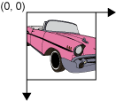

# 坐标

> 原文： [https://docs.oracle.com/javase/tutorial/2d/overview/coordinate.html](https://docs.oracle.com/javase/tutorial/2d/overview/coordinate.html)

Java 2D API 维护两个坐标空间：

*   _ 用户空间 _ - 指定图形基元的空间
*   _ 设备空间 _ - 输出设备（如屏幕，窗口或打印机）的坐标系

用户空间是与设备无关的逻辑坐标系，是程序使用的坐标空间。传递到 Java 2D 渲染例程的所有几何都在用户空间坐标中指定。

当使用从用户空间到设备空间的默认转换时，用户空间的原点是组件绘图区域的左上角。 _x_ 坐标向右增加， _y_ 坐标向下增加，如下图所示。窗口的左上角是 0,0。所有坐标都使用整数指定，这通常就足够了。但是，某些情况需要浮点或甚至双精度，这也是支持的。

设备空间是依赖于设备的坐标系，其根据目标渲染设备而变化。尽管窗口或屏幕的坐标系可能与打印机的坐标系非常不同，但这些差异对于 Java 程序是不可见的。用户空间和设备空间之间的必要转换在渲染期间自动执行。