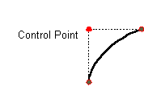
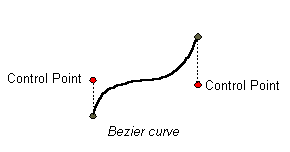

# 几何图元

> 原文： [https://docs.oracle.com/javase/tutorial/2d/overview/primitives.html](https://docs.oracle.com/javase/tutorial/2d/overview/primitives.html)

Java 2D API 提供了一组有用的标准形状，如点，线，矩形，圆弧，椭圆和曲线。定义常见几何图元的最重要的包是`java.awt.geom`包。任意形状可以由直的几何图元的组合来表示。

`Shape`接口表示几何形状，具有轮廓和内部。该接口提供了一组通用的方法，用于描述和检查二维几何对象，并支持曲线段和多个子形状。 [`Graphics`](https://docs.oracle.com/javase/8/docs/api/java/awt/Graphics.html) 类仅支持直线段。 [`Shape`](https://docs.oracle.com/javase/8/docs/api/java/awt/Shape.html) 接口可以支持曲线段。

有关如何绘制和填充形状的更多详细信息，请参阅[使用几何](../geometry/index.html)课程。

## 点

`Point2D`类定义表示（x，y）坐标空间中的位置的点。 Java 2D API 中的术语“点”与像素不同。点没有区域，不包含颜色，无法渲染。

点用于创建其他形状。 `Point2D`类还包括计算两点之间距离的方法。

## 行

`Line2D`类是表示一条线的抽象类。线的坐标可以检索为 double。 `Line2D`类包括几种设置线路端点的方法。

您还可以使用下面描述的`GeneralPath`类创建直线段。

## 矩形形状

`Rectangle2D`，`RoundRectangle2D`，`Arc2D`和`Ellipse2D`基元都来自`RectangularShape`类。此类为`Shape`对象定义可由矩形边界框描述的方法。 `RectangularShape`对象的几何形状可以从完全包围`Shape`轮廓的矩形外推。

## 二次和三次曲线

`QuadCurve2D`使您可以创建二次参数曲线段。二次曲线由两个端点和一个控制点定义。

`CubicCurve2D`类使您可以创建三次参数曲线段。三次曲线由两个端点和两个控制点定义。以下是二次曲线和三次曲线的示例。有关立方和二次曲线的实现，请参见[描边和填充图形基元](../geometry/strokeandfill.html)。

该图表示二次曲线。

该图表示三次曲线。

## 任意形状

`GeneralPath`类使您可以通过指定沿着形状边界的一系列位置来构造任意形状。这些位置可以通过线段，二次曲线或三次（Bézier）曲线连接。可以使用三个线段和三次曲线创建以下形状。有关此形状实现的更多信息，请参见[描边和填充图形基元](../geometry/strokeandfill.html)。

## 地区

使用`Area`类，可以在任何两个`Shape`对象上执行布尔运算，例如并集，交集和减法。这种技术通常被称为 _ 构造区域几何 _，使您能够快速创建复杂的`Shape`对象，而无需描述每个线段或曲线。