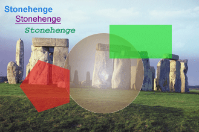

# 图片

> 原文： [https://docs.oracle.com/javase/tutorial/2d/overview/images.html](https://docs.oracle.com/javase/tutorial/2d/overview/images.html)

在 Java 2D API 中，图像通常是矩形的二维像素阵列，其中每个*像素*表示图像的该位置处的颜色，并且尺寸表示水平范围（宽度）和垂直范围。显示图像的（高度）。

用于表示此类图像的最重要的图像类是`java.awt.image.BufferedImage`类。 Java 2D API 将这些图像的内容存储在内存中，以便可以直接访问它们。

应用程序可以直接创建`BufferedImage`对象或从外部图像格式（如 PNG 或 GIF）获取图像。

在任何一种情况下，应用程序都可以使用 Java 2D API 图形调用来绘制图像。因此，图像不限于显示摄影类型图像。可以将诸如艺术线条，文本和其他图形以及甚至其他图像的不同对象绘制到图像上（如下图所示）。

Java 2D API 使您可以将图像过滤操作应用于`BufferedImage`，并包含多个内置过滤器。例如，`ConvolveOp`滤镜可用于模糊或锐化图像。

然后可以将生成的图像绘制到屏幕，发送到打印机，或以 PNG，GIF 等图形格式保存。要了解有关图像的更多信息，请参阅[使用图像](https://docs.oracle.com/javase/tutorial/images/index.html)课程。