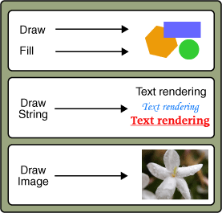

# 课程：图形入门

> 原文： [https://docs.oracle.com/javase/tutorial/2d/basic2d/index.html](https://docs.oracle.com/javase/tutorial/2d/basic2d/index.html)

Java 2D API 功能强大且复杂。但是，Java 2D API 的绝大多数用途都使用了`java.awt.Graphics`类中封装的一小部分功能。本课程涵盖了应用程序开发人员的最常见需求。稍后将在 Java 2D API 的[高级主题中描述不太常见的需求。](../advanced/index.html)

[`Graphics`](https://docs.oracle.com/javase/8/docs/api/java/awt/Graphics.html) 类的大多数方法可分为两个基本组：

*   绘制和填充方法，使您能够渲染基本形状，文本和图像
*   属性设置方法，它们会影响绘图和填充的显示方式

诸如`setFont`和`setColor`之类的方法定义了绘制和填充方法的呈现方式。

该图说明了这些方法如何与图形对象相关：



绘图方法包括：

*   `drawString` - 用于绘图文本

    ```java
    g.drawString("Hello", 10, 10);

    ```

*   `drawImage` - 用于绘制图像

    ```java
    g.drawImage(img, 
                0, 0, width, height,
                0, 0, imageWidth, imageHeight,
                null);                    

    ```

*   `drawLine`，`drawArc`，`drawRect`，`drawOval`，`drawPolygon` - 用于绘制几何形状

    ```java
    g2.draw(new Line2D.Double(0, 0, 30, 40));

    ```

根据您当前的需要，您可以根据以下条件从`Graphics`类中选择以下几种方法之一：

*   是否要以指定位置以原始大小渲染图像，或者将其缩放以适合给定矩形
*   您是喜欢用颜色填充图像的透明区域还是保持透明

填充方法适用于几何形状，包括`fillArc`，`fillRect`，`fillOval`，`fillPolygon`。

无论您是绘制一行文本还是图像，请记住在 2D 图形中，每个点都由其 x 和 y [坐标](../overview/coordinate.html)确定。所有绘制和填充方法都需要此信息，以确定文本或图像的呈现位置。

例如，要绘制一条线，应用程序将调用以下内容：

`java.awt.Graphics.drawLine(int x1, int y1, int x2, int y2)`

在此代码中 _（x1，y1）_ 是该行的起点，_（x2，y2）_ 是该行的终点。

所以绘制水平线的代码如下：

`Graphics.drawLine(20, 100, 120, 100);`

下面的演示累积了所有提到的技术。移动滑块以显示各种天气类型。

&lt;applet alt="WeatherWizard example" archive="examples/lib/2d_basic2d.jar" code="WeatherWizard" height="250" width="400"&gt;&lt;param name="permissions" value="sandbox"&gt;&lt;/applet&gt;

* * *

**Note:**  If you don't see the applet running, you need to install at least the [Java SE Development Kit (JDK) 7](http://www.oracle.com/technetwork/java/javase/downloads/index.html) release.

* * *

`WeatherWizard`演示使用`JSlider`组件以及各种图形功能来生成和显示指定的天气类型。有关`JSlider`类的更多信息，请参阅 Swing 教程的[如何使用滑块](../../uiswing/components/slider.html)部分。

`WeatherPainter`类的`paint`方法实现图形功能。以下代码绘制使用`setupWeatherReport()`方法确定的图像。

```java
...
origComposite = g2.getComposite();
if (alpha0 != null) g2.setComposite(alpha0);
g2.drawImage(img0,
             0, 0, size.width, size.height,
             0, 0, img0.getWidth(null),
             img0.getHeight(null), null);
if (img1 != null) {
    if (alpha1 != null) g2.setComposite(alpha1);
    g2.drawImage(img1,
                 0, 0, size.width, size.height,
                 0, 0, img1.getWidth(null),
                 img1.getHeight(null), null);
} 
...

```

`setFont`和`drawString`方法可以显示温度和天气状况。

```java
...
// Freezing, Cold, Cool, Warm, Hot,
// Blue, Green, Yellow, Orange, Red
Font font = new Font("Serif", Font.PLAIN, 36);
g.setFont(font);

String tempString = feels + " " + temperature+"F";
FontRenderContext frc =
           ((Graphics2D)g).getFontRenderContext();
...
g.setColor(textColor);
int xTextTemp = rX-(int)boundsTemp.getX();
int yTextTemp = rY-(int)boundsTemp.getY();
g.drawString(tempString, xTextTemp, yTextTemp);

int xTextCond = rX-(int)boundsCond.getX();
int yTextCond = rY-(int)boundsCond.getY()
                   + (int)boundsTemp.getHeight();
g.drawString(condStr, xTextCond, yTextCond);

```

`fillRect`方法允许您绘制填充指定颜色的矩形。

```java
...
Rectangle2D boundsTemp 
          = font.getStringBounds(tempString, frc);
Rectangle2D boundsCond 
          = font.getStringBounds(condStr, frc);
int wText = Math.max((int)boundsTemp.getWidth(),
            (int)boundsCond.getWidth());
int hText = (int)boundsTemp.getHeight()
            + (int)boundsCond.getHeight();
int rX = (size.width-wText)/2;
int rY = (size.height-hText)/2;

g.setColor(Color.LIGHT_GRAY);
g2.fillRect(rX, rY, wText, hText);
...

```

尝试修改`WeatherWizard`演示以更改图形内容。例如，使用`fillRoundRect`方法代替`fillRect`或在`setFont`方法中应用其他字体大小。在 [`WeatherWizard.java`](examples/WeatherWizard.java) 文件中找到此 applet 的完整代码。该演示还需要以下图像： [`weather-cloud.png`](examplhttps://docs.oracle.com/javase/tutorial/images/weather-cloud.png) ， [`weather-rain.png`](examplhttps://docs.oracle.com/javase/tutorial/images/weather-rain.png) ， [`weather-snow.png`](examplhttps://docs.oracle.com/javase/tutorial/images/weather-snow.png) 和 [`weather-sun.png`](examplhttps://docs.oracle.com/javase/tutorial/images/weather-sun.png) 位于`images`目录。