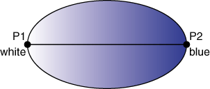
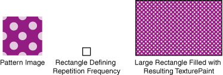

# 抚摸和填充图形基元

> 原文： [https://docs.oracle.com/javase/tutorial/2d/geometry/strokeandfill.html](https://docs.oracle.com/javase/tutorial/2d/geometry/strokeandfill.html)

您已经知道如何创建不同的几何图元和更复杂的形状。本课程教授如何为图形添加一些颜色和花哨的轮廓，并表示填充和描边：

*   _ 填充 _ - 是用纯色或颜色渐变或纹理图案绘制形状内部的过程
*   _ 抚摸 _ - 是一个绘制形状轮廓的过程，应用笔触宽度，线条样式和颜色属性

要将奇特线条样式和填充图案应用于几何图元，请在渲染之前更改 [`Graphics2D`](https://docs.oracle.com/javase/8/docs/api/java/awt/Graphics2D.html) 上下文中的笔触和绘制属性。例如，通过创建适当的 [`Stroke`](https://docs.oracle.com/javase/8/docs/api/java/awt/Stroke.html) 对象绘制虚线。要在渲染行之前将此笔划添加到`Graphics2D`上下文，请调用`setStroke`方法。类似地，通过创建`GradientPaint`对象并将其添加到`Graphics2D`上下文，将渐变填充应用于`Shape`对象。

以下代码行使用填充和描边上下文来丰富几何图元：

```
// draw RoundRectangle2D.Double

final static float dash1[] = {10.0f};
    final static BasicStroke dashed =
        new BasicStroke(1.0f,
                        BasicStroke.CAP_BUTT,
                        BasicStroke.JOIN_MITER,
                        10.0f, dash1, 0.0f);
g2.setStroke(dashed);
g2.draw(new RoundRectangle2D.Double(x, y,
                                   rectWidth,
                                   rectHeight,
                                   10, 10));

```


```
// fill Ellipse2D.Double
redtowhite = new GradientPaint(0,0,color.RED,100, 0,color.WHITE);
g2.setPaint(redtowhite);
g2.fill (new Ellipse2D.Double(0, 0, 100, 50));

```


[`ShapesDemo2D.java`](examples/ShapesDemo2D.java) 代码示例表示 stoking 和 fill 的其他实现。

## 定义花式线条样式和填充图案

使用 Java 2D `Stroke`和`Paint`类，您可以定义花式线条样式和填充图案。

### 线条样式

线条样式由`Graphics2D`渲染上下文中的笔触属性定义。要设置笔触属性，请创建`BasicStroke`对象并将其传递给`Graphics2D` `setStroke`方法。

`BasicStroke`对象包含有关线宽，连接样式，端盖样式和破折号样式的信息。使用`draw`方法渲染`Shape`时使用此信息。

_ 线宽 _ 是垂直于其轨迹测量的线的粗细。线宽指定为用户坐标单位的`float`值，当使用默认变换时，大致相当于 1/72 英寸。

_ 连接样式 _ 是在两个线段相交的地方应用的装饰。 `BasicStroke`支持以下三种连接样式：

 `JOIN_BEVEL`

 `JOIN_MITER`

 `JOIN_ROUND`

_ 端盖样式 _ 是在线段结束时应用的装饰。 `BasicStroke`支持以下三种端盖样式：

 `CAP_BUTT`

 `CAP_ROUND`

 `CAP_SQUARE`

_ 破折号样式 _ 定义沿线长度应用的不透明和透明部分的图案。破折号样式由破折号数组和破折号阶段定义。 _ 破折号数组 _ 定义破折号模式。数组中的交替元素表示短划线长度和用户坐标单位中虚线之间的空格长度。元素 0 表示第一个破折号，元素 1 表示第一个破折号，依此类推。 _ 破折号阶段 _ 是破折号模式的偏移量，也以用户坐标单位指定。破折号阶段指示破折号模式的哪个部分应用于行的开头。

### 填充图案

填充图案由`Graphics2D`渲染上下文中的 paint 属性定义。要设置 paint 属性，可以创建实现`Paint`接口的对象实例，并将其传递给`Graphics2D` `setPaint`方法。

以下三个类实现`Paint`接口：`Color`，`GradientPaint`和`TexturePaint`。

要创建`GradientPaint`，请指定起始位置和颜色以及结束位置和颜色。梯度沿着连接两个位置的线从一种颜色到另一种颜色成比例地变化。例如：

<center></center>

`TexturePaint`类的模式由`BufferedImage`类定义。要创建`TexturePaint`对象，请指定包含图案的图像以及用于复制和锚定图案的矩形。以下图像代表此功能：

<center></center>