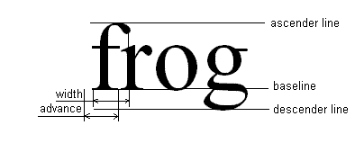

# 测量文本

> 原文： [https://docs.oracle.com/javase/tutorial/2d/text/measuringtext.html](https://docs.oracle.com/javase/tutorial/2d/text/measuringtext.html)

要正确测量文本，您需要学习一些方法和一些错误来避免。字体度量是由 [`Font`](https://docs.oracle.com/javase/8/docs/api/java/awt/Font.html) 对象呈现的文本的度量，例如字体中文本行的高度。测量文本的最常用方法是使用 [`FontMetrics`](https://docs.oracle.com/javase/8/docs/api/java/awt/FontMetrics.html) 实例封装此度量信息。例如：

```
// get metrics from the graphics
FontMetrics metrics = graphics.getFontMetrics(font);
// get the height of a line of text in this
// font and render context
int hgt = metrics.getHeight();
// get the advance of my text in this font
// and render context
int adv = metrics.stringWidth(text);
// calculate the size of a box to hold the
// text with some padding.
Dimension size = new Dimension(adv+2, hgt+2);

```

这种方式足以使许多应用程序均匀地分隔文本行或调整 Swing 组件的大小。

请注意以下事项：

*   度量标准从 [`Graphics`](https://docs.oracle.com/javase/8/docs/api/java/awt/Graphics.html) 类获得，因为该类封装了`FontRenderContext`，这是精确测量文本所需的。在屏幕分辨率下，调整字体以便于阅读。随着文本大小的增加，此调整不会线性缩放。因此，在 20 pt 时，字体的长度不会是 10 pt 的两倍。除文本本身和字体外，测量文本所需的另一个重要信息是`FontRenderContext`。此方法包括从用户空间到用于测量文本的设备像素的转换。
*   报告高度时不参考任何特定的文本字符串。例如，在文本编辑器中，您需要在每行文本之间使用相同的行间距。
*   `stringWidth()`返回文本的前进宽度。 _ 高级宽度 _ 是从文本原点到随后渲染的字符串的位置的距离。

使用这些方法测量文本时，请注意文本可以在矩形之外的任何方向上延伸，由字体高度和字符串的前进定义。



通常，最简单的解决方案是确保文本不被剪裁，例如，通过围绕文本的组件。在文本可能被剪裁的情况下添加填充。

如果此解决方案不足，则 Java 2D 软件中的其他文本测量 API 可以返回矩形边界框。这些框表示要测量的特定文本的高度和像素化效果。