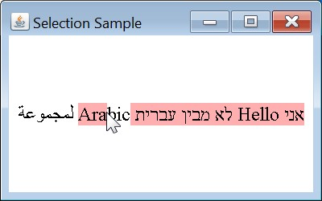
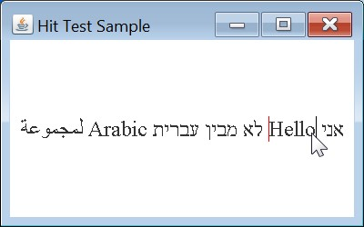

# 使用双向文本

> 原文： [https://docs.oracle.com/javase/tutorial/2d/text/textlayoutbidirectionaltext.html](https://docs.oracle.com/javase/tutorial/2d/text/textlayoutbidirectionaltext.html)

本节讨论如何使用 [`java.awt`](https://docs.oracle.com/javase/8/docs/api/java/awt/package-summary.html) 和 [`java.awt.font`](https://docs.oracle.com/javase/8/docs/api/java/awt/font/package-summary.html) 包中的类来处理双向文本。这些类允许您使用 Unicode 标准支持的任何语言或脚本绘制样式文本：用于处理各种现代，古典和历史语言的全局字符编码系统。绘制文本时，必须考虑文本的读取方向，以便字符串中的所有单词都能正确显示。无论字符串是从左到右，从右到左还是两者（双向）运行，这些类都保持文本的方向并正确地绘制它。双向文本为正确定位插入符号，准确定位选择以及正确显示多行提供了有趣的问题。此外，双向和从右到左的文本也存在类似的问题，即响应于向右和向左箭头按键，将插入符号移动到正确的方向。

涵盖以下主题：

*   [订购文字](#ordering_text)
*   [操纵双向文本](#manipulating_bidirectional_text)
    *   [显示插入符号](#displaying_carets)
    *   [移动插入符号](#moving_carets)
    *   [命中测试](#hit_testing)
    *   [突出显示选择](#highlighting_selections)
*   [在 Java 应用程序中执行文本布局](#performing_text_layout_in_a_java_application)
*   [使用 TextLayout 类](#managing_text_layout)管理文本布局
    *   [使用 TextLayout 类](#laying_out_text)布局文本
    *   [使用 TextLayout 类](#displaying_dual_carets)显示双重插入符号
    *   [使用 TextLayout 类](#moving_the_caret)移动插入符号
    *   [使用 TextLayout 类进行测试](#textlayout_hit_testing)
    *   [使用 TextLayout 类](#textlayout_highlighting_selections)突出显示选择

如果您打算使用 Swing 组件，请参阅[使用 JTextComponent 类](../../i18n/text/bidi.html)和[使用文本组件](../../uiswing/components/text.html)处理双向文本以获取更多信息。

Java SE 以逻辑顺序将文本存储在内存中，这是读取和写入字符和单词的顺序。逻辑顺序不一定与视觉顺序相同，视觉顺序是显示相应字形的顺序。

即使语言混合在一起，书写系统的视觉顺序也必须保持双向文本。下图说明了这一点，该图显示了嵌入英语句子中的阿拉伯语短语。

**注：**在本例和后续例子中，阿拉伯语和希伯来语文本用大写字母表示，空格用下划线表示。每个插图包含两部分：存储在存储器中的字符的表示（逻辑顺序中的字符），然后表示这些字符的显示方式（视觉顺序中的字符）。字符框下方的数字表示插入偏移量。


即使它们是英语句子的一部分，阿拉伯语单词也会以从右到左的阿拉伯语脚本顺序显示。因为斜体字的阿拉伯语在纯文本的阿拉伯语之后是逻辑上的，所以它在视觉上位于纯文本的左侧。

当显示具有从左到右和从右到左文本混合的行时，_ 基本方向 _ 是重要的。基本方向是主要书写系统的脚本顺序。例如，如果文本主要是带有一些嵌入式阿拉伯语的英语，则基本方向是从左到右。如果文本主要是阿拉伯语，其中包含一些嵌入的英语或数字，则基本方向是从右到左。

基本方向确定显示具有共同方向的文本段的顺序。在上图所示的示例中，基本方向是从左到右。此示例中有三个方向运行：句子开头的英文文本从左向右运行，阿拉伯文本从右向左运行，周期从左向右运行。

图形通常嵌入在文本流中。这些内联图形在它们如何影响文本流和换行方面表现得像字形。这种内联图形需要使用相同的双向布局算法进行定位，以便它们出现在字符流中的适当位置。

Java SE 使用 [Unicode 双向算法](http://unicode.org/reports/tr9/)，这是一种用于在一行内对字形进行排序的算法，从而确定双向文本的方向性。在大多数情况下，您不需要包含任何其他信息，以便此算法获得正确的显示顺序。

要允许用户编辑双向文本，您必须能够执行以下操作：

*   [显示插入符号](#displaying_carets)
*   [移动插入符号](#moving_carets)
*   [命中测试](#hit_testing)
*   [突出显示选择](#highlighting_selections)

在可编辑文本中，_ 插入符 _ 用于以图形方式表示当前插入点，即文本中将插入新字符的位置。通常，插入符号显示为两个字形之间的闪烁垂直条。插入新字符并显示在插入符号的位置。

计算插入位置可能很复杂，特别是对于双向文本。方向边界上的插入偏移具有两个可能的插入位置，因为对应于字符偏移的两个字形不会彼此相邻地显示。如下图所示。在该图中，插入符号显示为方括号，以指示插入符号对应的字形。


字符偏移 8 对应于下划线之后和 _A_ 之前的位置。如果用户输入阿拉伯字符，则其字形显示在 _A_ 的右侧（之前）;如果用户输入英文字符，则其字形显示在下划线的右侧（之后）。

为了处理这种情况，一些系统显示双插入符号，强（主）插入符和弱（次）插入符号。强插入符表示当该字符的方向与文本的基本方向相同时，将显示插入字符的位置。当字符的方向与基本方向相反时，弱插入符号显示插入字符的显示位置 [`TextLayout`](https://docs.oracle.com/javase/8/docs/api/java/awt/font/TextLayout.html) 自动支持双重插入符号。

当您使用双向文本时，不能简单地在字符偏移之前添加字形的宽度来计算插入位置。如果你这样做了，插入符将被绘制在错误的位置，如下图所示：


为了使插入符号正确定位，需要添加偏移量左侧的字形宽度并考虑当前上下文。除非考虑上下文，否则字形度量不一定与显示匹配。 （上下文可以影响使用哪些字形。）

所有文本编辑器都允许用户使用箭头键移动插入符号。用户希望插入符号沿按下的箭头键的方向移动。在从左到右的文本中，移动插入偏移很简单：右箭头键将插入偏移增加 1，左箭头键减少 1。在具有连字的双向文本或文本中，此行为将导致插入符号在方向边界处跳过字形并在不同的方向运行中反向移动。

要通过双向文本平滑移动插入符，您需要考虑文本运行的方向。按下右箭头键时不能简单地增加插入偏移量，按下左箭头键时减少插入偏移量。如果当前插入偏移量在从右到左字符的行程内，则右箭头键应减小插入偏移量，左箭头键应增加它。

将插入符号移动到方向边界更加复杂。下图说明了当用户使用箭头键导航时越过方向边界时会发生什么。在显示的文本中向右步进三个位置对应于移动到字符偏移 7,19，然后是 18。


某些字形不应该在它们之间插入;相反，插入符号应该像字形代表单个字符一样移动。例如，如果它们由两个单独的字符表示，则 _o_ 和变音符号之间不应该有插入符号。

[`TextLayout`](https://docs.oracle.com/javase/8/docs/api/java/awt/font/TextLayout.html) 类提供方法（ [`getNextRightHit`](https://docs.oracle.com/javase/8/docs/api/java/awt/font/TextLayout.html#getNextRightHit-int-) 和 [`getNextLeftHit`](https://docs.oracle.com/javase/8/docs/api/java/awt/font/TextLayout.html#getNextLeftHit-int-) ），使您可以通过双向文本轻松移动插入符号。

通常，设备空间中的位置必须转换为文本偏移量。例如，当用户在可选文本上单击鼠标时，鼠标的位置将转换为文本偏移并用作选择范围的一端。从逻辑上讲，这与定位插入符相反。

当您使用双向文本时，显示中的单个可视位置可以对应源文本中的两个不同偏移，如下图所示：


因为单个视觉位置可以对应于两个不同的偏移，所以命中测试双向文本不仅仅是测量字形宽度，直到找到正确位置处的字形，然后将该位置映射回字符偏移。检测击中的一侧有助于区分两种选择。

您可以使用 [`TextLayout.hitTestChar`](https://docs.oracle.com/javase/8/docs/api/java/awt/font/TextLayout.html#hitTestChar-float-float-) 执行命中测试。命中信息封装在[H​​TG2] `TextHitInfo`对象中，并包含有关命中所在侧的信息。

所选字符范围由高亮区域以图形方式表示，高亮区域是以逆视频或不同背景颜色显示字形的区域。

突出显示区域（如插入符号）对于双向文本比单向文本更复杂。在双向文本中，连续的字符范围在显示时可能没有连续的高亮区域。相反，显示视觉上连续的字形范围的高亮区域可能不对应于单个连续字符范围。

这导致两种策略突出显示双向文本中的选择：

*   _ 逻辑高亮 _：通过逻辑高亮显示，所选字符在文本模型中始终是连续的，并且高亮区域可以是不连续的。以下是逻辑突出显示的示例：

    

*   _ 视觉突出显示 _：通过视觉突出显示，可能会有多个选定字符范围，但突出显示区域始终是连续的。以下是视觉突出显示的示例：

    

逻辑突出显示更容易实现，因为所选字符在文本中始终是连续的。

样例 [``SelectionSample.java``](examples/SelectionSample.java)演示了逻辑突出显示：



根据您使用的 Java API，您可以根据需要对文本布局进行尽可能少的控制：

*   如果您只想显示文本块或需要可编辑的文本控件，可以使用 [`JTextComponent`](https://docs.oracle.com/javase/8/docs/api/javax/swing/text/JTextComponent.html) ，它将为您执行文本布局。 [`JTextComponent`](https://docs.oracle.com/javase/8/docs/api/javax/swing/text/JTextComponent.html) 旨在满足大多数国际应用的需求并支持双向文本有关 [`JTextComponent`](https://docs.oracle.com/javase/8/docs/api/javax/swing/text/JTextComponent.html) 的更多信息，请参阅[使用 JTextComponent 类的双向文本](../../i18n/text/bidi.html)和[使用文本组件](../../uiswing/components/text.html)获取更多信息。

*   如果要显示简单的文本字符串，可以调用方法 [`Graphics2D.drawString`](https://docs.oracle.com/javase/8/docs/api/java/awt/Graphics2D.html#drawString-java.text.AttributedCharacterIterator-int-int-) 并让 Java 2D 为您布置字符串。您还可以使用 [`Graphics2D.drawString`](https://docs.oracle.com/javase/8/docs/api/java/awt/Graphics2D.html#drawString-java.text.AttributedCharacterIterator-int-int-) 渲染包含双向文本的样式字符串和字符串。有关通过 [`Graphics2D`](https://docs.oracle.com/javase/8/docs/api/java/awt/Graphics2D.html) 呈现文本的更多信息，请参阅[使用文本 API](index.html) 。

*   如果要实现自己的文本编辑例程，可以使用 [`TextLayout`](https://docs.oracle.com/javase/8/docs/api/java/awt/font/TextLayout.html) 来管理文本布局，突出显示和命中检测。 [`TextLayout`](https://docs.oracle.com/javase/8/docs/api/java/awt/font/TextLayout.html) 提供的功能可处理大多数常见情况，包括带有混合字体，混合语言和双向文本的文本字符串。有关使用 TextLayout 的更多信息，请参阅[管理文本布局](#managing_text_layout)。

*   如果要完全控制文本的形状和位置，可以使用 [`Font`](https://docs.oracle.com/javase/8/docs/api/java/awt/Font.html) 类构建自己的 [`GlyphVector`](https://docs.oracle.com/javase/8/docs/api/java/awt/font/GlyphVector.html) 实例，然后通过 [`Graphics2D`](https://docs.oracle.com/javase/8/docs/api/java/awt/Graphics2D.html) 类。

通常，您不需要自己执行文本布局操作。对于大多数应用， [`JTextComponent`](https://docs.oracle.com/javase/8/docs/api/javax/swing/text/JTextComponent.html) 是显示静态和可编辑文本的最佳解决方案。但是， [`JTextComponent`](https://docs.oracle.com/javase/8/docs/api/javax/swing/text/JTextComponent.html) 不支持在双向文本中显示双重插入符号或不连续选择。如果您的应用程序需要这些功能，或者您更喜欢实现自己的文本编辑例程，则可以使用 Java 2D 文本布局 API。

## 管理文本布局

[`TextLayout`](https://docs.oracle.com/javase/8/docs/api/java/awt/font/TextLayout.html) 类支持包含来自不同书写系统的多种样式和字符的文本，包括阿拉伯语和希伯来语。 （阿拉伯语和希伯来语特别难以展示，因为您必须对文本进行整形和重新排序以获得可接受的表示形式。）

[`TextLayout`](https://docs.oracle.com/javase/8/docs/api/java/awt/font/TextLayout.html) 简化了显示和测量文本的过程，即使您使用的是纯英文文本也是如此。通过使用 [`TextLayout`](https://docs.oracle.com/javase/8/docs/api/java/awt/font/TextLayout.html) ，您可以毫不费力地实现高质量的排版。

[`TextLayout`](https://docs.oracle.com/javase/8/docs/api/java/awt/font/TextLayout.html) 的设计使其在用于显示简单的单向文本时不会对性能产生重大影响。当 [`TextLayout`](https://docs.oracle.com/javase/8/docs/api/java/awt/font/TextLayout.html) 用于显示阿拉伯语或希伯来语文本时，会有一些额外的处理开销。但是，它通常在每个字符的微秒级上，并且由正常绘图代码的执行支配。

[`TextLayout`](https://docs.oracle.com/javase/8/docs/api/java/awt/font/TextLayout.html) 类为您管理字形的定位和排序。您可以使用 [`TextLayout`](https://docs.oracle.com/javase/8/docs/api/java/awt/font/TextLayout.html) 执行以下操作：

*   [使用 TextLayout 类](#laying_out_text)布局文本
*   [使用 TextLayout 类](#displaying_dual_carets)显示双重插入符号
*   [使用 TextLayout 类](#moving_the_caret)移动插入符号
*   [使用 TextLayout 类进行测试](#textlayout_hit_testing)
*   [使用 TextLayout 类](#textlayout_highlighting_selections)突出显示选择

### 布局文本

[`TextLayout`](https://docs.oracle.com/javase/8/docs/api/java/awt/font/TextLayout.html) 自动布局文本，包括双向文本，具有正确的整形和排序。要正确地对表示文本行的字形进行整形和排序， [`TextLayout`](https://docs.oracle.com/javase/8/docs/api/java/awt/font/TextLayout.html) 必须知道文本的完整上下文：

*   如果文本适合单行，例如按钮的单字标签或对话框中的行，则可以直接从文本构造 [`TextLayout`](https://docs.oracle.com/javase/8/docs/api/java/awt/font/TextLayout.html) 。
*   如果您有多个文本可以放在单行上，或者想要将单行上的文本拆分为选项卡段，则无法直接构造 [`TextLayout`](https://docs.oracle.com/javase/8/docs/api/java/awt/font/TextLayout.html) 。您必须使用 [`LineBreakMeasurer`](https://docs.oracle.com/javase/8/docs/api/java/awt/font/LineBreakMeasurer.html) 来提供足够的上下文。有关详细信息，请参阅[绘制多行文本](drawmulstring.html)。

文本的基本方向通常由文本上的属性（样式）设置。如果缺少该属性，则 [`TextLayout`](https://docs.oracle.com/javase/8/docs/api/java/awt/font/TextLayout.html) 遵循 Unicode 双向算法，并从段落中的初始字符派生基本方向。

### 显示双重插入符号

[`TextLayout`](https://docs.oracle.com/javase/8/docs/api/java/awt/font/TextLayout.html) 维护插入符 [`Shape`](https://docs.oracle.com/javase/8/docs/api/java/awt/Shape.html) ，位置和角度等插入信息。您可以使用此信息在单向和双向文本中轻松显示插入符号。当您绘制双向文本的插入符号时，使用 [`TextLayout`](https://docs.oracle.com/javase/8/docs/api/java/awt/font/TextLayout.html) 可确保插入符号正确定位。

[`TextLayout`](https://docs.oracle.com/javase/8/docs/api/java/awt/font/TextLayout.html) 提供默认插入符`Shapes`并自动支持双插入符号。对于斜体和斜体字形， [`TextLayout`](https://docs.oracle.com/javase/8/docs/api/java/awt/font/TextLayout.html) 产生有角度的插入符号，如下图所示。这些插入位置还用作突出显示和命中测试的字形之间的边界，这有助于产生一致的用户体验。


给定插入偏移量， [`getCaretShapes`](https://docs.oracle.com/javase/8/docs/api/java/awt/font/TextLayout.html#getCaretShapes-int-) 方法返回 [`Shape`](https://docs.oracle.com/javase/8/docs/api/java/awt/Shape.html) 对象的双元素数组：元素 0 包含强插入符号，元素 1 包含弱插入符号（如果有）存在。要显示双重插入符号，您只需绘制插入符 [`Shape`](https://docs.oracle.com/javase/8/docs/api/java/awt/Shape.html) 对象;插入符号将自动呈现在正确的位置。

如果要使用自定义插入符号，可以从 [`TextLayout`](https://docs.oracle.com/javase/8/docs/api/java/awt/font/TextLayout.html) 中检索插入符号的位置和角度，并自行绘制。

样例 [``HitTestSample.java``](examples/HitTestSample.java)显示双重插入符号。

点击 _o_ 侧面的 _o_ 朝向希伯来语文本记录最终用户在 _o_ 之后点击，这是英文文本的一部分。这将 _o_ 旁边的弱（黑色）插入符号和 _H_ 前面的强插入符号（红色）定位：



单击 _o_ 右侧的空白记录最终用户单击空格，这是希伯来文本的一部分。这会将 _o_ 旁边的强（红色）插入符号和 _H_ 前面的弱插入符号（黑色）定位：


### 移动插入符号

当用户按下左箭头键或右箭头键时，您还可以使用 [`TextLayout`](https://docs.oracle.com/javase/8/docs/api/java/awt/font/TextLayout.html) 类来确定最终的插入偏移。给定表示当前插入偏移的`TextHitInfo`对象， [`getNextRightHit`](https://docs.oracle.com/javase/8/docs/api/java/awt/font/TextLayout.html#getNextRightHit-java.awt.font.TextHitInfo-) 方法返回 [`TextHitInfo`](https://docs.oracle.com/javase/8/docs/api/java/awt/font/TextHitInfo.html) 对象，如果按下右箭头键，则表示正确的插入偏移。 [`getNextLeftHit`](https://docs.oracle.com/javase/8/docs/api/java/awt/font/TextLayout.html#getNextLeftHit-java.awt.font.TextHitInfo-) 方法为左箭头键提供相同的信息。

以下摘自样例 [``ArrowKeySample.java``](examples/ArrowKeySample.java)演示了当用户按下左箭头键或右箭头键时如何确定生成的插入偏移量：

```java
public class ArrowKeySample extends JPanel implements KeyListener {

  // ...

  private static void createAndShowGUI() {
    // Create and set up the window.
    ArrowKey demo = new ArrowKey();
    frame = new JFrame("Arrow Key Sample");
    frame.addKeyListener(demo);
    // ...
  }

  private void handleArrowKey(boolean rightArrow) {
    TextHitInfo newPosition;
    if (rightArrow) {
      newPosition = textLayout.getNextRightHit(insertionIndex);
    } else {
      newPosition = textLayout.getNextLeftHit(insertionIndex);
    }

    // getNextRightHit() / getNextLeftHit() will return null if
    // there is not a caret position to the right (left) of the
    // current position.
    if (newPosition != null) {
      // Update insertionIndex.
      insertionIndex = newPosition.getInsertionIndex();
      // Repaint the Component so the new caret(s) will be displayed.
      frame.repaint();
    }
  }

  // ...

  @Override
  public void keyPressed(KeyEvent e) {
    int keyCode = e.getKeyCode();
    if (keyCode == KeyEvent.VK_LEFT || keyCode == KeyEvent.VK_RIGHT) {
      handleArrowKey(keyCode == KeyEvent.VK_RIGHT);
    }
  }
}

```

[`TextLayout`](https://docs.oracle.com/javase/8/docs/api/java/awt/font/TextLayout.html) 类为命中测试文本提供了一种简单的机制。 [`hitTextChar`](https://docs.oracle.com/javase/8/docs/api/java/awt/font/TextLayout.html#hitTestChar-float-float-) 方法将来自小鼠的 _x_ 和 _y_ 坐标作为参数并返回 [`TextHitInfo`](https://docs.oracle.com/javase/8/docs/api/java/awt/font/TextHitInfo.html) 对象。 [`TextHitInfo`](https://docs.oracle.com/javase/8/docs/api/java/awt/font/TextHitInfo.html) 包含指定位置的插入偏移和命中所在的一侧。插入偏移是最接近命中的偏移：如果命中超过了行的末尾，则返回该行末尾的偏移量。

以下来自 [``HitTestSample.java``](examples/HitTestSample.java)的摘录从鼠标点击中检索偏移量：

```java
private class HitTestMouseListener extends MouseAdapter {
    public void mouseClicked(MouseEvent e) {
      Point2D origin = computeLayoutOrigin();
      // Compute the mouse click location relative to
      // textLayout's origin.
      float clickX = (float) (e.getX() - origin.getX());
      float clickY = (float) (e.getY() - origin.getY());
      // Get the character position of the mouse click.
      TextHitInfo currentHit = textLayout.hitTestChar(clickX, clickY);
      insertionIndex = currentHit.getInsertionIndex();
      // Repaint the Component so the new caret(s) will be displayed.
      repaint();
    }
  }

```

### 突出显示选择

您可以从 [`TextLayout`](https://docs.oracle.com/javase/8/docs/api/java/awt/font/TextLayout.html) 获得代表高光区域的 [`Shape`](https://docs.oracle.com/javase/8/docs/api/java/awt/Shape.html) 。 [`TextLayout`](https://docs.oracle.com/javase/8/docs/api/java/awt/font/TextLayout.html) 在计算高光区域的尺寸时自动考虑上下文。 [`TextLayout`](https://docs.oracle.com/javase/8/docs/api/java/awt/font/TextLayout.html) 支持逻辑和视觉突出显示。

以下来自 [``SelectionSample.java``](examples/SelectionSample.java)的摘录演示了一种显示突出显示文本的方法：

```java
public void paint(Graphics g) {

    // ...

    boolean haveCaret = anchorEnd == activeEnd;

    if (!haveCaret) {
      // Retrieve highlight region for selection range.
      Shape highlight = 
          textLayout.getLogicalHighlightShape(anchorEnd, activeEnd);
      // Fill the highlight region with the highlight color.
      graphics2D.setColor(HIGHLIGHT_COLOR);
      graphics2D.fill(highlight);
    }

    // ...

  }

  // ...

  private class SelectionMouseMotionListener extends MouseMotionAdapter {
    public void mouseDragged(MouseEvent e) {
      Point2D origin = computeLayoutOrigin();
      // Compute the mouse location relative to
      // textLayout's origin.
      float clickX = (float) (e.getX() - origin.getX());
      float clickY = (float) (e.getY() - origin.getY());
      // Get the character position of the mouse location.
      TextHitInfo position = textLayout.hitTestChar(clickX, clickY);
      int newActiveEnd = position.getInsertionIndex();
      // If newActiveEnd is different from activeEnd, update activeEnd
      // and repaint the Panel so the new selection will be displayed.
      if (activeEnd != newActiveEnd) {
        activeEnd = newActiveEnd;
        frame.repaint();
      }
    }
  }

  private class SelectionMouseListener extends MouseAdapter {
    public void mousePressed(MouseEvent e) {
      Point2D origin = computeLayoutOrigin();
      // Compute the mouse location relative to
      // TextLayout's origin.
      float clickX = (float) (e.getX() - origin.getX());
      float clickY = (float) (e.getY() - origin.getY());
      // Set the anchor and active ends of the selection
      // to the character position of the mouse location.
      TextHitInfo position = textLayout.hitTestChar(clickX, clickY);
      anchorEnd = position.getInsertionIndex();
      activeEnd = anchorEnd;
      // Repaint the Panel so the new selection will be displayed.
      frame.repaint();
    }
  }

```

方法`SelectionMouseListener.mousePressed`指定变量`anchorEnd`，它是单击鼠标的文本中的位置。方法`SelectionMouseMotionListener.mouseDragged`指定变量`activeEnd`，它是拖动鼠标的文本中的位置。 `paint`方法检索表示所选文本的 [`Shape`](https://docs.oracle.com/javase/8/docs/api/java/awt/Shape.html) 对象（位置`anchorEnd`和`activeEnd`之间的文本）。然后`paint`方法用高亮颜色填充 [`Shape`](https://docs.oracle.com/javase/8/docs/api/java/awt/Shape.html) 对象。