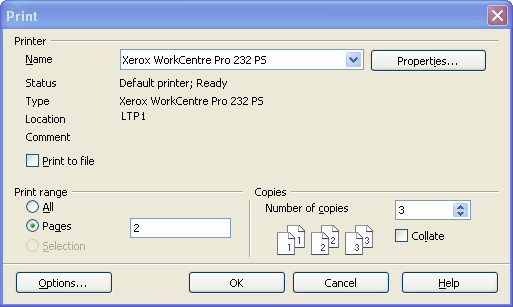
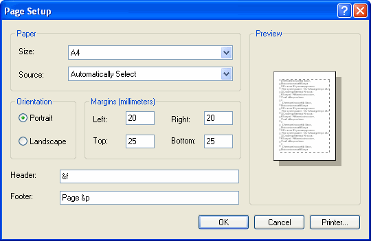

# 使用“打印设置”对话框

> 原文： [https://docs.oracle.com/javase/tutorial/2d/printing/dialog.html](https://docs.oracle.com/javase/tutorial/2d/printing/dialog.html)

传统上，用户想要查看页面设置和打印对话框。从打印对话框中，您可以选择打印机，指定要打印的页面，以及设置份数。



当用户按下与打印命令相关的按钮时，应用程序显示打印对话框，或者从打印菜单中选择项目。要显示该对话框，请调用 [`PrinterJob`](https://docs.oracle.com/javase/8/docs/api/java/awt/print/PrinterJob.html) 类的 [`printDialog`](https://docs.oracle.com/javase/8/docs/api/java/awt/print/PrinterJob.html#printDialog--) 方法：

```java
PrinterJob pj = PrinterJob.getPrinterJob();
...
    if (pj.printDialog()) {
        try {pj.print();}
        catch (PrinterException exc) {
            System.out.println(exc);
         }
     }   
...    

```

如果用户单击“确定”退出对话框，则此方法返回`true`，否则返回`false`。用户在对话框中的选择受基于已设置为`PrinterJob`的页面的数量和格式的约束。

上面代码段中的`printDialog`方法打开一个本机打印对话框。 [`PrintDialogExample.java`](examples/PrintDialogExample.java) 代码示例显示了如何显示跨平台打印对话框。

您可以使用页面设置对话框更改 [`PageFormat`](https://docs.oracle.com/javase/8/docs/api/java/awt/print/PageFormat.html) 对象中包含的页面设置信息。



要显示页面设置对话框，请调用`PrinterJob`类的`pageDialog`方法。

```java
PrinterJob pj = PrinterJob.getPrinterJob();
PageFormat pf = pj.pageDialog(pj.defaultPage());

```

使用传递给`pageDialog`的参数初始化页面设置对话框。如果用户单击对话框中的“确定”按钮，将根据用户选择创建`PageFormat`实例，然后返回。如果用户取消对话框，`pageDialog`将返回原始未更改的 PageFormat。

通常，Java 2D Printing API 需要应用程序来显示打印对话框，但有时可以打印而不显示任何对话框。这种类型的打印称为 _ 静音打印 _。它可能在特定情况下很有用，例如，当您需要打印特定数据库每周报告时。在其他情况下，始终建议在打印过程开始时通知用户。