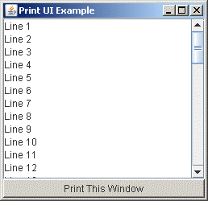

# 打印用户界面的内容

> 原文： [https://docs.oracle.com/javase/tutorial/2d/printing/gui.html](https://docs.oracle.com/javase/tutorial/2d/printing/gui.html)

另一种常见的打印任务是全部或部分地打印窗口或框架的内容。窗口可能包含以下组件：工具栏，按钮滑块，文本标签，可滚动文本区域，图像和其他图形内容。所有这些组件都使用以下 Java 2D 打印 API 方法打印：

```
java.awt.Component.print(Graphics g);
java.awt.Component.printAll(Graphics g);

```

下图表示一个简单的用户界面。



创建此 UI 的代码位于示例程序 [`PrintUIWindow.java`](examples/PrintUIWindow.java) 中。

要打印此窗口，请修改前面打印文本或图像的示例中的代码。生成的代码应如下所示：

```
public int print(Graphics g, PageFormat pf, int page)
    throws PrinterException {
    if (page > 0) {
        return NO_SUCH_PAGE;
    }

    Graphics2D g2d = (Graphics2D)g;
    g2d.translate(pf.getImageableX(), pf.getImageableY());

    // Print the entire visible contents of a
    // java.awt.Frame.
    frame.printAll(g);

    return PAGE_EXISTS;
}

```

* * *

**Note:** The call to the `printAll` method is the only difference between this example and examples to print text or image. The `print(Graphics g)` method mirrors the `java.awt.Component.paint(Graphics g)` method used for on-screen rendering. Use the `print()` method rather than the `paint()` method as the `Components` class may have overridden the `print()` method to handle the printing case differently.

* * *

`printAll(Graphics g)`方法打印组件及其所有子组件。此方法通常用于打印完整窗口等对象，而不是单个组件。