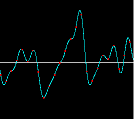
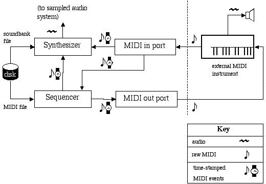

# 路径：声音

> 原文： [https://docs.oracle.com/javase/tutorial/sound/index.html](https://docs.oracle.com/javase/tutorial/sound/index.html)

Java Sound API 是一个低级 API，用于实现和控制声音媒体的输入和输出，包括音频和乐器数字接口（MIDI）数据。 Java Sound API 在一个促进可扩展性和灵活性的框架中提供对声音输入和输出通常所需功能的显式控制。

Java Sound API 满足了各种应用程序开发人员的需求。潜在的应用领域包括：

*   通信框架，例如会议和电话
*   最终用户内容传送系统，例如媒体播放器和使用流内容的音乐
*   交互式应用程序，例如使用动态内容的游戏和网站
*   内容创建和编辑
*   工具，工具包和实用程序

Java Sound API 在 Java 平台上提供最低级别的声音支持。它为应用程序提供了对声音操作的大量控制，并且是可扩展的。例如，Java Sound API 提供了安装，访问和操作系统资源的机制，如音频混合器，MIDI 合成器，其他音频或 MIDI 设备，文件读取器和写入器以及声音格式转换器。 Java Sound API 不包含复杂的声音编辑器或图形工具，但它提供了构建此类程序的功能。它强调低级控制，超出最终用户通常期望的控制。

Java Sound API 包括对数字音频和 MIDI 数据的支持。这两个主要功能模块在单独的包中提供：

*   [`javax.sound.sampled`](https://docs.oracle.com/javase/8/docs/api/javax/sound/sampled/package-summary.html) - 此软件包指定用于捕获，混合和回放数字（采样）音频的接口。
*   [`javax.sound.midi`](https://docs.oracle.com/javase/8/docs/api/javax/sound/midi/package-summary.html) - 该软件包提供 MIDI 合成，排序和事件传输的接口。

另外两个软件包允许服务提供者（而不是应用程序开发人员）创建自定义软件组件，以扩展 Java Sound API 实现的功能：

*   [`javax.sound.sampled.spi`](https://docs.oracle.com/javase/8/docs/api/javax/sound/sampled/spi/package-summary.html)
*   [`javax.sound.midi.spi`](https://docs.oracle.com/javase/8/docs/api/javax/sound/midi/spi/package-summary.html)

本页介绍了采样音频系统，MIDI 系统和 SPI 包。然后在本教程的后面更详细地讨论每个包。

* * *

**Note:** 

还有其他 Java 平台 API 也具有与声音相关的元素。 [Java Media Framework API（JMF）](http://www.oracle.com/technetwork/java/javase/tech/index-jsp-140239.html)是一个更高级别的 API，目前可用作 Java 平台的标准扩展。 JMF 指定用于捕获和回放基于时间的媒体的统一架构，消息传递协议和编程接口。 JMF 为基本的媒体播放器应用程序提供了一种更简单的解决方案，它可以实现不同媒体类型（如音频和视频）之间的同步。另一方面，专注于声音的程序可以从 Java Sound API 中受益，特别是如果它们需要更高级的功能，例如仔细控制缓冲音频播放或直接操作 MIDI 合成器的能力。其他具有声音方面的 Java API 包括用于电话和语音的 Java 3D 和 API。任何这些 API 的实现都可能在内部使用 Java Sound API 的实现，但不是必须这样做。

* * *

## 什么是 Sampled Audio？

[`javax.sound.sampled`](https://docs.oracle.com/javase/8/docs/api/javax/sound/sampled/package-summary.html) 包处理数字音频数据，Java Sound API 将其称为采样音频。 _ 样本 _ 是信号的连续快照。在音频的情况下，信号是声波。麦克风将声学信号转换为相应的模拟电信号，并且模数转换器将该模拟信号转换为采样的数字形式。下图显示了录音中的短暂时刻。

采样声波

该图描绘了垂直轴上的声压（振幅）和水平轴上的时间。以一定速率周期性地测量模拟声波的幅度，从而产生包括数字音频信号的离散样本（图中的红色数据点）。中心水平线表示零幅度;线上方的点是正值样本，下面的点是负数。模拟信号的数字近似的精度取决于其在时间上的分辨率（_ 采样率 _）及其 _ 量化 _，或幅度分辨率（用于表示每个的比特数）样品）。作为参考，记录存储在光盘上的音频每秒采样 44,100 次，每个采样 16 位。

这里使用的术语“采样音频”略有松散。可以以离散的间隔对声波进行采样，同时保持模拟形式。但是，出于 Java Sound API 的目的，“采样音频”等同于“数字音频”。

通常，计算机上的采样音频来自录音，但声音可以通过合成生成（例如，创建按键式电话的声音）。术语“采样音频”是指数据的类型，而不是其来源。

Java Sound API 不承担特定的音频硬件配置;它旨在允许在系统上安装不同种类的音频组件，并由 API 访问。 Java Sound API 支持常见功能，例如声卡的输入和输出（例如，用于录制和回放声音文件）以及混合多个音频流。以下是典型音频架构的一个示例：

典型的音频架构

在该示例中，诸如声卡的设备具有各种输入和输出端口，并且在软件中提供混合。混音器可能接收从文件读取，从网络流式传输，应用程序即时生成或由 MIDI 合成器生成的数据。混音器将其所有音频输入组合成单个流，可以将其发送到输出设备进行渲染。

## 什么是 MIDI？

[javax.sound.midi](https://docs.oracle.com/javase/8/docs/api/javax/sound/midi/package-summary.html) 软件包包含用于传输和排序 MIDI 事件以及合成来自这些事件的声音的 API。

虽然采样音频是声音本身的直接表示， _MIDI 数据 _ 可以被认为是创建声音的配方，尤其是音乐声音。与音频数据不同，MIDI 数据不直接描述声音。相反，它描述了影响由启用 MIDI 的设备或乐器（例如合成器）执行的声音（或动作）的事件。 MIDI 数据类似于图形用户界面的键盘和鼠标事件。在 MIDI 的情况下，事件可以被认为是对音乐键盘的动作，以及对该乐器上的各种踏板，滑块，开关和旋钮的动作。这些事件实际上不需要硬件乐器;它们可以用软件模拟，也可以存储在 MIDI 文件中。可以创建，编辑和执行这些文件的程序称为顺控程序。许多计算机声卡包括 MIDI 可控音乐合成器芯片，音序器可以向其发送其 MIDI 事件。合成器也可以完全用软件实现。合成器解释它们接收的 MIDI 事件并产生音频输出。通常，从 MIDI 数据合成的声音是音乐声音（例如，与语音相反）。 MIDI 合成器还能够产生各种声音效果。

某些声卡包括 MIDI 输入和输出端口，外部 MIDI 硬件设备（如键盘合成器或其他乐器）可以连接到这些端口。从 MIDI 输入端口，应用程序可以接收由配备有外部 MIDI 的乐器生成的事件。该程序可以使用计算机的内部合成器播放音乐表演，将其作为 MIDI 文件保存到磁盘，或将其呈现为乐谱。程序可能使用 MIDI 输出端口播放外部乐器，或控制其他外部设备（如录音设备）。

下图说明了基于 Java Sound API 的可能 MIDI 配置中主要组件之间的功能关系。 （与音频一样，Java Sound API 允许安装和互连各种 MIDI 软件设备。此处显示的系统只是一种可能的情况。）组件之间的数据流用箭头表示。数据可以是标准文件格式，或者（如图中右下角的键所示），可以是音频，原始 MIDI 字节或带时间标记的 MIDI 消息。

可能的 MIDI 配置

在该示例中，应用程序通过将存储为标准 MIDI 文件的乐谱加载到盘（图的左侧）来准备音乐演奏。标准 MIDI 文件包含轨道，每个轨道都是带时间标记的 MIDI 事件列表。大多数事件代表音符（音高和节奏）。读取该 MIDI 文件，然后由软件定序器“执行”。音序器通过将 MIDI 信息发送到某些其他设备（例如内部或外部合成器）来执行其音乐。合成器本身可以读取包含用于模拟某些乐器的声音的指令的音库文件。如果没有，合成器将使用已加载到其中的任何乐器声音播放存储在 MIDI 文件中的音符。

如图所示，在通过 MIDI 输出端口发送到外接 MIDI 乐器之前，必须将 MIDI 事件转换为原始（非时间标记）MIDI。类似地，从外部 MIDI 源（键盘乐器，在图中）进入计算机的原始 MIDI 数据被转换为时间标记的 MIDI 消息，可以控制合成器，或者音序器可以存储以供以后使用。

## 服务提供者接口

[`javax.sound.sampled.spi`](https://docs.oracle.com/javase/8/docs/api/javax/sound/sampled/spi/package-summary.html) 和 [`javax.sound.midi.spi`](https://docs.oracle.com/javase/8/docs/api/javax/sound/midi/spi/package-summary.html) 软件包包含 API，可让软件开发人员创建新的音频或 MIDI 资源，可以单独提供给用户并“插入”在“Java Sound API 的现有实现中。以下是可以通过这种方式添加的服务（资源）的一些示例：

*   音频混音器
*   一个 MIDI 合成器
*   一种文件解析器，可以读取或写入新类型的音频或 MIDI 文件
*   一种转换器，可在不同的声音数据格式之间进行转换

在某些情况下，服务是硬件设备（如声卡）功能的软件接口，服务提供商可能与硬件供应商相同。在其他情况下，服务纯粹存在于软件中。例如，合成器或混合器可以是声卡上芯片的接口，或者可以在没有任何硬件支持的情况下实现。

Java Sound API 的实现包含一组基本服务，但服务提供者接口（SPI）包允许第三方创建新服务。这些第三方服务以与内置服务相同的方式集成到系统中。 [`AudioSystem`](https://docs.oracle.com/javase/8/docs/api/javax/sound/sampled/AudioSystem.html) 类和 [`MidiSystem`](https://docs.oracle.com/javase/8/docs/api/javax/sound/midi/MidiSystem.html) 类充当协调器，让应用程序显式或隐式地访问服务。通常，服务的存在对使用它的应用程序是完全透明的。服务提供程序机制使基于 Java Sound API 的应用程序用户受益，因为可以将新的声音功能添加到程序中而无需新版本的 JDK 或运行时环境，并且在许多情况下甚至不需要新的发布应用程序本身。